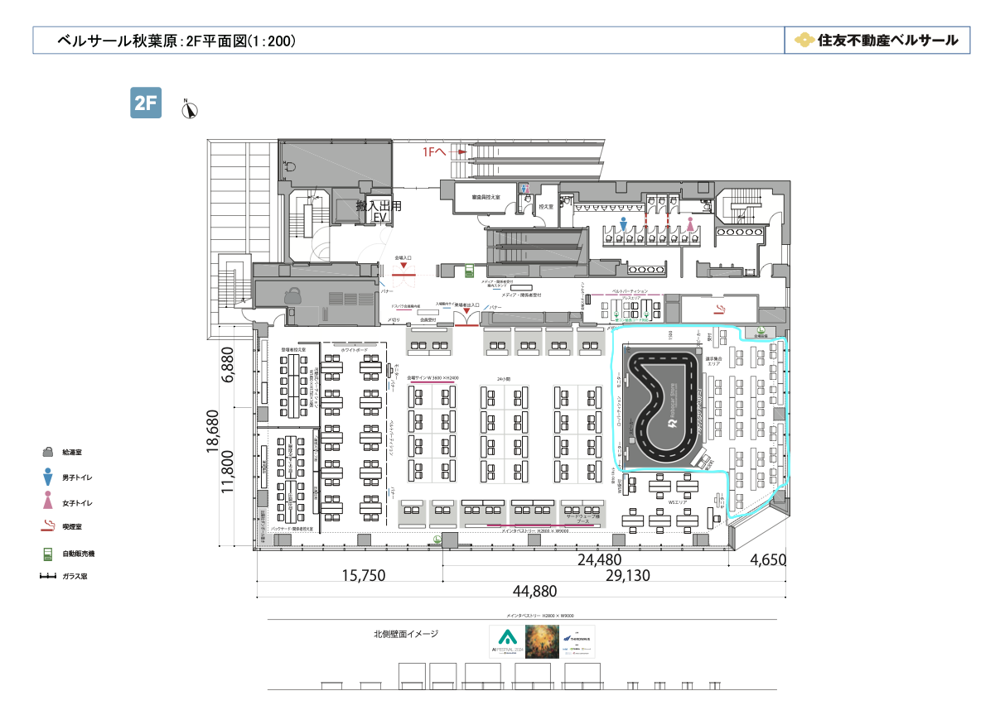
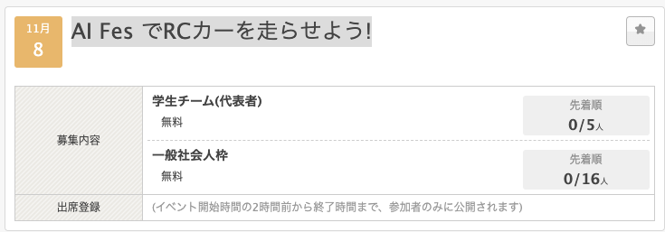
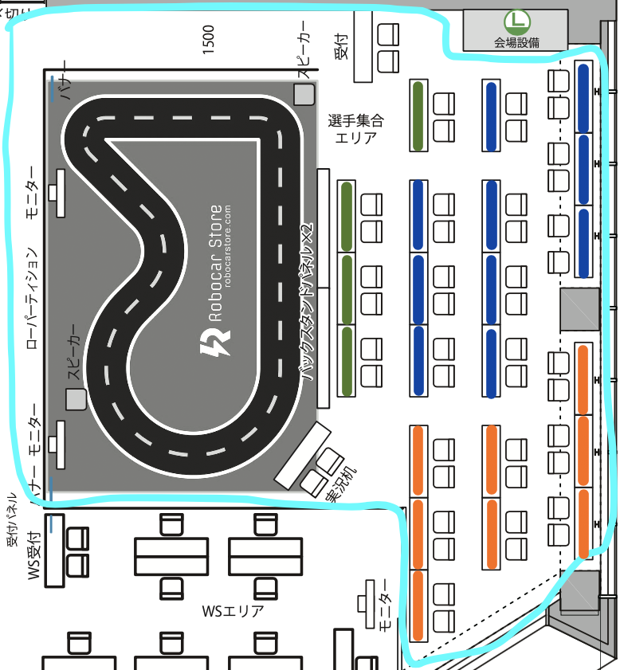
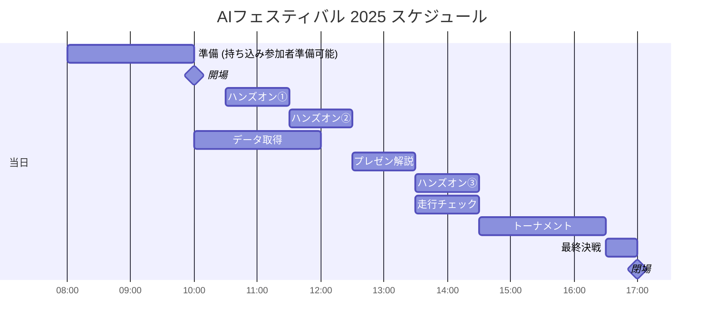

# AIフェスティバル 2025でAI RCカーを走らせよう！

<div align="right"> ymmtny 2025.7.11  </div>
<br>
AIでRCカーを走らせよう！ in AIフェスティバルは AI RCカー持参のレーサ同士の交流と 広くAI Fesに参加された方々全員に
これから来るAIのある生活をコンパクトに肌で知ってもらうことを目的としています。

<br>


*テクノロジーの大波は「オモチャ」のようなものからやってくる*

  ```
  「センサー」「マイコン」「クウラウド」「GPU」「ニューラルネットワーク」がある。Donkey Carの走行会では、
  これから来るAIのある生活をコンパクトに肌で知ることができる。
  ```

<div align="right">
<a href="https://ascii.jp/elem/000/001/895/1895561/">引用元 [遠藤諭のプログラミング＋日記 第66回]</a></div>


### [AIフェスティバル 概要](https://www.aifestival.jp/)

- 11/8(土）秋葉原 AIクリエイターズマーケット、アートグランプリなどあります 現在進行中のハッカソンもある
- 参加者は AIに関心のある成人がメイン
- 入場無料: [ドスパラアプリ会員登録が必要](https://www.dospara.co.jp/5info/cts_lp_members_apps.html)



---

## レーサーの皆様へ

- レーサーは AI RCカー持ち込み 会場に設置したコースで 自動走行を行えます。
- 事前申込で人数を確定、学生チームでの参加も可能です。
  - デュアル対戦のトーナメントを実施します。
    　例 ドンキーカー、ジェットレーサなど
  - トーナメントに参加は必須ではありませんので、デモンストレーションとしてのユニークなAI RCカーを自由に走行させてください。

      例 カエルAIカー、ミニオンAIカー

- 前日11月7日（金）14:00～18:00 事前準備可能です。
- 当日11月8日（土）8:00～ から会場に入れます。
    - 10:00 入場開始
    - 17:00 閉場

### 【申込】

下記のconnpassの下記のイベントページで行っております。学生チーム:募集数:５ チーム, 一般個人:16人を募集します、参加費は無料です。

<div align="center"><br>
 申込ページ: <a href="https://ai-rc-mft2023.connpass.com/event/362203/">AI Fes でRCカーを走らせよう!</a><br><br>
</div>


### レイアウト

- レース参加者 机(青、橙色) x18
  >  机に2人なら MAX 36人です
- 走行準備用机 x2

   次にコースを利用する車体(プレゼン時のデモ、ハンズオン、トーナメント)を一時的におく場所です。

- 一般 ハンズオン 机x4 (緑の机 １机はアシスタント席)
- 実況席


  ### 机と募集枠

    - 緑: セルフハンズオン ３机とアシスタントの１机で = 4机
    - 青: 学生チーム:募集数を５、 机 2つ           = 10机
    - 橙: 一般個人:募集 16人 (二人で一机を共有)    = ８机

  <br>
  

  > WiFi 事情は　十分とのこと (ハッカソンなどもやっているため)


### タイムテーブル

- 10:00  開場

    10:00-12:15, 13:30-14:30にコースを自由に利用可能。譲り合い、共有して走行データの取得や、AI走行のテストを行う。

- 12:30 遠藤さん、佐々木さんによる AI RCカーとは何かについて、解説を行う (45分)。そのデモとして、特定のAI RCカーやロボットをコースで走らせることも可能。
- 14:30からトーナメントとして、対戦形式のAIRCカーの競争を行う。３週コースを周回させて競争。
- 16:30 トーナメント決勝を行う。優勝したAI RCカーに人間のマニュアル操作でのラジコンカーを競わせても面白いだろう。

  ※ 10:30, 11:30, 13:30の枠中で、AI RCカーの体験プログラムを一般AIFes参加者向けに行っています。事前に準備した３台のドンキーカーを貸し出して 体験してもらうハンズオンを実施予定です。コースの利用は ハンズオンと走行チームで全体で共有です。


| 時間        | プログラム              | コース               | 内容                                                | 備考 |
|:------------|:------------------------|:---------------------|:----------------------------------------------------|:-----|
| 前日        |                         |                      |                                                     |      |
| 14:00-18:00 | 準備                    | 持ち込み             | ハンズオン用車体のAIモデル構築                      |      |
| 当日        |                         |                      |                                                     |      |
| 8:00-10:00  | 準備                    | 持ち込み             | 持ち込み参加者も準備可能とする                      |      |
| 10:00       | 開場                    |                      |                                                     |      |
| 10:30       | ハンズオン①             | ハンズオン、持ち込み | ハンズオンや持ち込みAICarによる走行(マニュアル、AI) |      |
| 11:30       | ハンズオン②             | ハンズオン、持ち込み | 同上                                                |      |
| 12:30       | AI RCカーとロボティクス | プレゼンター、デモ   | 遠藤さん、佐々木さんによる解説                      |      |
| 13:30       | ハンズオン③             | ハンズオン、持ち込み | ハンズオンや持ち込みAICarによる走行(マニュアル、AI  |      |
| 14:30       | トーナメント            | 持ち込み             | 持ち込みAICarでのデュアル対戦                       |      |
| 16:30       | 最終決戦                | 持ち込み             | AIvs人間(レースで買った車体と人間)も実施            |      |
| 17:00       | 閉場                    |                      |                                                     |      |



---

メモ

- [自動運転ミニカーバトル2024の準決勝の様子。緑色の車体がFaBo](https://x.com/gclue_akira/status/1850847403949322586)

- [色々な公開AIカーイベント](https://thundering-feverfew-bcc.notion.site/14b59d0b08a980efbdb4d53606ebefc1?v=e18fce51dbe4479f92462faf673511a6)

