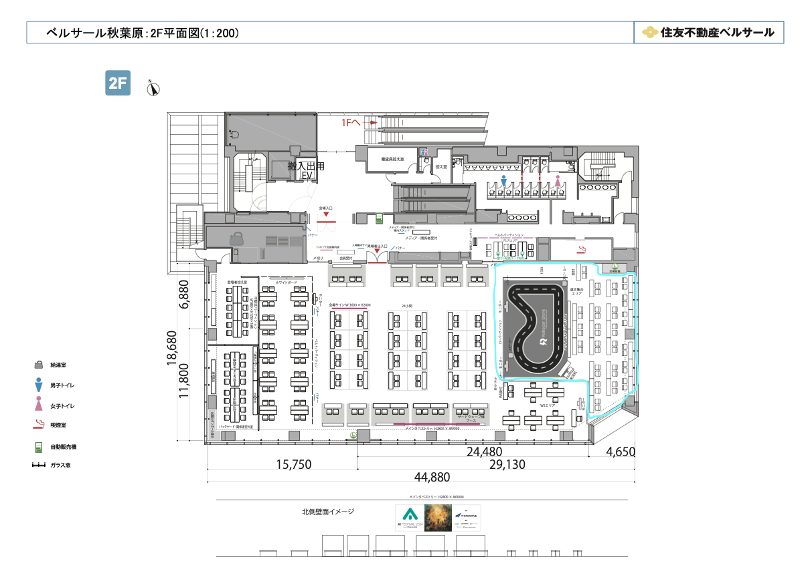
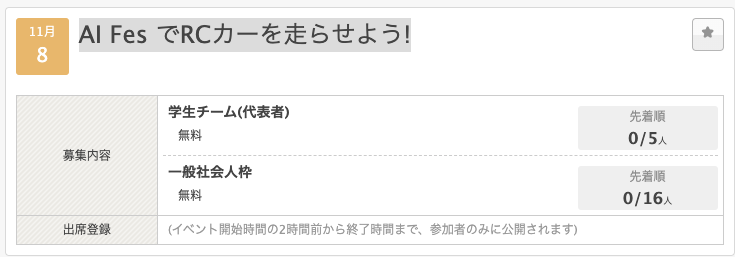
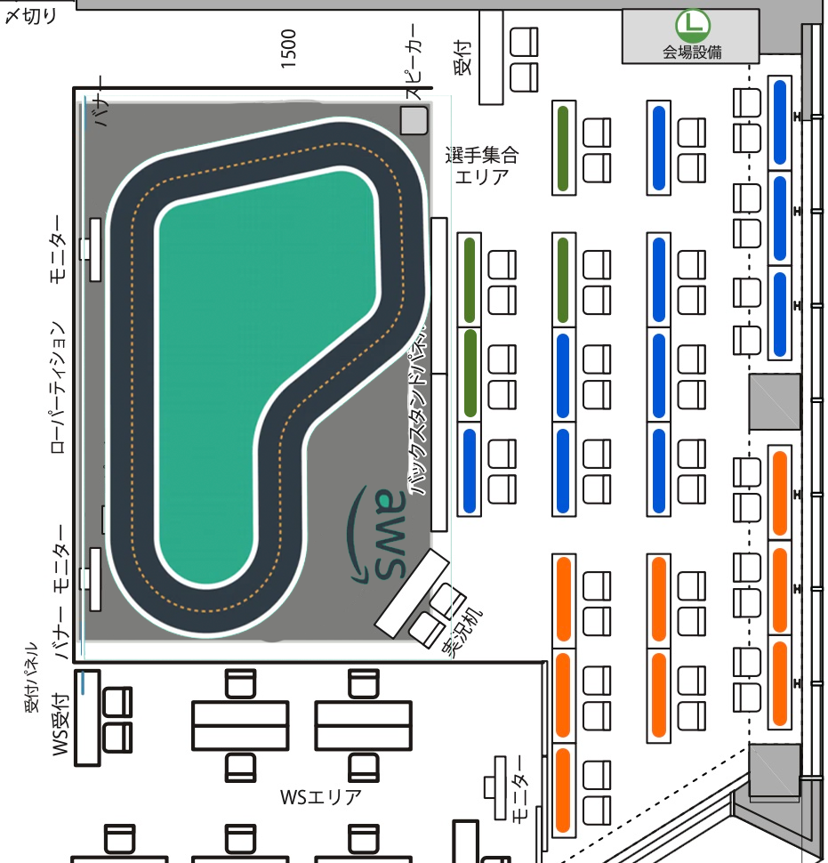
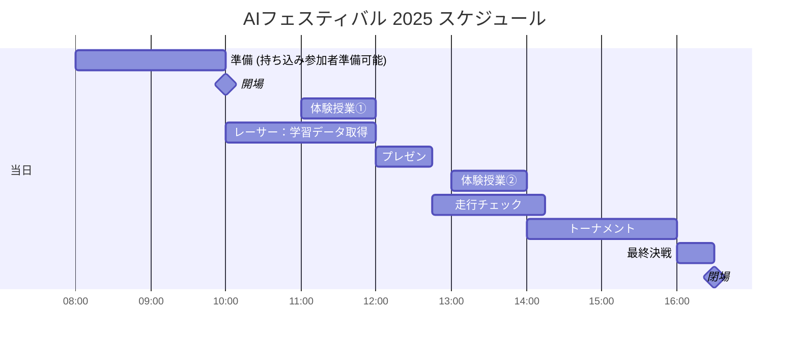

# AIフェスティバル 2025でAI RCカーを走らせよう！

<div align="right"> ymmtny 2025.7.21  </div>
<br>
AIでRCカーを走らせよう！ in AIフェスティバルは AI RCカー持参のレーサ同士の交流と 広くAI Fesに参加された方々全員に
これから来るAIのある生活をコンパクトに肌で知ってもらうことを目的としています。

<br>


*テクノロジーの大波は「オモチャ」のようなものからやってくる*

  ```
  「センサー」「マイコン」「クウラウド」「GPU」「ニューラルネットワーク」がある。Donkey Carの走行会では、
  これから来るAIのある生活をコンパクトに肌で知ることができる
  ```

<div align="right">
<a href="https://ascii.jp/elem/000/001/895/1895561/">引用元 [遠藤諭のプログラミング＋日記 第66回]</a></div>


### [AIフェスティバル 概要](https://www.aifestival.jp/)

- 11/8(土）秋葉原 AIクリエイターズマーケット、アートグランプリなどあります 現在進行中のハッカソンもある
- 参加者は AIに関心のある成人がメイン
- 入場無料: [ドスパラアプリ会員登録が必要](https://www.dospara.co.jp/5info/cts_lp_members_apps.html)



---

## レーサーの皆様へ

- レーサーは AI RCカー持ち込み 会場に設置したコースで 自動走行を行えます。
- 事前申込で人数を確定、学生チームでの参加も可能です。
  - デュアル対戦のトーナメントを実施します。
    　例 ドンキーカー、ジェットレーサなど
  - トーナメントに参加は必須ではありませんので、デモンストレーションとしてのユニークなAI RCカーを走行でも構いません。

      例 カエルAIカー、ミニオンAIカー

- 前日11月7日（金）14:00～18:00 事前準備可能です。
- 当日11月8日（土）8:00～ から会場に入れます。
    - 10:00 入場開始
    - 17:00 閉場

### 【申込】

下記のconnpassの下記のイベントページで行っております。学生チーム:募集数:５ チーム, 一般個人:16人を募集します、参加費は無料です。

<div align="center"><br>
 申込ページ: <a href="https://ai-rc-mft2023.connpass.com/event/362203/">AI Fes でRCカーを走らせよう!</a><br><br>
</div>


### レイアウト

- レース参加者 机(青、橙色) x18
  >  机に2人なら MAX 36人です
- 走行準備用机 x2

   次にコースを利用する車体(プレゼン時のデモ、体験授業、トーナメント)を一時的におく場所です。

- 体験授業 机x4 (緑の机 １机はアシスタント席)
- 実況席


  ### 机と募集枠

    - 緑: 体験授業 ３机とアシスタントの１机で = 3机
    - 青: 学生チーム:募集数を５、 机 2つ           = 10机
    - 橙: 一般個人:募集 16人 (二人で一机を共有)    = ８机

  <br>
  

### タイムテーブル

- 10:00  開場

    10:00-12:15, 13:30-14:30にコースを自由に利用可能。譲り合い、共有して走行データの取得や、AI走行のテストを行う。

- 12:00 遠藤さん、佐々木さんによる AI RCカーとは何かについて、解説を行う (30分)。そのデモとして、特定のAI RCカーやロボットをコースで走らせることも可能。
- 14:30からトーナメントとして、対戦形式のAIRCカーの競争を行う。３週コースを周回させて競争。
- 16:30 トーナメント決勝を行う。優勝したAI RCカーに人間のマニュアル操作でのラジコンカーを競わせても面白いだろう。

  ※ 11:00, 13:00に　AI RCカーの体験授業のプログラムを一般AIFes参加者向けに行っています。事前に準備した2台のドンキーカーを使い、体験授業をを実施予定です。コースの利用は 体験授業と走行チームで全体で共有です。


| 時間        | プログラム              | コース               | 内容                                                | 備考 |
|:------------|:------------------------|:---------------------|:----------------------------------------------------|:-----|
| 前日        |                         |                      |                                                     |      |
| 14:00-18:00 | 準備                    | レーサー             | 体験授業用車体のAIモデル構築                      |      |
| 当日        |                         |                      |                                                     |      |
| 8:00-10:00  | 準備                    | レーサー             | レーサー参加者も準備可能とする                      |      |
| 10:00-11:00 | 開場                    | レーサー             | レーサーAICarによる走行(マニュアル、AI)                                                    |      |
| 11:00       | 体験授業①              | 体験授業、レーサー     | 同上                                                |      |
| 12:00       | 【プレゼン】 <br>AI RCカーとロボティクス | プレゼンター、デモ   | 遠藤さん、佐々木さんによる解説                      |      |
| 12:30       |                       |            レーサー | 同上                                                |      |
| 13:00       | 体験授業②             | 体験授業、レーサー | 体験授業やレーサーAICarによる走行(マニュアル、AI  |      |
| 14:00       |                       |            レーサー | 同上                                                |      |
| 14:30       | 【トーナメント】            | レーサー             | レーサーAICarでのデュアル対戦                       |      |
| 16:30       | 最終決戦                | レーサー             | 【Extra】<br>AIvs人間(レースで買った車体と人間)も実施            |      |
| 17:00       | 閉場                    |                      |                                                     |      |

<div style="width: 1600px; overflow-x: auto;">


```mermaid
gantt
    title AIフェスティバル 2025 スケジュール
    dateFormat YYYY-MM-DD HH:mm
    axisFormat %H:%M

    section 当日
    準備 (持ち込み参加者準備可能) :prep2, 2024-11-08 08:00, 2h
    開場 :milestone, open, 2024-11-08 10:00, 0h
    体験授業① :hands1, 2024-11-08 11:00, 1h
    レーサー：学習データ取得 :racer, after open, 2h
    プレゼン :presentation, after racer, 0.75h
    体験授業② :hands3,2024-11-08 13:00, 1h
    走行チェック :hands4, after presentation, 1.5h
    トーナメント :tournament, after hands3, 2h
    最終決戦 :final, after tournament, 30m
    閉場 :milestone, close, after final, 0h
```

</div>

---

メモ

- [自動運転ミニカーバトル2024の準決勝の様子。緑色の車体がFaBo](https://x.com/gclue_akira/status/1850847403949322586)

- [色々な公開AIカーイベント](https://thundering-feverfew-bcc.notion.site/14b59d0b08a980efbdb4d53606ebefc1?v=e18fce51dbe4479f92462faf673511a6)

