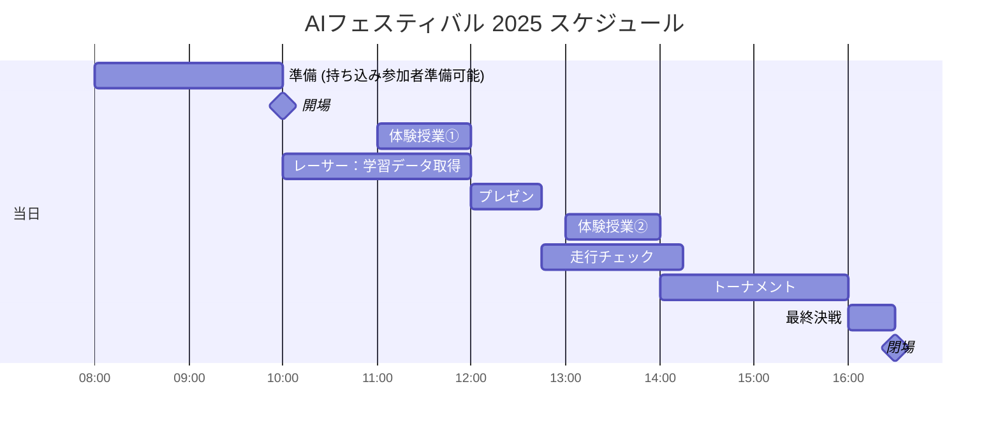
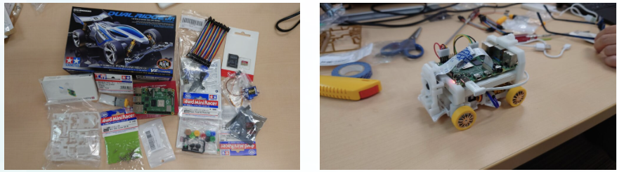
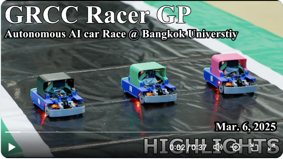
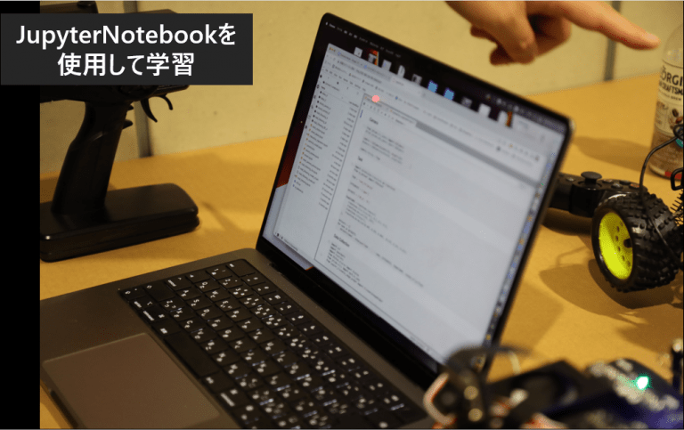
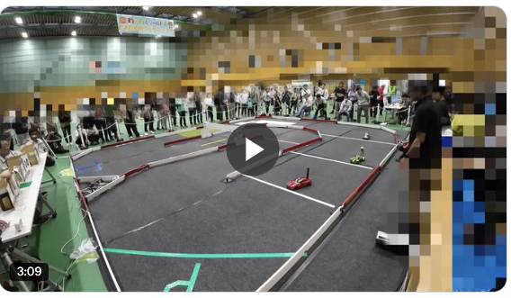

# AIフェスティバル 2025でAI RCカーを走らせよう！

<div align="right"> ymmtny 2025.7.21  </div>
<br>
AIでRCカーを走らせよう！ in AIフェスティバルは AI RCカー持参のレーサ同士の交流と 広くAI Fesに参加された方々全員に
これから来るAIのある生活をコンパクトに肌で知ってもらうことを目的としています。

<br>


*テクノロジーの大波は「オモチャ」のようなものからやってくる*

  ```
  「センサー」「マイコン」「クウラウド」「GPU」「ニューラルネットワーク」がある。Donkey Carの走行会では、
  これから来るAIのある生活をコンパクトに肌で知ることができる
  ```

<div align="right">
<a href="https://ascii.jp/elem/000/001/895/1895561/">引用元 [遠藤諭のプログラミング＋日記 第66回]</a></div>


### [AIフェスティバル 概要](https://www.aifestival.jp/)

- 11/8(土）秋葉原 AIクリエイターズマーケット、アートグランプリなどあります 現在進行中のハッカソンもある
- 参加者は AIに関心のある成人がメイン
- 入場無料: [ドスパラアプリ会員登録が必要](https://www.dospara.co.jp/5info/cts_lp_members_apps.html)


---

## レーサーの皆様へ

- レーサーは AI RCカー持ち込み 会場に設置したコースで 自動走行を行えます。
- 事前申込で人数を確定、学生チームでの参加も可能です。
  - デュアル対戦のトーナメントを実施します。
    　例 ドンキーカー、ジェットレーサなど
  - トーナメントに参加は必須ではありませんので、デモンストレーションとしてのユニークなAI RCカーを走行でも構いません。

      例 カエルAIカー、ミニオンAIカー

- 前日11月7日（金）14:00～18:00 事前準備可能です。
- 当日11月8日（土）8:00～ から会場に入れます。
    - 10:00 入場開始
    - 17:00 閉場

### 【申込】

下記のconnpassの下記のイベントページで行っております。学生チーム:募集数:５ チーム, 一般個人:16人を募集します、参加費は無料です。

<div align="center"><br>
 申込ページ: <a href="https://ai-rc-mft2023.connpass.com/event/362203/">AI Fes でRCカーを走らせよう!</a><br><br>
</div>


### レイアウト

- レース参加者 机(青、橙色) x18
  >  机に2人なら MAX 36人です
- 走行準備用机 x2

   次にコースを利用する車体(プレゼン時のデモ、体験授業、トーナメント)を一時的におく場所です。

- 体験授業 机x4 (緑の机 １机はアシスタント席)
- 実況席


  ### 机と募集枠

    - 緑: 体験授業 ３机とアシスタントの１机で = 3机
    - 青: 学生チーム:募集数を５、 机 2つ           = 10机
    - 橙: 一般個人:募集 16人 (二人で一机を共有)    = ８机

  <br>
  

### タイムテーブル

- 10:00  開場

    10:00-12:15, 13:30-14:30にコースを自由に利用可能。譲り合い、共有して走行データの取得や、AI走行のテストを行う。

- 12:00 遠藤さん、佐々木さんによる AI RCカーとは何かについて、解説を行う (30分)。そのデモとして、特定のAI RCカーやロボットをコースで走らせることも可能。
- 14:30からトーナメントとして、対戦形式のAIRCカーの競争を行う。３週コースを周回させて競争。
- 16:30 トーナメント決勝を行う。優勝したAI RCカーに人間のマニュアル操作でのラジコンカーを競わせても面白いだろう。

  ※ 11:00, 13:00に　AI RCカーの体験授業のプログラムを一般AIFes参加者向けに行っています。事前に準備した2台のドンキーカーを使い、体験授業をを実施予定です。コースの利用は 体験授業と走行チームで全体で共有です。


| 時間        | プログラム              | コース               | 内容                                                | 備考 |
|:------------|:------------------------|:---------------------|:----------------------------------------------------|:-----|
| 前日        |                         |                      |                                                     |      |
| 14:00-18:00 | 準備                    | レーサー             | 体験授業用車体のAIモデル構築                      |      |
| 当日        |                         |                      |                                                     |      |
| 8:00-10:00  | 準備                    | レーサー             | レーサー参加者も準備可能とする                      |      |
| 10:00-11:00 | 開場                    | レーサー             | レーサーAICarによる走行(マニュアル、AI)                                                    |      |
| 11:00       | 体験授業①              | 体験授業、レーサー     | 同上                                                |      |
| 12:00       | 【プレゼン】 <br>AI RCカーとロボティクス | プレゼンター、デモ   | 遠藤さん、佐々木さんによる解説                      |      |
| 12:30       |                       |            レーサー | 同上                                                |      |
| 13:00       | 体験授業②             | 体験授業、レーサー | 体験授業やレーサーAICarによる走行(マニュアル、AI  |      |
| 14:00       |                       |            レーサー | 同上                                                |      |
| 14:30       | 【トーナメント】            | レーサー             | レーサーAICarでのデュアル対戦                       |      |
| 16:30       | 最終決戦                | レーサー             | 【Extra】<br>AIvs人間(レースで買った車体と人間)も実施            |      |
| 17:00       | 閉場                    |                      |                                                     |      |



#### サポーター
| 役割       | プログラム   | 前日                           | 当日      | 時間              |
|--------------|--------------|--------------------------------|-----------|-------------------|
| 講師　　　　 | 体験授業   | 前日データ作成, 車体準備 | 午前 午後 | 11:00 13:00 |
| 進行役　　　 | プレゼン・トーナメント | プレゼン、コンテストの進行 | 午前 午後 | 12:00 14:00~ |
| 実況者       | トーナメント |                                | 午後      | 14:30~            |


---

## **体験授業**

当日の一般AIFesの参加者が、実際のAI RCカーを動作させる体験を授業形式で講師が解説します。

  - [ ] 机x3 3組 (1-3名)のグループ・親子で参加も可能
  - [ ]  一回 60分 11:00~, 13:00~の2回
  - [ ] PC/車体は３台を準備、参加者は学習データ取得のラジコン操作を実施します。

  内容

  1. AI搭載ラジコンを触ってみる (15分程度)

  2. AIモデル構築 (20分程度)

     - 用意された手順書を見ながら、 End2EndのAIモデルを構築する
     - 走行ボタン、学習ボタン、推論ボタンの3ボタン構成の車体

       > 学習には２０分程度かかる。学習中は 他の展示を見学や休息も可能

       > アシスタント要員も付帯するが、jupyterlabのノートブックを使った解説を講師が行う。

     - [ ] マニュアル作成  内容 参考 2024 skipcity (fabo) 手順 - jetson nano 1/16 donkey

         - [AIカーの走行(ディリー) AI走行](https://kwiksher.com/Hangout/AI-RC/SkipCity2024/daily/jupyterlab.html)
         - [AIカーの操作(土日)　学習](https://kwiksher.com/Hangout/AI-RC/SkipCity2024/weekend/run_car.html)

  3. 自動走行の確認　(10分程度)


---

## メモ

準備するもの

- 電源タップを各机
- A1模造紙 マジック 対戦表
- 実況用マイク・カメラ

  - [x] WiFi 事情は　十分とのこと (ハッカソンなどもやっているため)

体験授業
- WiFi ルーターを閉じた形で 準備して、体験用RCカーを固定IPアドレスで接続する
- バッテリ、F710など

Fabo
- 普通のラジコン プロポ
- AI RCカー
- コース
- コーン・養成テープ

その他展示
- ロボットアーム？
- OpenDuckMin？

過去のワークショップ

> フルスクラッチの場合は どちらも 4時間は必要

- TatamiRacer

  TatamiRacerワークショップでは、4時間の枠のうち、組み立てに約3時間、残り1時間くらいが走行といった感じでした。このときは、AI学習による走行は時間がなく実施できませんでした😊

  - https://dsforum.jp/2022/special/1802/
    - 参加費　5,000円
  - https://speakerdeck.com/covao/minisi-qu-besunoaika-tatamiracernozhi-zuo?slide=9

  - https://github.com/covao/TatamiRacer

  

- KAIT QT

  https://x.com/KAITRacerGP/status/1902208807599841593


  

  <video src="./img/KAIT_QT_1.mov" width="400" controls></video>

  バンコクへ8台持ち込んで、各参加大学へ（一部　賞として）置いて来ました。レースで車両改善できるので、イベント事は出来るだけお手伝い出来ればと思います。コース拝見しました、もし光沢面であればは白トビでAIカーには厳しそうな気がしました…完熟（練習）に20分くらい、データ取りは最低10周（10〜20分）データ転送（ノートパソコン）学習20分くらい、講義や説明無しでひと通り流すだけなら2コマ 200分くらい（トラブル無ければ）

    https://www.townnews.co.jp/0404/2024/08/16/746810.html

  
  <div align="center">引用元 https://aismiley.co.jp/ai_news/ai-rc-maker-faire-tokyo-2022/ </div>

----
<div style="page-break-before:always"></div>

## 参考

取り組んでいる大学や高校など

### 学生

1. 神奈川工科大学(KAIT Qt)
2. 会津大学

[KAIT Racer GP 7 2025年3月22日 合計 11チーム](https://www.kait.jp/news/post_286.html)

  3.   豊田西高校
  4.   神奈川県立 厚木北高
  5.   神奈川県立商工高
  6.   明星大学

  - [KAIT Racer GP 8」2025/9/20(土)](https://x.com/KAITRacerGP/status/1923720031042720013)

[自動運転ミニカーバトル2024 - 無制限 16チーム](https://autonomous-minicar-battle.github.io/race-2024/)

  7.  海陽学園
  8.  名城大学
  9.  刈谷工科

   - [自動運転ミニカーバトル2024の準決勝の様子。緑色の車体がFaBo](https://x.com/gclue_akira/status/1850847403949322586)

     


[C1 Japan 2025 EXPO (6/22)](https://x.com/c1race/status/1937660639222329760)
  - https://c1race.com/c1-japan-2025/

   ```
   P1 #1 YOKOMO・・・FPV
   P2 #10 すしみーず・・・FPV
   P3 #100 OKOME・・・FPV
   P4 #27 SPEEDNAUTS・・・AI
   ```

一般社会人で、AI RC Carのコミュニティーで過去にMaker Faireなどに自分のAIカーを持って参加した方々は ２０名ほど

----

## 参考 AI RCカー チーム

### 一般個人

  1. 浦川さん(カエルカー)　
  2. 長濱さん（ミニオン）　　
  3. 本田さん（ゴエモン）
  4. 小林（TatamiRacer)　
  5. 熊沢さん　　　
  6. 遠藤さん　　　
  7. 佐々木さん　
  8. 近藤さん
  9. 河村さん
  10. 服部さん
  11. 中島さん
  12. 堀さん
  13. タミヤ 滝博士
  14. スバル?
  15. ダイハツ?

----

7/8 メモ

```
当日
　コトプランニングのチーム
　　高野さん　会場の運営　RCかーの担当
　　山田さん　メインステージ

　　選手集合エリア
  　バックスタンドのロゴのパネル
   　　2mの高さ <== 変更する
　ロゴ
　紹介動画・解説動画
  　インタービュー動画
    Youtube 月、水、金で関連動画を流している
　　　　　一回5分 x3回 8月11日の週
　　　　　7月別途調整
　前日と当日
　　11/7(金) 1:00PM - 18:00 PM
      人数制限はないので、予め人数を連絡。
      搬入物をそのまま置いて行っても大丈夫です。
    11/8(土) 8:00AM -
    入場無料
      ドスパラの会員 スマホで見せればOK

  コースは佐々木さんが持ち込んでくれる

  車は可能？
  　地下の駐車畳は入場は可能だが、駐車できない。

  参加者の状況は 8月にアップデート

  9月にウェブのページの更新
```

[公開AIカーイベント](https://thundering-feverfew-bcc.notion.site/14b59d0b08a980efbdb4d53606ebefc1?v=e18fce51dbe4479f92462faf673511a6)

https://x.com/aminicarclub


----

協力費
- [ ] 部品代金
- [ ] 学生向け旅費?