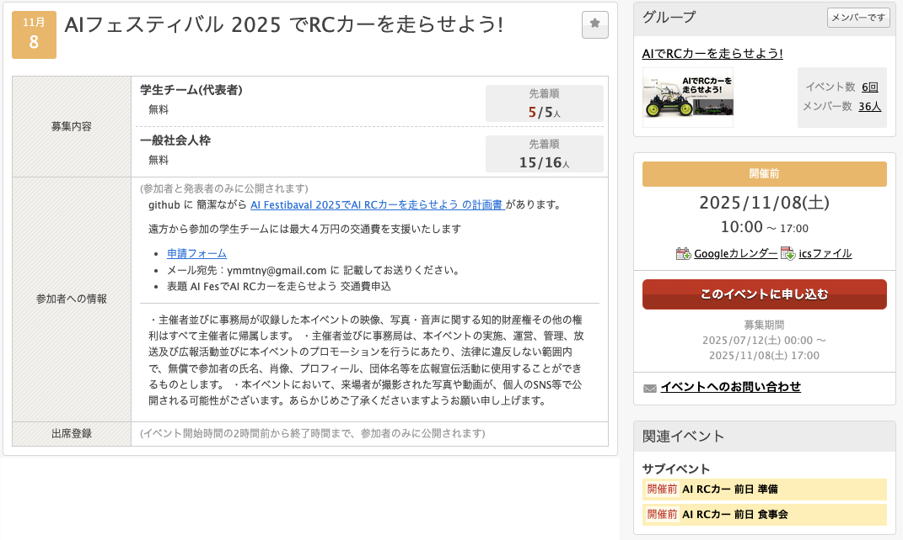
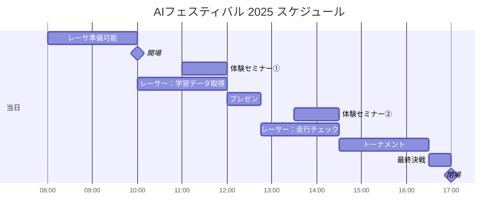

# AIフェスティバル 2025でAI RCカーを走らせよう！

<div align="right"> ymmtny 2025.10.2  </div>
<br>
AIでRCカーを走らせよう！ in AIフェスティバルは AI RCカー持参のレーサ同士の交流と 広くAI Fesに参加された方々全員に
これから来るAIのある生活をコンパクトに肌で知ってもらうことを目的としています。

<br><br>


*テクノロジーの大波は「オモチャ」のようなものからやってくる*

  ```
  「センサー」「マイコン」「クウラウド」「GPU」「ニューラルネットワーク」がある。Donkey Carの走行会では、
  これから来るAIのある生活をコンパクトに肌で知ることができる
  ```

<div align="right">
<a href="https://ascii.jp/elem/000/001/895/1895561/">引用元 [遠藤諭のプログラミング＋日記 第66回]</a></div>


### [AIフェスティバル 概要](https://www.aifestival.jp/)

- 11/8(土）秋葉原 AIクリエイターズマーケット、アートグランプリなどあります 現在進行中のハッカソンもある
- 参加者は AIに関心のある成人がメイン
- 入場無料: [ドスパラアプリ会員登録が必要](https://www.dospara.co.jp/5info/cts_lp_members_apps.html)


---

## レーサーの皆様へ

- レーサーは AI RCカー持ち込み 会場に設置したコースで 自動走行を行えます。
- 事前申込で人数を確定、学生チームでの参加も可能です。
  - デュアル対戦のトーナメントを実施します。
    　例 ドンキーカー、ジェットレーサなど
  - トーナメントに参加は必須ではありませんので、デモンストレーションとしてのユニークなAI RCカーを走行でも構いません。お披露目として トーナメント一回戦に参加してください。

      例 カエルAIカー、ミニオンAIカー

  - 対戦は３周早く周回したほうが勝ちです。

    コースにはコーンが置いてありますので、著しくコースを外れて周回した場合は審判の判断に従ってください。

  - [ ] 賞品？

- 前日11月7日（金）14:00～18:00 事前準備可能です。

  **前日準備に参加するには 申込**が必要です。Connpassのサブイベントで申込をお願いします。

  - **前日 18:30~ 秋葉原で食事会**しましょう。

    参加可能な方は Connpassのサブイベントで申込をお願いします。人数確定後にお店を確保してご連絡いたします。

- 当日11月8日（土）8:00～ から会場に入れます。
    - 10:00 入場開始
    - 17:00 閉場

  - 当日 8:30, 9:00, 9:30 会場入口で 入場パスを配布します。ドスパラ会員証を提示してください。
  - この時間より遅れる場合は AI Festivalの一般参加者の列に並んで、入場してください。ドスパラ会員証を提示してください。

- 電源タップを用意してください。机近くには電源が用意されていますが、机上にはコンセントはありません。

- 会場のWiFiを利用可能ですが、混線の可能性が全く無いということではございませんので、その点はご留意ください。

### 【申込】

下記のconnpassの下記のイベントページで行っております。学生チーム:募集数:５ チーム, 一般個人:16人を募集します、参加費は無料です。

<div align="center"><br>
 申込ページ: <a href="https://ai-rc-mft2023.connpass.com/event/362203/">AI Fes でRCカーを走らせよう!</a><br><br>
</div>

#### 前日 11/7(金) 14:00〜の準備と食事会に参加可能方は サブイベントの申込をお願いします。

  - [AI RCカー 前日 準備](https://connpass.com/event/371352/) 締め切り 10/15
  - [AI RCカー 前日 食事会](https://connpass.com/event/371353/) 締め切り 11/3

### レイアウト

- レース参加者 机(青、橙色) x18
  >  机に2人なら MAX 36人です
- 走行準備用机 x2

   次にコースを利用する車体(プレゼン時のデモ、体験セミナー、トーナメント)を一時的におく場所です。

- 体験セミナー 机x4 (緑の机 １机はアシスタント席)
- 実況席


  ### 机と募集枠

    - 緑: 体験セミナー ３机とアシスタントの１机で = 3机
    - 青: 学生チーム:募集数を５、 机 2つ           = 10机
    - 橙: 一般個人:募集 16人 (二人で一机を共有)    = ８机

  <br>
  

### タイムテーブル

- 10:00  開場

    10:00-12:15, 13:30-14:30にコースを自由に利用可能。譲り合い、共有して走行データの取得や、AI走行のテストを行う。

- 12:00 遠藤さん、佐々木さんによる AI RCカーとは何かについて、解説を行う (30分)。そのデモとして、特定のAI RCカーやロボットをコースで走らせることも可能。
- 14:30からトーナメントとして、対戦形式のAIRCカーの競争を行う。３週コースを周回させて競争。
- 16:30 トーナメント決勝を行う。優勝したAI RCカーに人間のマニュアル操作でのラジコンカーを競わせても面白いだろう。

  ※ 11:00, 13:00に　AI RCカーの体験セミナーのプログラムを一般AIFes参加者向けに行っています。事前に準備した2台のドンキーカーを使い、体験セミナーをを実施予定です。コースの利用は 体験セミナーと走行チームで全体で共有です。


| 時間        | プログラム              | コース               | 内容                                                | 備考 |
|:------------|:------------------------|:---------------------|:----------------------------------------------------|:-----|
| 前日        |                         |                      |                                                     |      |
| 14:00-18:00 | 準備                    | レーサー             | 体験セミナー用車体のAIモデル構築                      |      |
| 当日        |                         |                      |                                                     |      |
| 8:00-10:00  | 準備                    | レーサー             | レーサー参加者も準備可能とする                      |      |
| 10:00-11:00 | 開場                    | レーサー             | レーサーAICarによる走行(マニュアル、AI)                                                    |      |
| 11:00       | 体験セミナー①              | 体験セミナー、レーサー     | 同上                                                |      |
| 12:00       | 【プレゼン】 <br>AI RCカーとロボティクス | プレゼンター、デモ   | 遠藤さん、佐々木さんによる解説                      |      |
| 12:30       |                       |            レーサー | 同上                                                |      |
| 13:30       | 体験セミナー②             | 体験セミナー、レーサー | 体験セミナーやレーサーAICarによる走行(マニュアル、AI  |      |
| 14:00       |                       |            レーサー | 同上                                                |      |
| 14:30       | 【トーナメント】            | レーサー             | レーサーAICarでのデュアル対戦                       |      |
| 16:30       | 最終決戦                | レーサー             | 決勝戦<br>時間があれば AIvs人間(レースで買った車体と人間)
| 17:00       | 閉場                    |                      |                                                     |      |



#### サポーター
| 役割       | プログラム   | 前日                           | 当日      | 時間              |
|--------------|--------------|--------------------------------|-----------|-------------------|
| 講師　　　　 | 体験セミナー   | 前日データ作成, 車体準備 | 午前 午後 | 11:00 13:30 |
| 進行役　　　 | プレゼン・トーナメント | プレゼン、コンテストの進行 | 午前 午後 | 12:00 14:00~ |
| 実況者       | トーナメント |                                | 午後      | 14:30~            |


---

<div style="page-break-before:always"></div>

## **体験セミナー**

当日の一般AIFesの参加者が、実際のAI RCカーを動作させる体験をセミナー形式で講師が解説します。

  - [ ] 机x3 3組 (1-3名)のグループ・親子で参加も可能
  - [ ]  一回 60分 11:00~, 13:30~の2回
  - [ ] PC/車体は３台を準備、参加者は学習データ取得のラジコン操作を実施します。
    - [ ] ディスプレイ+PC x3

  内容

  1. AI搭載ラジコンを触ってみる (15分程度)

  2. AIモデル構築 (20分程度)

     - 用意された手順書を見ながら、 End2EndのAIモデルを構築する
     - 走行ボタン、学習ボタン、推論ボタンの3ボタン構成の車体

       > 学習には２０分程度かかる。学習中は 他の展示を見学や休息も可能

       > アシスタント要員も付帯するが、jupyterlabのノートブックを使った解説を講師が行う。

     - [ ] マニュアル作成  内容 参考 2024 skipcity (fabo) 手順 - jetson nano 1/16 donkey

         - [AIカーの走行(ディリー) AI走行](https://kwiksher.com/Hangout/AI-RC/SkipCity2024/daily/jupyterlab.html)
         - [AIカーの操作(土日)　学習](https://kwiksher.com/Hangout/AI-RC/SkipCity2024/weekend/run_car.html)

  3. 自動走行の確認　(10分程度)


---

## メモ

準備するもの

- 電源タップを各机
- A1模造紙 マジック 対戦表
- 実況用マイク・カメラ

  - [x] WiFi 事情は　十分とのこと (ハッカソンなどもやっているため)

体験セミナー
- WiFi ルーターを閉じた形で 準備して、体験用RCカーを固定IPアドレスで接続する
- バッテリ、F710など

Fabo
- 普通のラジコン プロポ
- AI RCカー
- コース
- コーン・養成テープ

その他展示
- ロボットアーム？
- OpenDuckMin？

過去のワークショップ

> フルスクラッチの場合は どちらも 4時間は必要

- TatamiRacer

  TatamiRacerワークショップでは、4時間の枠のうち、組み立てに約3時間、残り1時間くらいが走行といった感じでした。このときは、AI学習による走行は時間がなく実施できませんでした😊

  - https://dsforum.jp/2022/special/1802/
    - 参加費　5,000円
  - https://speakerdeck.com/covao/minisi-qu-besunoaika-tatamiracernozhi-zuo?slide=9

  - https://github.com/covao/TatamiRacer

  

- KAIT QT

  https://x.com/KAITRacerGP/status/1902208807599841593


  

  <video src="./img/KAIT_QT_1.mov" width="400" controls></video>

  バンコクへ8台持ち込んで、各参加大学へ（一部　賞として）置いて来ました。レースで車両改善できるので、イベント事は出来るだけお手伝い出来ればと思います。コース拝見しました、もし光沢面であればは白トビでAIカーには厳しそうな気がしました…完熟（練習）に20分くらい、データ取りは最低10周（10〜20分）データ転送（ノートパソコン）学習20分くらい、講義や説明無しでひと通り流すだけなら2コマ 200分くらい（トラブル無ければ）

    https://www.townnews.co.jp/0404/2024/08/16/746810.html

  
  <div align="center">引用元 https://aismiley.co.jp/ai_news/ai-rc-maker-faire-tokyo-2022/ </div>

----
<div style="page-break-before:always"></div>

## 参考

取り組んでいる大学や高校など

### 学生

1. 神奈川工科大学(KAIT Qt)
2. 会津大学

[KAIT Racer GP 7 2025年3月22日 合計 11チーム](https://www.kait.jp/news/post_286.html)

  3.   豊田西高校
  4.   神奈川県立 厚木北高
  5.   神奈川県立商工高
  6.   明星大学

  - [KAIT Racer GP 8」2025/9/20(土)](https://x.com/KAITRacerGP/status/1923720031042720013)

[自動運転ミニカーバトル2024 - 無制限 16チーム](https://autonomous-minicar-battle.github.io/race-2024/)

  7.  海陽学園
  8.  名城大学
  9.  刈谷工科

   - [自動運転ミニカーバトル2024の準決勝の様子。緑色の車体がFaBo](https://x.com/gclue_akira/status/1850847403949322586)

     


[C1 Japan 2025 EXPO (6/22)](https://x.com/c1race/status/1937660639222329760)
  - https://c1race.com/c1-japan-2025/

   ```
   P1 #1 YOKOMO・・・FPV
   P2 #10 すしみーず・・・FPV
   P3 #100 OKOME・・・FPV
   P4 #27 SPEEDNAUTS・・・AI
   ```

一般社会人で、AI RC Carのコミュニティーで過去にMaker Faireなどに自分のAIカーを持って参加した方々は ２０名ほど

