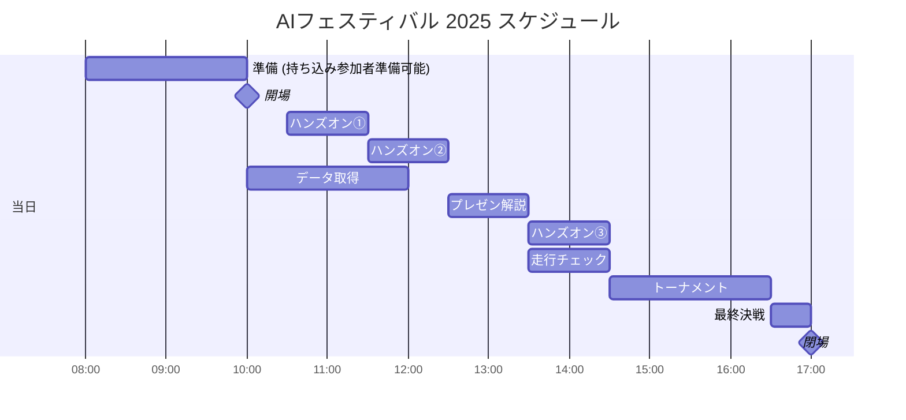
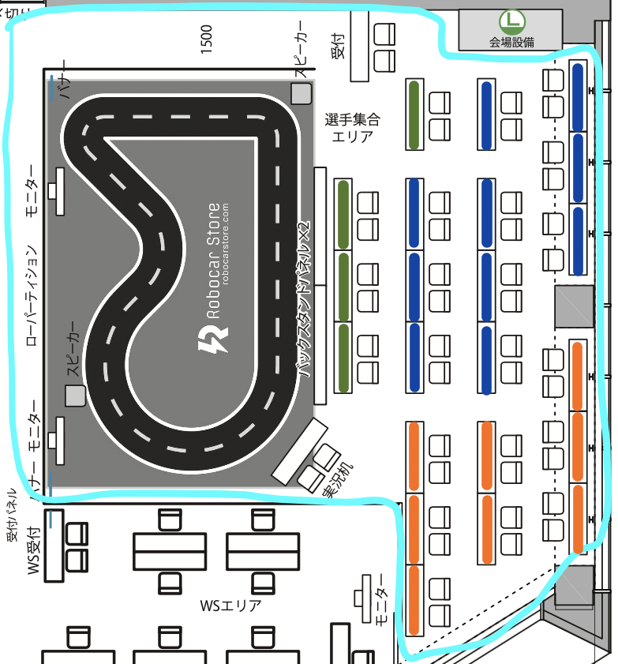
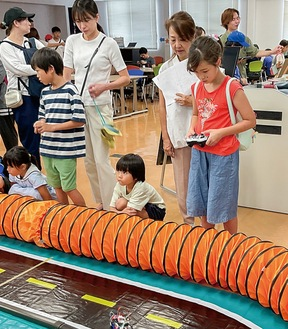
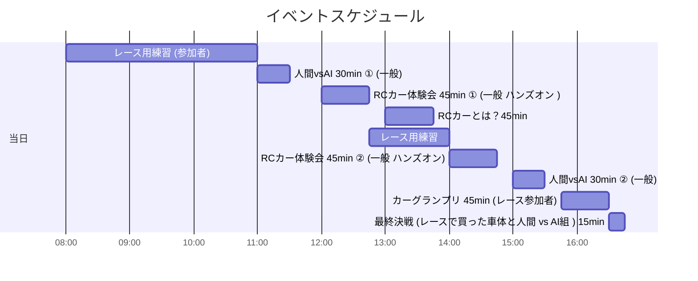
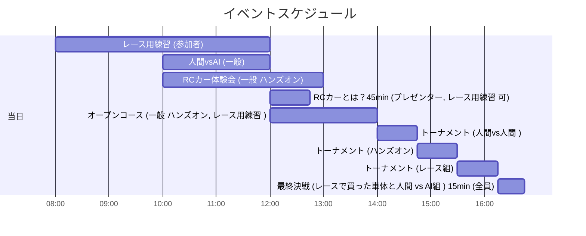
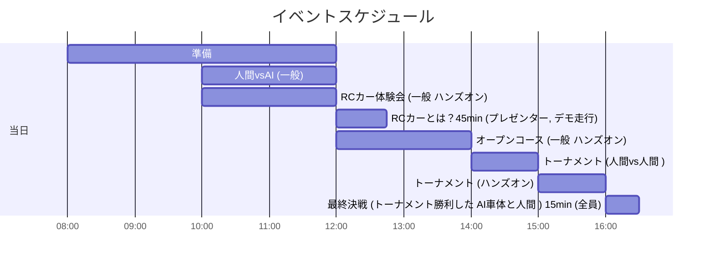

```
当日
　コトプランニングのチーム
　　高野さん　会場の運営　RCかーの担当
　　山田さん　メインステージ

　　選手集合エリア
  　バックスタンドのロゴのパネル
   　　2mの高さ <== 変更する
　ロゴ
　紹介動画・解説動画
  　インタービュー動画
    Youtube 月、水、金で関連動画を流している
　　　　　一回5分 x3回 8月11日の週
　　　　　7月別途調整
　前日と当日
　　11/7(金) 1:00PM - 18:00 PM
      人数制限はないので、予め人数を連絡。
      搬入物をそのまま置いて行っても大丈夫です。
    11/8(土) 8:00AM -
    入場無料
      ドスパラの会員 スマホで見せればOK

  コースは佐々木さんが持ち込んでくれる

  車は可能？
  　地下の駐車畳は入場は可能だが、駐車できない。

  参加者の状況は 8月にアップデート

  9月にウェブのページの更新
```

# AIフェスティバル 2025

<div align="right"> ymmtny 2025.7.8 </div>

AIでRCカーを走らせよう！

https://www.aifestival.jp/

- 11/8(土）秋葉原 AIクリエイターズマーケット、アートグランプリなどあります 現在進行中のハッカソンもある
- 参加者は AIに関心のある成人がメイン

---

- 前日11月7日（金）14:00～18:00 事前準備
- 当日11月8日（土）8:00～ から会場に入れます。
    - 10:00 入場開始
    - 17:00 閉場

### AI RCカー 参加者区分

- 一般　セルフハンズオン
    1. AI搭載ラジコンを触ってみる

      　事前学習済みの自動走行AIRCカーと競争もできます (AIvs人間)

    2. AIモデル構築
       - 用意された手順書を見ながら、 End2EndのAIモデルを構築する
       - 走行ボタン、学習ボタン、推論ボタンの3ボタン構成の車体

         > 学習には２０分程度かかる。学習中は 他の展示を見学や休息も可能

         > アシスタント要員も付帯するが、jupyterlabのノートブックを使ったことがある程度の事前知識が必要


       - [ ] マニュアル作成  内容 参考 2024 skipcity (fabo) 手順 - jetson nano 1/16 donkey

           - [AIカーの走行(ディリー) AI走行](https://kwiksher.com/Hangout/AI-RC/SkipCity2024/daily/jupyterlab.html)
           - [AIカーの操作(土日)　学習](https://kwiksher.com/Hangout/AI-RC/SkipCity2024/weekend/run_car.html)

       - [ ] 机x3 3組 (1-3名)のグループ・親子で参加も可能
         - [ ] PC/車体は３台
       - [ ]  一回 45分 10:30~, 11:30~, 13:30~の３回

- 経験者 AI RCカー持ち込み
  - デモ走行
      例 カエルAIカー、ミニオンAIカー、リモート操作、ロボット？
  - レース
    　例 ドンキーカー、ジェットレーサなど

<div style="page-break-before:always"></div>

### タイムテーブル

- ハンズオン参加者は４５分間の参加枠(10:30, 11:30, 13:30)中で、持ち込み参加者は 10:00-12:15, 13:30-14:30にコースを自由に利用可能。譲り合い、共有して走行データの取得や、AI走行のテストを行う。

- 12:30遠藤さん、佐々木さんによる AI RCカーとは何かについて、解説を行う (45分)。そのデモとして、特定のAI RCカーやロボットをコースで走らせることも可能。
- 14:30からトーナメントとして、対戦形式のAIRCカーの競争を行う。３週コースを周回させて競争。
- 16:30 トーナメント決勝を行う。優勝したAI RCカーに人間のマニュアル操作でのラジコンカーを競わせても面白いだろう。


| 時間        | プログラム              | コース               | 内容                                                | 備考 |
|:------------|:------------------------|:---------------------|:----------------------------------------------------|:-----|
| 前日        |                         |                      |                                                     |      |
| 14:00-18:00 | 準備                    | 持ち込み             | ハンズオン用車体のAIモデル構築                      |      |
| 当日        |                         |                      |                                                     |      |
| 8:00-10:00  | 準備                    | 持ち込み             | 持ち込み参加者も準備可能とする                      |      |
| 10:00       | 開場                    |                      |                                                     |      |
| 10:30       | ハンズオン①             | ハンズオン、持ち込み | ハンズオンや持ち込みAICarによる走行(マニュアル、AI) |      |
| 11:30       | ハンズオン②             | ハンズオン、持ち込み | 同上                                                |      |
| 12:30       | AI RCカーとロボティクス | プレゼンター、デモ   | 遠藤さん、佐々木さんによる解説                      |      |
| 13:30       | ハンズオン③             | ハンズオン、持ち込み | ハンズオンや持ち込みAICarによる走行(マニュアル、AI  |      |
| 14:30       | トーナメント            | 持ち込み             | 持ち込みAICarでのデュアル対戦                       |      |
| 16:30       | 最終決戦                | 持ち込み             | AIvs人間(レースで買った車体と人間)も実施            |      |
| 17:00       | 閉場                    |                      |                                                     |      |


- コースの利用は ハンズオンと走行チームで全体で共有です。

#### サポーター
| 参加者       | プログラム   | 前日                           | 当日      | 時間              |
|--------------|--------------|--------------------------------|-----------|-------------------|
| アシスタント | ハンズオン   | 前日データ作成, ハンズオン理解 | 午前 午後 | 10:30 11:30 13:30 |
| 実況者       | トーナメント |                                | 午後      | 14:30~            |

<div style="page-break-before:always"></div>

### レイアウト

- 実況席
- 走行準備用机 x2
   次にコースを利用する車体(プレゼン時のデモ、ハンズオン、トーナメント)を一時的におく場所です。
- 一般 ハンズオン 机x4 (真ん中 緑で囲った机 １机はアシスタント席)
- レース参加者 机 x18

- [ ] 机やエリアの増設の検討について
  - 机に2人なら24人ですが　作業スペースとしてやや狭い
  - 神奈川工科大学や会津大学といった学生チームが参加する場合は、机一つずつは必要。


  

  

    - 緑: セルフハンズオン ３机とアシスタントの１机で = 4机
    - 青: 学生チーム:募集数を５、 机 2つ           = 10机
    - 橙: 一般個人:募集 16人 (二人で一机を共有)    = ８机

  ### 一般個人

    1. 浦川さん(カエルカー)　
    2. 長濱さん（ミニオン）　　
    3. 本田さん（ゴエモン）
    4. 小林（TatamiRacer)　
    5. 熊沢さん　　　
    6. 浦さん　　　
    7. 佐々木さん　
    8. 近藤さん
    9. 河村さん
    10. 服部さん
    11. 中島さん
    12. 堀さん
    13. タミヤ 滝博士
    14. スバル?
    15. ダイハツ?

  ### 学生

  1. 神奈川工科大学(KAIT Qt)
  2. 会津大学

  KAIT Racer GP 7 2025年3月22日 合計11チーム
    https://www.kait.jp/news/post_286.html

    3.   豊田西高校
    4.   神奈川県立 厚木北高
    5.   神奈川県立商工高
    6.   明星大学

  自動運転ミニカーバトル2024 - 無制限 16チーム
  https://autonomous-minicar-battle.github.io/race-2024/

   7.  海陽学園
   8.  名城大学
   9.  刈谷工科

    KAIT Racer GP 8」2025/9/20(土)
    https://x.com/KAITRacerGP/status/1923720031042720013


  C1 Japan 2025 EXPO (6/22)
  https://x.com/c1race/status/1937660639222329760
  ```
  P1 #1 YOKOMO・・・FPV
  P2 #10 すしみーず・・・FPV
  P3 #100 OKOME・・・FPV
  P4 #27 SPEEDNAUTS・・・AI
    https://c1race.com/c1-japan-2025/
  ```

---
人間vsAI
- [自動運転ミニカーバトル2024の準決勝の様子。緑色の車体がFaBo](https://x.com/gclue_akira/status/1850847403949322586)


準備するもの

- 電源タップを各机
- A1模造紙 マジック 対戦表
- 実況用マイク・カメラ

  - [x] WiFi 事情は　十分とのこと (ハッカソンなどもやっているため)

Fabo
- 普通のラジコン プロポ
- AI RCカー
- コース
- コーン・養成テープ

その他展示
- ロボットアーム？
- OpenDuckMin？

-----
<div style="page-break-before:always"></div>

### 検討用メモ (obsolete)

```
吉見です。
先ほどはお時間いただきありがとうございました。

口頭でお伝えしましたが
前日11月7日（金）は14時～18時で会場で作業ができます。
当日11月8日（土）は8時から会場に入れます。
そして10時に入場開始となります。

当日のイベントのスケジュールですが、
ざっくり考えてみました。
こんな感じの一日で、いかがでしょうか？

＝＝
10時会場

11時～11時30分【参加】
人間vsAI　RCカーバトル①

12時～12時45分【参加】
RCカー体験会（前半）
※事前募集＋当日参加？
※参加者はPC持参をマストとするか？

13時～13時45分【見学】
RCカープレゼンテーション
・RCカーとは？
・RCカーの遊び方
・上級者によるデモ走行、エキシビジョン
・リモートによるデモ走行
・これからRCカーをはじめたい人にアドバイス

14時～14時45分【参加】
RCカー体験会（後半）

15時～15時30分【参加】
人間vsAI　RCカーバトル②

15時45分～16時45分【参加＆見学】
全日本AIRCカーグランプリ2025（仮称）

17時閉場
＝＝
```

```
Akira
走行ボタン、学習ボタン、推論ボタンの3ボタン構成
  ちょっと、車体の構成考えてみますね。
模倣学習のロボットを横で動かしても面白いかもしれないですね。
  ロボットアーム
  DonkeyCarの進化系 -> ロボットアーム
  ロボットアームの進化系 -> Humanoid
  OpenDuckMiniもっていきますか
  https://github.com/apirrone/Open_Duck_Mini
RCカーコミュニティのエリアとして確保して引き込んで見せるとかですかね。まずは平面図を詰めさせてもらってですね。
  レース組(当日準備)
  ハンズオン組(前日準備)
  人間 vs AI組(前日データ作成)
  最終決戦: 興行的には、レースで買った車体と人間 vs AI組 というのが面白そう

Satoshi
  たしかに。ラスボスが人間だと。
```


ワークショップ

> どちらも 4時間は必要

- TatamiRacer

  TatamiRacerワークショップでは、4時間の枠のうち、組み立てに約3時間、残り1時間くらいが走行といった感じでした。このときは、AI学習による走行は時間がなく実施できませんでした😊

  - https://dsforum.jp/2022/special/1802/
    - 参加費　5,000円
  - https://speakerdeck.com/covao/minisi-qu-besunoaika-tatamiracernozhi-zuo?slide=9

  - https://github.com/covao/TatamiRacer

  

- KAIT QT

  https://x.com/KAITRacerGP/status/1902208807599841593


  

  バンコクへ8台持ち込んで、各参加大学へ（一部　賞として）置いて来ました。レースで車両改善できるので、イベント事は出来るだけお手伝い出来ればと思います。コース拝見しました、もし光沢面であればは白トビでAIカーには厳しそうな気がしました…完熟（練習）に20分くらい、データ取りは最低10周（10〜20分）データ転送（ノートパソコン）学習20分くらい、講義や説明無しでひと通り流すだけなら2コマ 200分くらい（トラブル無ければ）

    https://www.townnews.co.jp/0404/2024/08/16/746810.html

    神奈川工科大学（小宮一三学長／下荻野）が主催する科学体験型のイベント「ＫＡＩＴサイエンスサマー〜わくわくする未来を体験しよう〜」 ホノマイケル夏奈子さん（小４）は「ラジコンの操作は難しかったけど、楽しかった」

    

----
<div style="page-break-before:always"></div>

----

### 提案１

- AIvs人間 子供がラジコンとして、プロポでAI RCカーを操作するのみ
- ハンズオンでは Fabo作成のデモAIカー（jetson nanoで通常走行ボタン、学習AIモデル作成ボタン、AI走行ボタン）で、AI走行を体験
  - [ ] 台数は3台くらい？　一回 20分程度
- 作業エリアは、一般・ハンズオンの参加者が利用することはないので、AI RCカーを持参の経験者の参加者を多く募集可能。




<div style="page-break-before:always"></div>

### 提案2

- AIvs人間は、子供がラジコンとして、プロポでAI RCカーを操作するのみ
- ハンズオンでは、組み立て> 学習走行 > AIモデル作成 > AI走行と一通りの流れ実施する
  - KAIT Qt または TatamiRacer
  - ハンズオンでRCカー、

- [ ] ハンズオンの実施のため、AI RCカーを持参の経験者の参加者は**最大12名程度**?が望ましい　(机一台に２名）

  > 持参可能な経験者が、持参する代わりに Qt/TatamiRacerのハンズオンに参加も可能だろう

- [ ] ハンズオンは 6机 ペア参加可能
- [ ] KAIT Qt or TatamiRacer?





### 提案3

- 提案１、提案２の**経験者**による持参RCカーの持ち込み参加を**自粛**する、KAIT QtまたはTatamiRacerのみとする
- 解説・デモ走行として
  1. 浦川さん(カエルカー)
  1. Fabo Jetracer


- [ ] ハンズオンは 12机
- [ ] KAIT Qt ６台と TatamiRacerの 6台


