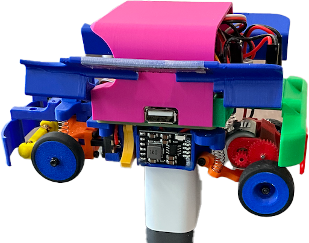

## AI ミニカー体験セミナー

３０分程度で 基本的なワークフローを解説します。

予約表ですので、お名前をお書きください。時間になったら ご案内いたします。定員６名で締め切りです

### 午前 11:00~

> **職種例**: エンジニア、デザイナー、マネージャー


| | 名前 |  |　　| |職種|
|------|------|------|------|------|------|
| 1.   |      | |
| 2.   |      | |
| 3.   |      | |
| 4.   |      | |
| 5.   |      | |
| 6.   |      | |

<br>
<br>


----

### 午後 1:30~

| | 名前 |  |　　| |職種|
|------|------|------|------|------|------|
| 1.   |      | |
| 2.   |      | |
| 3.   |      | |
| 4.   |      | |
| 5.   |      | |
| 6.   |      | |


<br>
<br>



神奈川工科大学: KAIT-QT　[知能移動モビリティ研究室](https://researchmap.jp/seiji-komiya)　小宮先生より、
KAIT Qtを三台 今回のAI Festival 2025でお借りしています。


- [ ] 接続・起動

  2つのバッテリー（ラズパイ用・モーター用）を装着
  WiFiルーター経由でPCから接続
  データ記録

- [ ] F710ゲームパッドで手動運転

  Bボタンで記録On/Off
  10-15周（3-5分）の走行で2000-6000データセット収集
  学習

- [ ] PCにデータを転送（rsync）
  donkey uiでデータ確認・クリーニング
  モデル学習を実行
  学習済みモデルをラズパイに転送
  自動走行

- [ ] 学習済みモデルで自動運転モード

  Startボタンでモード切替（手動→半自動→完全自動）
  Aボタンで緊急停止

- [ ] コマンド

  ```
  # ラズパイ側
  python manage.py drive --js
  python manage.py drive --js --model models/mypilot.h5

  # PC側
  rsync -rv pi@10.20.171.221:~/mycar/data/ ~/projects/mycar/data/
  donkey ui
  donkey train --tub ./data --model ./models/mypilot.h5
  ```


----

オープンソースで公開されている tatamiRacerも組み立てみましたので、身近に見ることができます。

https://github.com/covao/TatamiRacer

  「タミヤ ミニ四駆」キットに基づいた小型自動運転車です。


