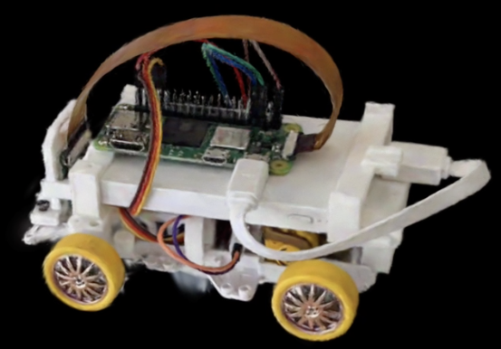
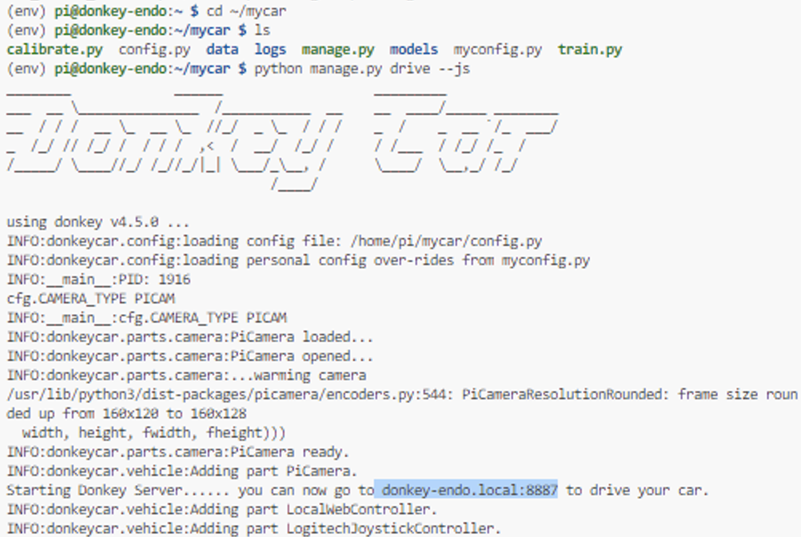
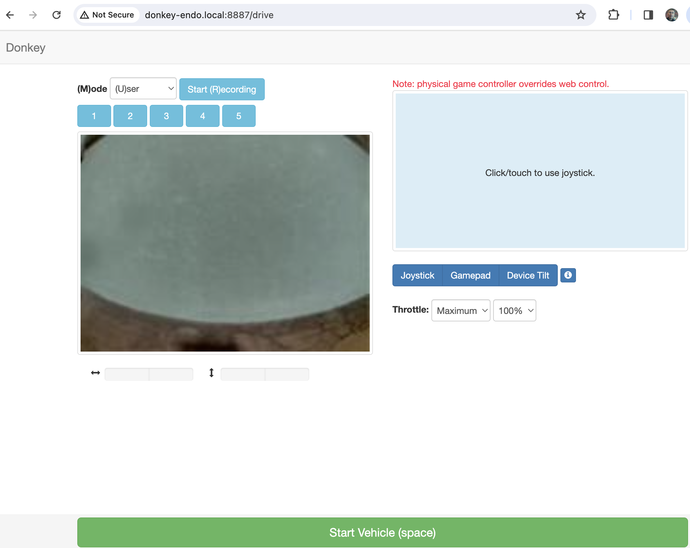
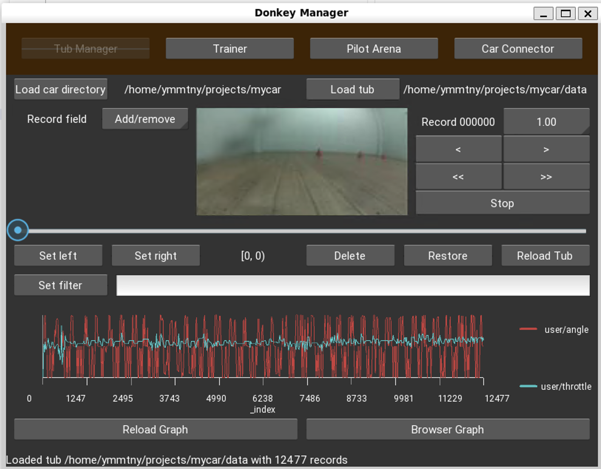
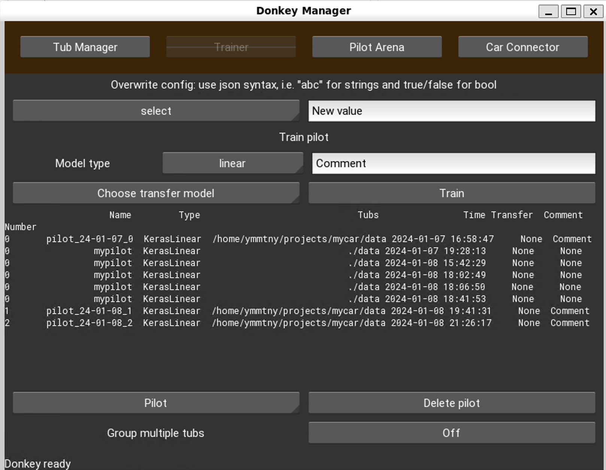
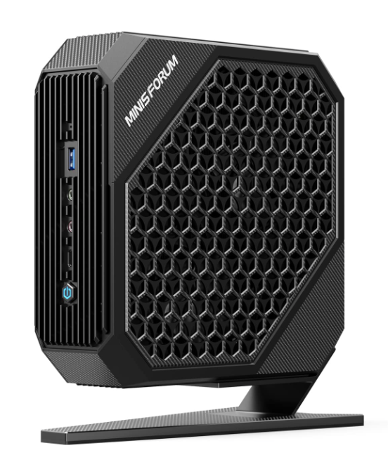
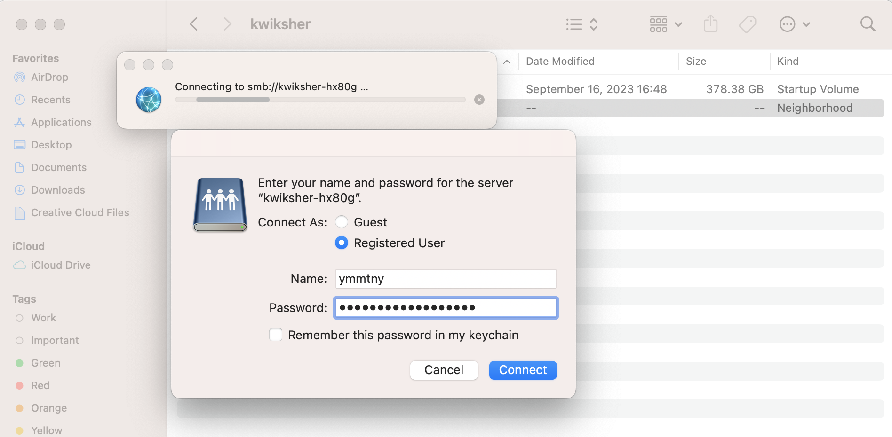
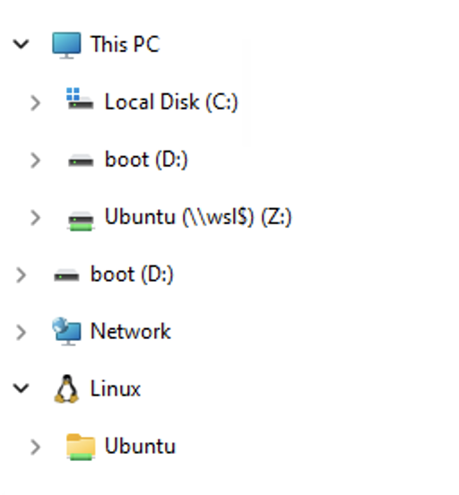
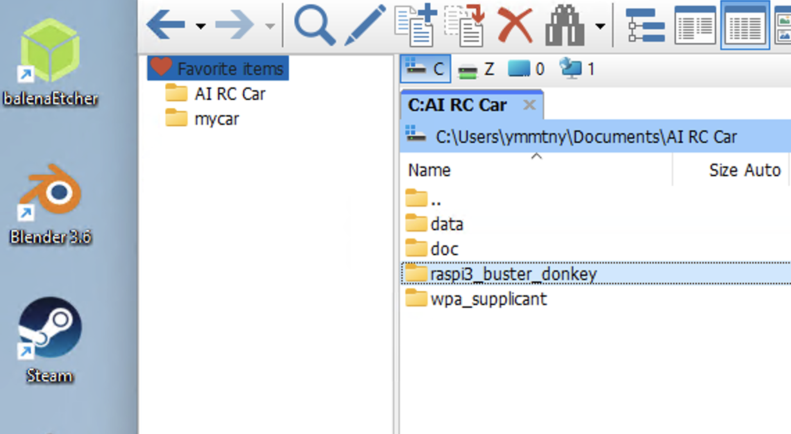

Donkey カー MLOps

Tatamiracer zero mac addresses : 2c:cf:67:b2:b0:45

- [ ] IPアドレスの確認

  ```
  arp -a | grep 2c:cf
  ```

  - [ ] ~/.ssh/configにIPアドレスを設定

    ```
    Host tatamiracer-zero
      HostName 10.20.171.146
      User pi
    ```

車体
- hostname:tatamiracer-zero.local
- ip address: DHCP
- pi:raspberry

- [ ] 電源

  {{}}


## 構図

  ```mermaid
  graph LR

    WiFiRouter[無線LANスポット AI RC Car Fabo]

    subgraph バッテリー管理
      battriesUsed[バッテリー 使用済]
      battriesNext[交換用バッテリー]
      adapterCharge[充電器]
      adapterCharge -.- battriesUsed
    end

    subgraph ラジコン
      mobilebattery[ラズパイ用バッテリー]
      battery[モータ用バッテリー]
      motor[モータ throttle]
      servo[サーボ steering]
      subgraph raspi
        WiFi
        camera[カメラ]
        donkey[donkey SDK <br> web server]
        dataPi[(data)]
        modelPi[[model]]
      end
    end

    subgraph F170[ゲームパッド]
      batterycell[乾電池]
      mode[モードボタンはオフ]
      inut[XInput]
    end

    subgraph PC
      subgraph conda-env-donkey
      　data[(data)]
        model[[model]]
        terminal[terminal<br>学習]
        terminal -.- donkeySDK
      end
      chrome[ブラウザ]
    end


    WiFiRouter-. wpa_supplicant .- WiFi
    WiFiRouter -.- PC
    chrome -. "http 8887" .- donkey
    terminal -. ssh .- raspi
    F170 -.- raspi

  ```


## MLOps

接続
- PC

    .ssh/config 設定済み
    ```
    Host tatamiracer-zero
      HostName 10.20.171.146
      User pi
    ```

  - [ ] ssh して Raspiに入ります

    ```
    ssh pi@kaito-qt-221
    ```

記録

- Raspi

  - [ ] 走行させて E2Eデータを記録します

    ```
    cd ~/mycar

    python manage.py drive --js
    ```

  F710のゲームパッドの動作
    - [ ] 真ん中のLogicoolと書かれたボタンを押して、起動させます
    - [ ] ジョイスティック右 アクセル
    - [ ] ジョイスティック左 ハンドル
    - [ ] Bボタン データ記録 On/Off
    - [ ] Yボタン 直前のデータを消去
    - [ ] Aボタン 緊急停止

  - [ ] 10-15周 3-5分の走行を実施

     > 2000-3000データセットで十分試すことができます。5分で6000データセットが集まります。


  - [ ] manage.py を停止するには ctrl+c

    - [ ] データセットの数を確認

      ```
      ls -l ./data/images | wc-l
      ```

- PC

  - [ ] カメラの確認

     http://10.20.171.146:8887

      Donkey Webでカメラからの映像が表示されていることを確認してください。


学習

- PC
  - [ ] データ取得

    ```
    rsync -rv --progress --partial pi@tatamiracer-zero:~/mycar/data/  ~/projects/mycar/data/
    ```

  - [ ] 学習

    ```
    conda activate donkey

     ~/projects/mycar/
    ```

  - [ ] donkey ui のGUIを立ち上げます

    ```
    donkey ui
    ```

    - [ ] 走行データの確認・エラーデータの削除
    - [ ] 学習実行

  - [ ] モデルのアップロード

    ```
    rsync -rvt --progress --partial ~/projects/mycar/models/ pi@tatamiracer-zero:~/mycar/models/
    ```

自動走行

- Raspi

    - [ ] 自動走行　Auto pilotの実行

      ```
      python manage.py drive --js --model models/mypilot.h5
      ```

      - [ ] tfliteのモデルでも試してみましょう

        ```
        python manage.py drive --js --model ./models/pilot_24-01-08_1.tflite --type tflite_linear
        ```

    - [ ] F710のstartボタンで 手動から、自動モード(Local Angle, Local Angle & Throttle)に切り替えます。

      startボタンで走行が手動・自動が切り替わります。自動モードには ステアリングとスロットルの両方をAIモデルが行う完全な AutoPilotモードと、ステアリングを自動にAIが操作し人間がスロットルを制御するモードがあります。

      1. 人間がスロットルとステアリング
      2. 人間がスロットル、AIがステアリング
      3. AIがスロットル、AIがステアリング

    - [ ] Aボタン(緊急停止)

      衝突した場合は Aボタンを押す。 startボタンで人間操作にして、後退させて再度自動走行を実施します。

----
### Donkey web

  - [ ] カメラ画像が正しく表示されていること

  > 記録中のデータレコード数が ターミナルにログが出てきます。

  > 問題なければ、走行データの記録が可能です、コースにて走行してください。**Bボタン**で記録がOn/Offします。

{{}}

{{}}

---
### Donkey ui

donkey ui を起動して、Tub Managerで走行データの確認が可能です,
Trainerも動作します。

> Pilot ArenaとCarConnectorの動作確認は未実施です。

```
donkey ui
```

{{}}

{{}}

----
### 補足 コンソール操作

1. calibrate in raspi

    ```
    donkey calibrate --channel 1 --bus=1
    donkey calibrate --channel 0 --bus=1
    ```

1. drive in raspi

    https://docs.donkeycar.com/guide/get_driving/

   - 100 records (5 seconds at 20 hz drive loop).
   - 10-20 laps of good data (5-20k images)

   => 5分-10分で 6000-12000 records


1. train in PC

    https://docs.donkeycar.com/guide/deep_learning/train_autopilot/

    FYI..
    - 8000枚　10分
    - 14985 30秒/epoc  20分
    - 19915 40秒/epoc  22分

      > intel macbookpro 2020 だと 19915 60秒/epoc 46分


2. auto pilot tflite

    tfliteのモデルのほうが 自動走行が良く走ります

    ```
    cd ~/mycar
    mypilot=pilot_24-01-07_0.tflite
    python manage.py drive --js --model ./models/$mypilot --type tflite_linear
    ```

---

ゲームパッド

  {{}}

  - XInputを使用して、MODEボタンはOFF（緑色のLEGが消灯）
  - Vibrationボタンでバッテリーが十分であるかの確認ができます。


---
## MLOps サマリー

  ```mermaid
  graph TB
  subgraph Donkeycar
    subgraph raspi[raspi 3A+ tatamiracer-zero]
      app[donkeycar v4.4.0]
      mycardata([mycar/data])
      mycarmodels([mycar/models])
    end
    mobile([モバイルバッテリー])
    battery([ラジコンバッテリー])
    switch([ラジコンスイッチ])
    stirring
    motor
    controller
    app-.-controller
    controller -.- motor
    controller -.- stirring
  end

  subgraph joystick[ゲームパッド]
    buttonB([Bボタン 記録 On/Off])
    buttonY([Yボタン 削除5秒])
    buttonA([Aボタン 緊急停止])
    start([startボタン  手動・Auto])
    stickL([左ジョイスティック<br> ハンドル])
    stickR([右ジョイスティック<br> アクセル])
  end

  joystick -.- app

  subgraph pc[Windows WSL Ubuntu 20.04]
    subgraph mycar[home/ymmtny/projects/mycar]
      data([./data])
      models([./models])
      donkey-ui([donkey ui])
      train([donkey train --tub ./data <br> --model ./models/mypilot.h5])

      data -.-> train
      train -.-> models
    end


    subgraph vscode[ssh tatamiracer-zero]
      drive([python manage.py drive --js])
      driveWithModel([pythn mange.py drive --js <br> --model ./models/mypilot.h5])
    end
  end

  pc -. ssh .- raspi

  data -. rsync .- mycardata
  models -. rsync .- mycarmodels

  donkey-ui -.cleaning.->data

vscode -.ssh.- raspi

  USBAdapter([USB充電])
  mobile -.- USBAdapter
  batteryAdapter([充電器])
  battery -.-batteryAdapter

  WifiSpot[無線LAN AI RC Car Fabo]
  WifiSpot -.- Donkeycar
  WifiSpot -.- pc

  ```

---
## Windows WSL Ubuntu 20.04

ホストPCの環境は HX80GのミニゲーミングPCに構築

{{}}

キーボードとマウスを繋げてください。ヘッドレスでの利用も可能です、Windows Remote Desktopで別のマシンから遠隔アクセス可能です。

Raspiドンキーカーと同じ無線WiFiに接続してください。


### アクセス

- ユーザ: ymmtny
- パスワード: ****

  ネットワークからアクセス可能な共有フォルダとして SMBで 以下の共有フォルダにアクセス可能です。

  - ホスト名: smb://KWIKSHER-HX80G/Users/ymmtny/Documents/Shared

    {{}}


Ubuntuは、Z: ドライブにもマウントしてあります。

{{}}

- [ ] vs code > workspace: AI RC Car(WSL)

    {{TODO screenshot}}


### Doc

この解説のウェブページは、AI RC Car/docフォルダに格納されています。
hugo.exeを起動してウェブサーバがローカルに立ち上がります。

```
hugo.exe server
```

### vscode - mycar

vscodeのAI RC Car(WSL:Ubuntu) のワークスペースを開きます

{{screenshot}}


注意

- 英語キーボード切り替え
  =>
    Microsoft Remotedesktop App > Connections > Keyboard Mode > Unicodeにする

    =>
      powser shellで入力できない、元のscancodeに戻す

- vscodeの EmacsキーのエクステンションでEmacsキーになってます。


---

 <div style="page-break-before:always"></div>

### Raspi img

raspiのイメージのバックアップが AI RC Car/raspi3_buster_donkey フォルダに格納されています。復元には kait-qt-dhcpのimgをつかい、WiFi ルータに接続後に donkey findcar または arp コマンドでIPアドレスを見つけてください。

- [ ] kait-qt-dhcp

  ```
  arp -a | grep $MAC_ADDRESS
  ```

- pi-image.img

  {{}}

  EtcherもWin32DiskManagerもインストール済みです。

---


#### WiFi 接続

raspiドンキーカーを任意のWiFiに接続する場合は、**wpa_supplicant**のファイルを用意して、SDカードに書き込んでください。


wpa_supplicant/AI RC Car 5GHz

```
country=JP
ctrl_interface=DIR=/var/run/wpa_supplicant GROUP=netdev
update_config=1
network={
    ssid="AI RC Car 5GHz"
    psk="AIFestival"
}
```


