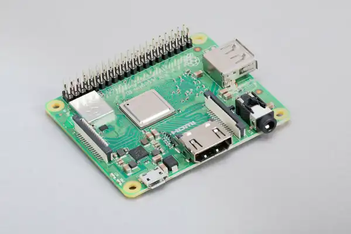
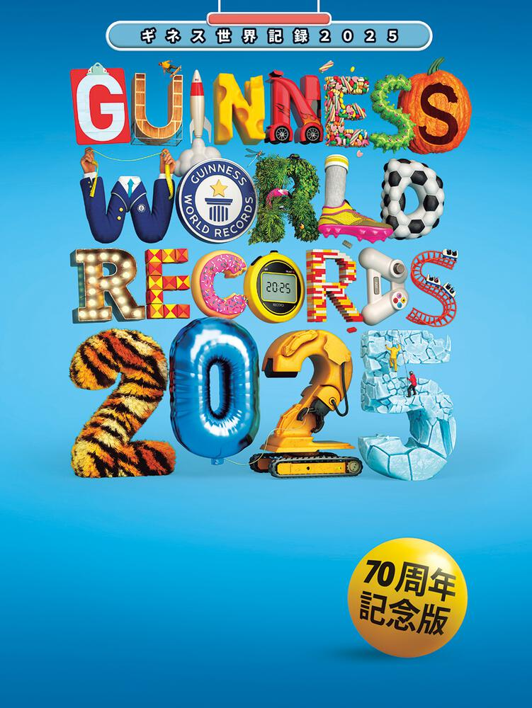
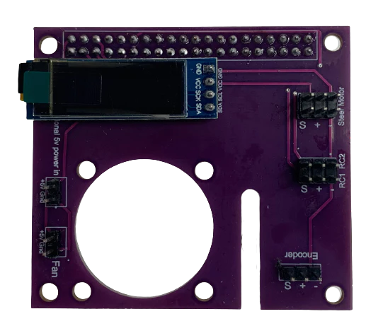
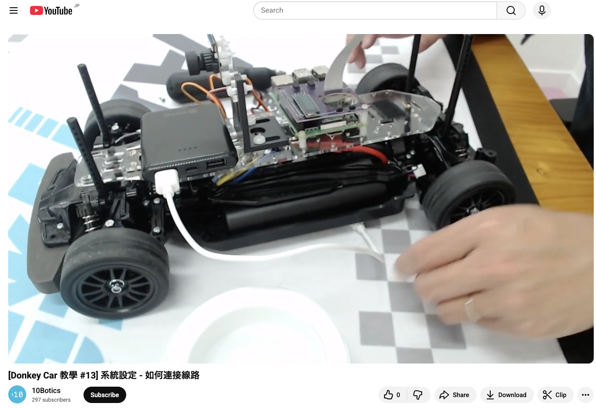
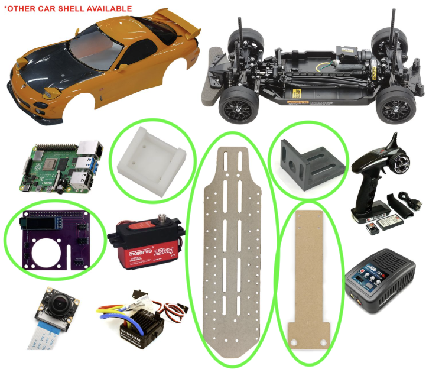
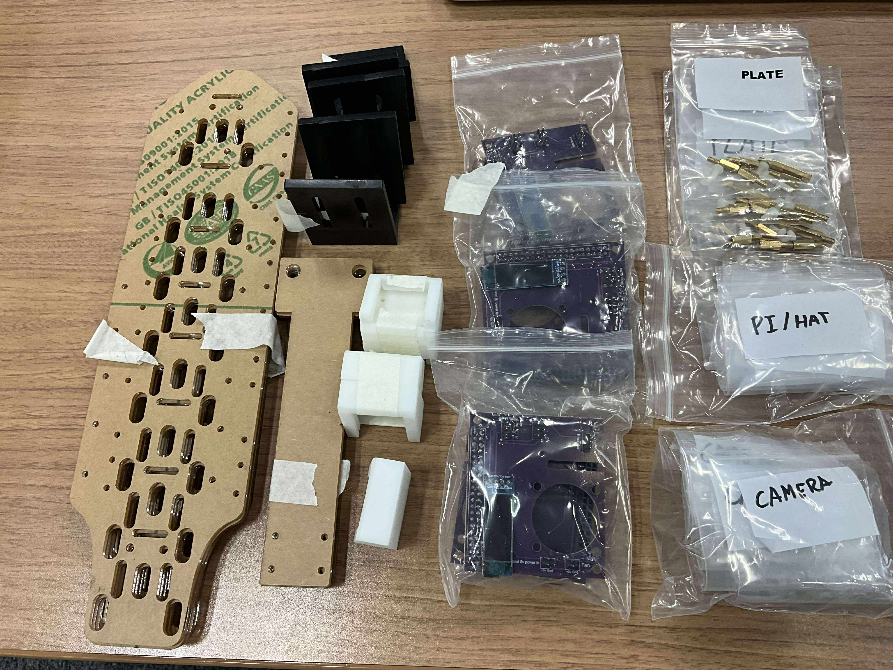

# 優勝

Raspberry Pi 3 Model A+

----

# 2位、３位

ギネス世界記録 2026

> 後日送付します

----

# 学生:優秀賞

Donkey HAT + TT-02用マウント部品

---

最優秀学生チームには　Donkey HATとTT-02のマウントの部品が5組を進呈いたします

> ラジコン本体やラズペリーパイ、カメラ、ESC, バッテリー、充電器は含みません。

- https://shop.10botics.com/Donkey-Car-TT02-p620630022

- https://youtu.be/eedstYktwc4?si=P4ipc_rCukJDhM4b&t=102

  

  

---

