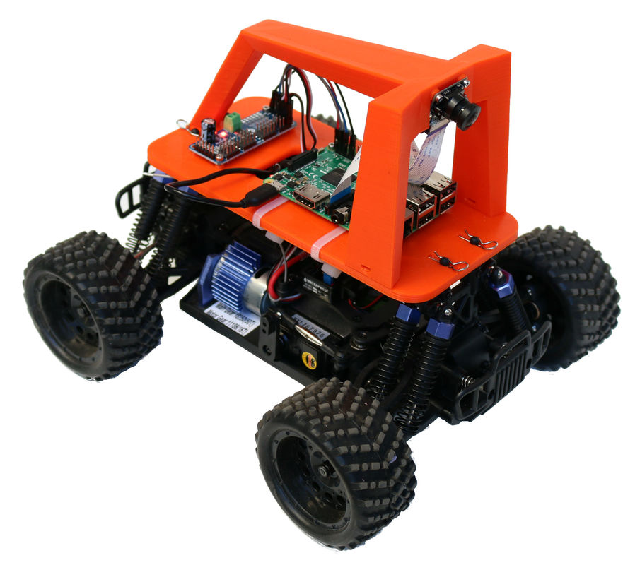
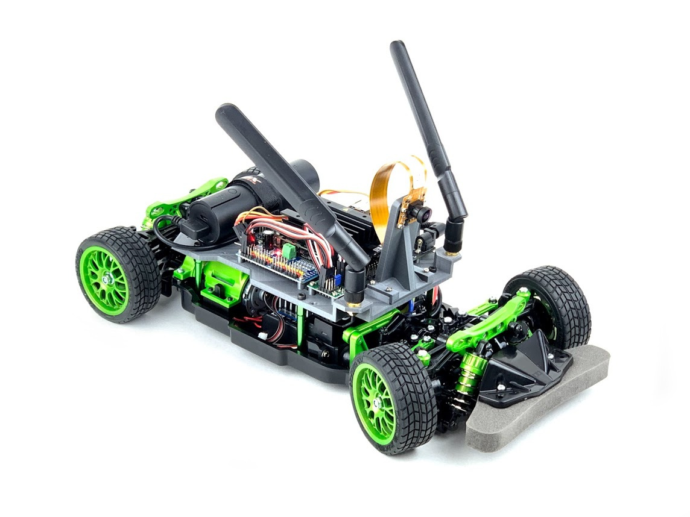
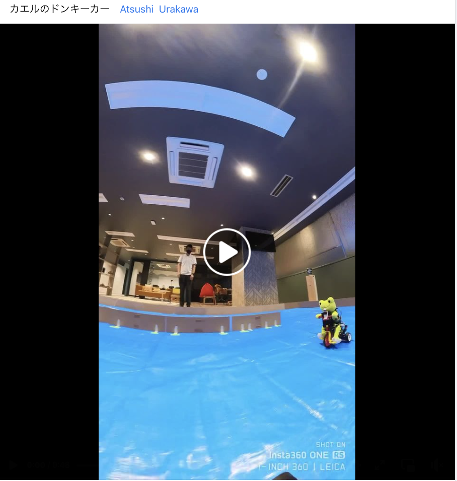
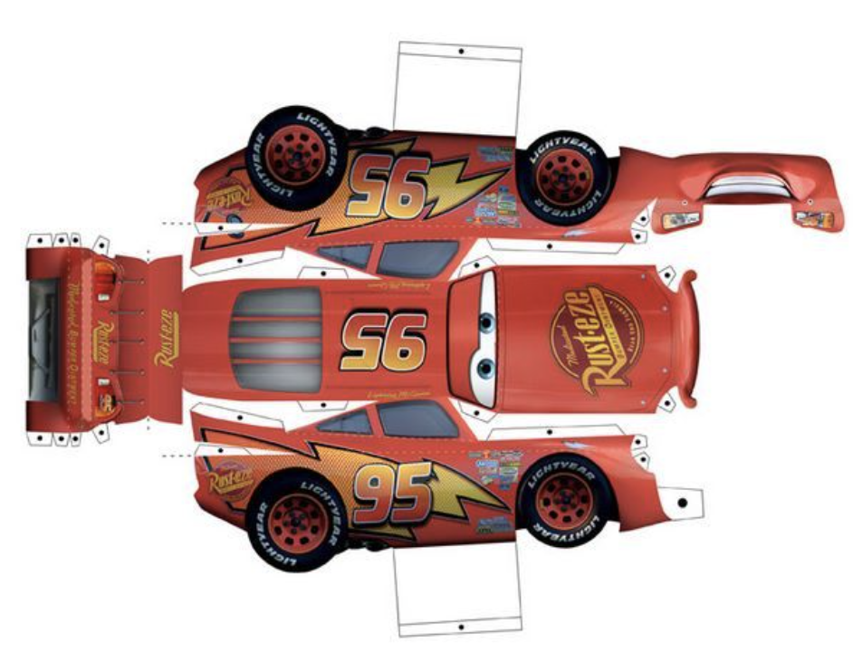
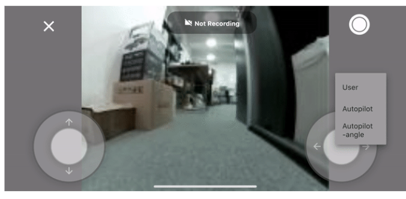
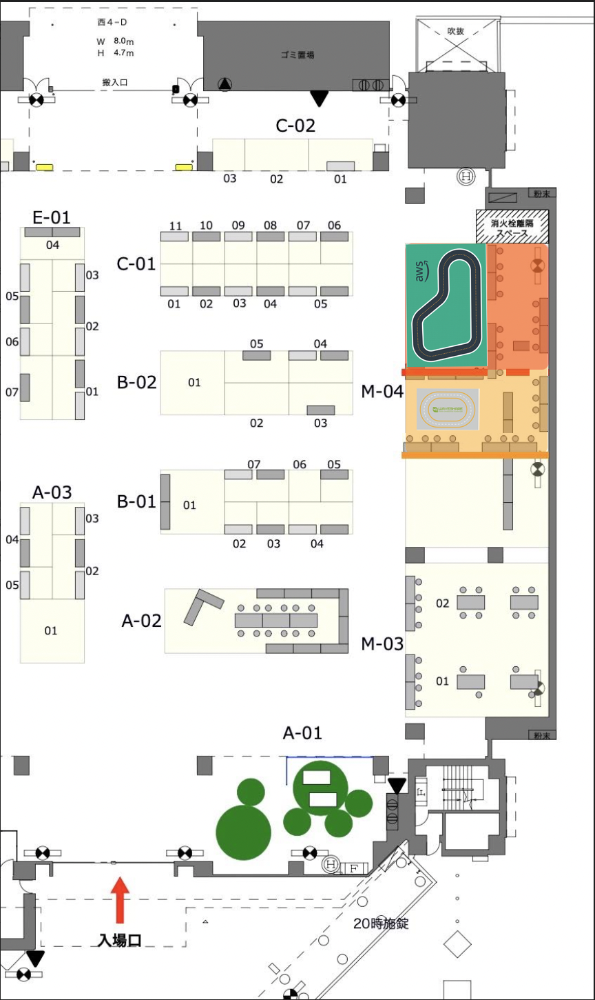
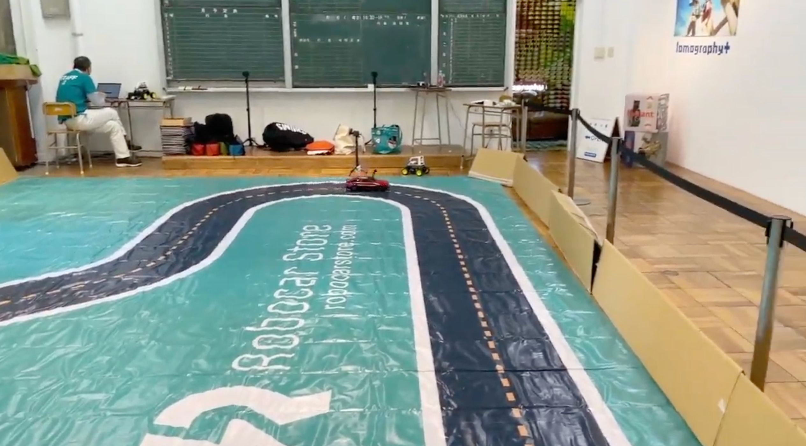

ご連絡 「Maker Faire Tokyo 2023のAIラジコンカーの参加者募集について」

 7/16 2023   山本直也@AI_RCカー事務局  support@kwiksher.com  

 
有志の fbグループで運営している「AIでRCカーを走らせよう!」のコミュニティの山本です。MFT2019, 2022と行ったAI ラジコンカーのレースをMFT2023でも実施いたしますので、そのお知らせとなります。

 

  - [MFT2019 ロボスタ記事](https://robotstart.info/2019/08/29/donkeycar-maker-tokyo.html)
  - [MFT 2022 アスキー記事](https://ascii.jp/elem/000/004/107/4107194/)

昨年より 少し小規模になりますが、[Donkey Car](https://www.donkeycar.com/) を主としたフリー走行枠の１２名と、Nvidia Jetraceなどのレース枠の１２名のAI ラジコンカーの参加者を募集いたします。市販のラジコンカーにラズペリーパイなどのコンピュータを搭載して、AIを利用した自動走行機能を実装された社会人・学生のメーカーな方々、東京メーカーフェアで その車体や走りをお披露目していただけないでしょうか？ レース枠ではタイムトライアルとトーナメント実施しますので、日頃のチューンナップの成果をお試しください。フリー走行枠は ユニークな車体や実験的な手法を取り入れたAIラジコンカーやロボカーの走行をデモンストレーションしていただければ幸いです。

MFT2023は、10/14(土曜）と15日(日曜)の開催です。

- [Maker Faire Tokyo １０月１４日（土）１５日（日)](https://makezine.jp/event/mft2023/)

  東京ビックサイト 　西4ホール

MFTの参加チケットの1000円と机・椅子など備品代として、参加費用は一人 4000円となります。

  - MFT公式 事前チケット(1000円)
  - 机・椅子などの備品代 (3000円)

    > 合計 4000円が参加費です。チケットは、AI_RCカー事務局が まとめて 24枚を手配いたしますので、MFT当日に入場ゲート前にてお渡しします。
    > または 9/29(金) 10/6(金)に予定している事前のドンキー準備会にご参加される場合は、その時に手渡し可能です。

  語句について

  - フリー走行枠 (12名)　

    主に Donkey Carを対象として、コースを周回できるかを目的とします。市販のラジコンカー + コンピュータや、ロボット、ロボカーの参加も大歓迎です。

    https://www.donkeycar.com/

    

    例 ニューラルネット(CNN)などの教師あり学習を利用

  - レース枠  (12名)

    チューナップしたドンキーカーやJetracerなどの速さを競う部門です、予選は１台づつのタイムトライアルを行い、上記８台が２台づつのトーナメントに進んで 競争を行います。

    https://fabo.store/collections/jetracer

    

    ResNet,転移学習など

### 申し込み先

  [(参加申し込み) MFT2023 AIでRCカーを走らせよう!](https://ai-rc-mft2023.connpass.com/event/290595/)

  フリー走行枠/レース枠の参加条件としましては、ご自分のAIラジコンカーやロボットカーをご準備でき、当日に走行が可能な状態である必要があります。

  - Donkey Car、自作AIカー、ロボットカーのいずれか、コントローラ
  - PCまたはMacのノードブック

## 内容とタイムテーブル

AI_RCカー事務局では、子供むけ体験会の時間枠も用意してありますので、フリー走行枠とレース枠の参加者の皆様には、時間配分とコースの共有利用に ご協力をお願い申し上げます。

  - 1日目
    - 午前 9:00 展示者入場
      - 9:00 - 10:00

        コース準備 各自準備

      10:00 - 12:00
        - フリー部門: 学習
        - レース部門: 学習
    - 午後
      12:00 一般入場開始
      - 12:00 - 14:00
        - フリー部門: 学習, 走行
        - レース部門: 学習, 走行

      14:00 ~
      - ① 子供むけ体験会
      - ② フリー走行/モビリティ交流会

      18:00 終了

  - 2日目
    - 午前 9:00 展示者入場

    - 午前 10:00 一般入場
      - 10:00 - 13:00
        - レース部門: 予選/レース
        - フリー部門:走行
    - 午後 13:00 ~
      - ① 子供むけ体験会
      - ② フリー走行/モビリティ交流会

      17:00 終了

> 2022年のMFTのAI RCカーと比べますと、2023年はRCカーのコースがが小さくなり、会場全体の参加者も増加し、通信・無線環境も厳しくなるとの予想から、比較的無線状況が良い
午前に、フリー走行やレース枠でのラジコンカーの走行を行うタイムテーブルになっております。レース部門のレース自体は 2日目の午前になります。

---
### フリー走行枠、レース枠の参加者向け注意事項

　WiFi/光回線の提供はありません。参加者個人で モバイルルータなどの通信回線をご用意ください。

  本体サイズ、重量、走行スピード等が、JetRacer (1/10) / Donkey Car（1/16）と著しく異なる場合は事前に問い合わせください。

  参考) Maker Faire Tokyo 2023 危険物申請書から

  https://makezine.jp/event/wp-content/uploads/sites/2/2023/05/kikenbutsu_Maker.pdf

  - 当日のハンダゴテの利用は禁止です
  - リチウムイオン電池 == (リチウムポリマー電池、リチウムフェライト電池、リン酸鉄リチウムイオン電池も含む)

    >パソコンやスマートフォンなど市販の家電製品への充電に使⽤する際のリチウムイオン電池のモバイルバッテリは申請不要です。

    それ以外の使用では 申請が必要です。下記のgoogle spreadsheetにご使用されるバッテリの製品名などを記載してください。

    - https://docs.google.com/spreadsheets/d/163RyX407vJxyzI4dEilmphnCulDfDH61qmqXMP91svM/edit?usp=sharing

     

    > 株式会社タミヤの標準バッテリーや、DonkeyCar(HSP-94186 1/16 electric Truck)は、ニッカドマンガンなので、申請対象外です

### 免責事項
　会場の無線環境によってAIカーの無線コントロールが難しくなる可能性があります。

- 開催内容は予定です。都合により変更・中止となる場合があります。
- 「AIでRC カーを走らせよう」の参加申し込みには、定員となり次第申込受付終了とさせていただく場合がございます。

  [Maker Faire Tokyo 2023 出展申込要項 PDF ](https://makezine.jp/wp-content/themes/makerfairetokyo/mft2023/pdf/MFT2023_youkou.pdf)の6-2, 6-3 持ち込みに申請が必要な物品の記載があります。

  会場内の安全確保のため、持ち込み禁⽌の物品の持ち込みはおこなわおこなわ場合は、必ず申込の際にご連絡ください。
  事前に申請のない作品、機材に関しては、撤去していただくこともあります。

  ※出展者の作品修理⽤に、MFT事務局にてハンダごてを使⽤できる「ハンダ修理コーナー」が提供されます。

## イベントに関するお問い合わせ先：
- AI_RCカー事務局 山本
- Email:  support@kwiksher.com

  > Fabo discord channelの　AIでRCカーを走らせようのスレッドは [こちら](https://discord.com/channels/684962202960003142/723338625282211870/threads/1113307027570180157)

---
# 事前 ドンキー準備会

6名づつ 予約制 ２回行います。 秋葉原で実施。ちょっと練習が必要な方向けです。

- 養生テープで 3 x 4m ほどのコースを作るので 自主練習が可能です。
- MFT 2023 AI RCカー運営の打ち合わせも行います。
- 内容
  - Donkey Car S/Wのアップデート
  - ローカルPCでの学習の講習
  - AI走行の実施など

  > フリー走行枠とレース枠の参加者にMFTチケットを事前に手渡しすることも可能です。

  参考画像) オープンソースのAI学習カー「Donkey Car」を走らせてみた！ 2018年12月31日 09時00分更新

  

### 日時

- 9/29(金) 19:00-21:00
- 10/6(金) 19:00-21:00

### 場所

決定次第 参加者に個別に連絡いたします。

### 機材

ご自分のAIラジコンカーとノートブックなどをご持参ください

- Donkey Car、自作AIカーのいずれか、コントローラ
- PCまたはMacのノードブック

  > WiFi環境と電源は ご提供可能です。

### 申し込み先

[事前ドンキー準備会](https://ai-rc-mft2023.connpass.com/event/290598/)

---
# AIでRCカーを走らせよう！ MFT2023

 fb:naoya.yamamoto.3154  <a href="https://www.facebook.com/groups/2249059025382644"> AIでRCカーを走らせよう </a>

[Maker Faire Tokyo １０月１４日（土）１５日（日)](https://makezine.jp/event/mft2023/)

## このイベントについて

　AIを搭載したラジコンカー（Donkey CarやJetRacer、自作の模型カー）や ロボットカーの体験イベントと走行会を行います。走らせるコースとしては、体験イベント向けのスペースで気軽に走らせることができるコースと、レースが行える走行会むけのコースの２つが用意されます。

1.  **体験**

    トラックでは ラジコンやロボカーを動かしたり、触ったりすることができます。

    対象: 子供、AI/IoT初心者

    > 以下は 現在 検討中の企画候補となります。AIRCコミュニティの有志がインストラクターとなり、５分程度の時間、交代で子供たちが 用意されたラジコンカーを操作・体験します。

    - ラジコンカーを動かしみよう

      

      > 参考 [カエルのドンキーカー](https://www.facebook.com/reel/578585950672956)

    - ラジコンカーをデコってみよう

      > 手書きやテープなどで、ラジコン化のフレームや車体をデザイン、または Generative AIを利用した印刷可能な紙の車体を作れるイベントを計画中
      > TODO: ドンキーカーに台形の立方体にしてスポっと被せてみる。カメラの穴とアンテナを外だし？

      > 参考 https://www.pinterest.com/pin/309622543102147338/

        

      > 参考 モルカーデコレーション https://hobby.dengeki.com/news/1418267/

      > 参考 [誰でもカーデザイナーになれる？「画像生成AI」にクルマを描かせてみた 2枚目の写真・画像](https://response.jp/article/img/2023/05/17/371044/1886478.html)

      > 株式会社 Faob様から Donkey Carの車体を借りる予定です。

      佐々木 陽 2020年2月22日 DonkeyCar 14色

      

      > 同じ車体だから、一つ学習させて モデルをコピーして他の車体に入れても それなりに自動走行してくれるのではないか。

1. **理解**

    - 展示ボード

      - 簡易のA1程度の説明板を用意
      - 部品・ハード面はラズパイなど貼り付けておく。

    - ラジコンカーとAIの仕組みの解説

      - Donkey Car とは?

        AI ラジコンカーの入門の解説と走行

        [Doneky Car アプリ](https://medium.com/robocar-store/robocar-controller-quick-start-guide-bdf8cb16d7ce)

        

2. **走行会**

    Donkey carやJetRacer など AIラジコンカーのタイムトライアルができるスペース。

    対象: 既にAIカーを動かしているメーカー（社会人、学生)

    - フリー走行枠

      募集人数: 12人

      Donkey CarロボットカーなどのAIによる自動走行でコースを脱線することなく周回できることにチャレンジする

    - レース枠

      募集人数: 12人

      JetRacerやデジタルツインの仕組みを利用したラジコンカーで、如何に早くコースを自動走行できるかを主眼に、レースを実施する

      - 予選 (一台づつ)

          - 3周する時間を計測
          - 上位 8台がトーナメントに進みます。

      - トーナメント (２台で 競走)

          - 一回戦  4試合
          - 準決勝  2試合
          - 決勝    1試合

      > 2022年のコースは 木枠による外壁があるコースでしたが、2023年は 養生テープで作成されたコースにコーンを配置する形となります。

      > 参考 [Official Oakland Race Rules (2019 edition)](https://www.diyrobocars.com/2019/07/22/official-oakland-race-rules-2019-edition/)

      

3. **モビリティ・ロボット交流会**

    MFTメーカとして参加した方々が利用可能なデモスペースとして、IoTロボットやモビリティを動かしてもらい、交流を促進する場所としてオープンに利用可能とする。

---
Layout

  原点に帰って、可能なコースをコンクリートの上にテープを貼って作る

  > 参考情報、既存のコースサイズは以下となります
  - AWSコースがレース用

      [e:Invent 2018 Track　4.95m x 7.5m](https://www.robocarstore.com/collections/tracks/products/aws-deepracer-standard-track)

  - Jetracerが体験用

    [JetRacer oval 2m x 3m](https://www.welectron.com/Waveshare-99001-Track-Map-for-JetRacer-PiRacer_1)

    

- 机・椅子

  長机 １２台、椅子２４脚

- コースの外壁 (要検討)

  > ダンボールで自作する予定

  

  10mx6mコース 通行人への衝突防止、機材破損防止の目的でダンボール設置

---
## 運営チーム
Facebookグループ「AIでRCカーを走らせよう!」
https://www.facebook.com/groups/2249059025382644/

コミュニティ管理者

  - 遠藤 諭
  - 佐々木 陽
  - 山本 直也

