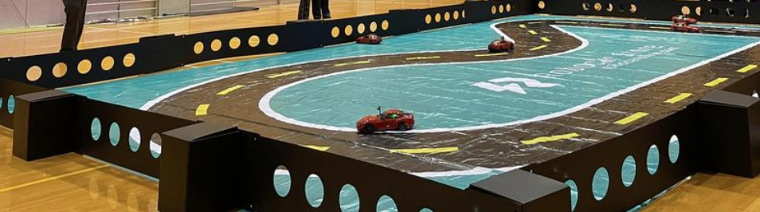

ご連絡 「Maker Faire Tokyo 2023のAIラジコンカーの参加者募集について」

 7/12 2023   山本直也@AI_RCカー事務局  support@kwiksher.com  

 
有志の fbグループで運営している「AIでRCカーを走らせよう!」のコミュニティの山本です。MFT2019, 2022と行ったAI ラジコンカーのレースをMFT2023でも実施いたしますので、そのお知らせとなります。

 

  - [MFT2019 ロボスタ記事](https://robotstart.info/2019/08/29/donkeycar-maker-tokyo.html)
  - [MFT 2022 アスキー記事](https://ascii.jp/elem/000/004/107/4107194/)

昨年より 少し小規模になりますが、Donkey Carを主としたフリー走行枠の１２名と、Nvidia Jetraceなどのレース枠の１２名のAI ラジコンカーの参加者を募集いたします。

MFT2023は、10/14(土曜）と15日(日曜)の開催です。

- [Maker Faire Tokyo １０月１４日（土）１５日（日)](https://makezine.jp/event/mft2023/)

  東京ビックサイト 　西4ホール

MFTの参加チケットの1000円と机・椅子など備品代として、参加費用は一人 40000円となります。

  - MFT公式 事前チケット(1000円)
  - 机・椅子などの備品代 (3000円)

    > 合計 4000円が参加費です。チケットは、AI_RCカー事務局が まとめて 24枚を手配いたしますので、当日または 9月に予定している事前のドンキー講習会の時にお渡しします。

  語句について

  - フリー走行枠 (12名)

    主に Donkey Carを対象として、コースを周回できるかを目的とする

    https://www.donkeycar.com/

    例 ニューラルネット(CNN)などの教師あり学習を利用

  - レース枠  (12名)

    Jetracerなどの速さを競う部門、２台づつのトーナメント形式で、競争を行う

    https://fabo.store/collections/jetracer

    ResNet,転移学習など

## 内容とタイムテーブル

AI_RCカー事務局では、子供むけ体験会の時間枠も用意してありますので、フリー走行枠とレース枠の参加者の皆様には、時間配分とコースの共有利用に ご協力をお願い申し上げます。

  - 1日目
    - 午前
        - フリー部門: 学習
        - レース部門: 学習
        - フリー、レース部門: 走行
    - 午後
      - ① 子供むけ体験会
      - ② フリー走行/モビリティ交流会

  - 2日目
    - 午前
        - レース部門: 予選/レース
        - フリー部門:走行
    - 午後
      - ① 子供むけ体験会
      - ② フリー走行/モビリティ交流会

- [ ] 募集

    TODO: connpass?

- [ ] 事前ドンキー講習会 (参加費無料)

  調整中
    - 9月30日(土)または10/1(日)
    - 定員 10-20名
    - 場所：

  都内でDonkey Carの講習会を行う予定です。AI ラジコンカーの調整やお試し走行が可能です。

  > フリー走行枠とレース枠の参加者にMFTチケットを事前にお渡しすることも可能です。

  - Donkey Car S/Wのアップデート
  - ローカルPCでの学習の講習
  - AI走行の実施

---
### フリー走行枠、レース枠の参加者向け注意事項

　WiFi/光回線の提供はありません。参加者個人で モバイルルータなどの通信回線をご用意ください。

  本体サイズ、重量、走行スピード等が、JetRacer (1/10) / Donkey Car（1/16）と著しく異なる場合は事前に問い合わせください。

  参考) Maker Faire Tokyo 2023 危険物申請書から

  https://makezine.jp/event/wp-content/uploads/sites/2/2023/05/kikenbutsu_Maker.pdf
  - 当日のハンダゴテの利用は禁止です
  - 市販の家電製品としての小形コンピュータやラジコンカーの充電利用としての、リチウムイオン電池のモバイルバッテリは利用可能す。

    > リチウムイオン電池(リチウムポリマー電池、リチウムフェライト電池、リン酸鉄リチウムイオン電池も含む)

### 免責事項
　会場の無線環境によってAIカーの無線コントロールが難しくなる可能性があります。

- 開催内容は予定です。都合により変更・中止となる場合があります。
- 「AIでRC カーを走らせよう」の参加申し込みには、定員となり次第申込受付終了とさせていただく場合がございます。

## イベントに関するお問い合わせ先：
- AI_RCカー事務局 山本
- Email:  support@kwiksher.com

  > Fabo discord channelの　AIでRCカーを走らせようのスレッドは [こちら](https://discord.com/channels/684962202960003142/723338625282211870/threads/1113307027570180157)

---
# 事前 ドンキー講習会

### 日時
### 場所
### 受講に必要な機材について（受講前に必ずご確認ください）
- Donkey Car、自作AIカーのいずれか、コントローラ

    > ただし、今回使用予定のコースで走行するのに相応しい本体サイズ、重量、走行スピード、動力のものに限らせていただきます。

  > 合致しない場合は、当日、走行をお断りする場合がありますのでご注意ください。

  > PCまたはMac（Chromeブラウザがインストールされている必用があります）

### 機材のお貸し出しについて

> 株式会社 Faobの協力により、Donkey Carの車体の貸し出しを検討中

---
# AIでRCカーを走らせよう！ MFT2023

 fb:naoya.yamamoto.3154  <a href="https://www.facebook.com/groups/2249059025382644"> AIでRCカーを走らせよう </a>

[Maker Faire Tokyo １０月１４日（土）１５日（日)](https://makezine.jp/event/mft2023/)

## このイベントについて

　AIを搭載したラジコンカー（Donkey CarやJetRacer、自作の模型カー）や ロボットカーの体験イベントと走行会を行います。走らせるコースとしては、体験イベント向けのスペースで気軽に走らせることができるコースと、レースが行える走行会むけのコースの２つの空間が用意されます。

1.  **体験**

    トラックでは ラジコンやロボカーを動かしたり、触ったりすることができます。

    対象: 子供、AI/IoT初心者

    > 以下は 現在 検討中の企画候補となります。AIRCコミュニティの有志がインストラクターとなり、５分程度の時間、交代で子供たちが 用意されたラジコンカーを操作・体験します。

    - ラジコンカーを動かしみよう

      

      > 参考 [カエルのドンキーカー](https://www.facebook.com/reel/578585950672956)

    - ラジコンカーをデコってみよう

      > 手書きやテープなどで、ラジコン化のフレームや車体をデザイン、または Generative AIを利用した印刷可能な紙の車体を作れるイベントを計画中

      > 参考 https://www.pinterest.com/pin/309622543102147338/

        

      > 参考 モルカーデコレーション https://hobby.dengeki.com/news/1418267/

      > 参考 [誰でもカーデザイナーになれる？「画像生成AI」にクルマを描かせてみた 2枚目の写真・画像](https://response.jp/article/img/2023/05/17/371044/1886478.html)

1. **理解**

    - 展示ボード

      - 簡易のA1程度の説明板を用意
      - 部品・ハード面はラズパイなど貼り付けておく。

    - ラジコンカーとAIの仕組みの解説

      - Donkey Car とは?

        AI ラジコンカーの入門の解説と走行

        [Doneky Car アプリ](https://medium.com/robocar-store/robocar-controller-quick-start-guide-bdf8cb16d7ce)

        

2. **走行会**

    Donkey carやJetRacer など AI RC カーのタイムトライアルができるスペース。

    対象: 既にAIカーを動かしているメーカー（社会人、学生)

    - ドンキーカー 部門

      募集人数: 12人

      Donkey Carなどで、AIによる自動走行でコースを脱線することなく周回できることにチャレンジする

    - レース部門

      募集人数: 12人

      JetRacerやデジタルツインの仕組みを利用したラジコンカーで、如何に早くコースを自動走行できるかを主眼に、レースを実施する

      - 予選 (一台づつ)

          - 3周する時間を計測
          - 上位 8台がトーナメントに進みます。

      - トーナメント (２台で 競走)

          - 一回戦  4試合
          - 準決勝  2試合
          - 決勝    1試合

3. **モビリティ・ロボット交流会**

    MFTメーカとして参加した方々が利用可能なデモスペースとして、IoTロボットやモビリティを動かしてもらい、交流を促進する場所としてオープンに利用可能とする。

---
Layout

  原点に帰って、可能なコースをコンクリートの上にテープを貼って作る

  > 参考情報、既存のコースサイズは以下となります
  - AWSコースがレース用

      [e:Invent 2018 Track　4.95m x 7.5m](https://www.robocarstore.com/collections/tracks/products/aws-deepracer-standard-track)

  - Jetracerが体験用

    [JetRacer oval 2m x 3m](https://www.welectron.com/Waveshare-99001-Track-Map-for-JetRacer-PiRacer_1)

  

- 机・椅子

  長机 １２台、椅子２４脚

- コースの外壁 (要検討)

  > ダンボールで自作する予定

  

---
## 運営チーム
Facebookグループ「AIでRCカーを走らせよう!」
https://www.facebook.com/groups/2249059025382644/

コミュニティ管理者

  - 遠藤 諭
  - 佐々木 陽
  - 山本 直也

