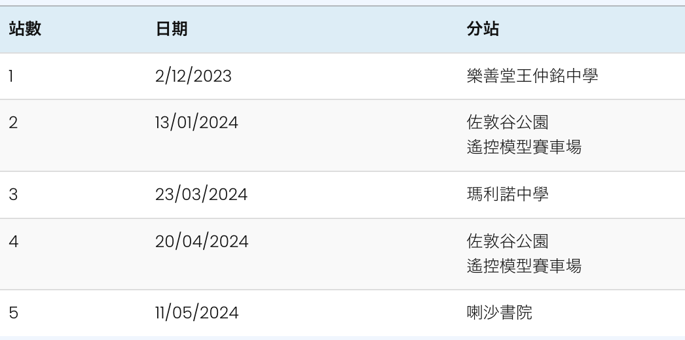
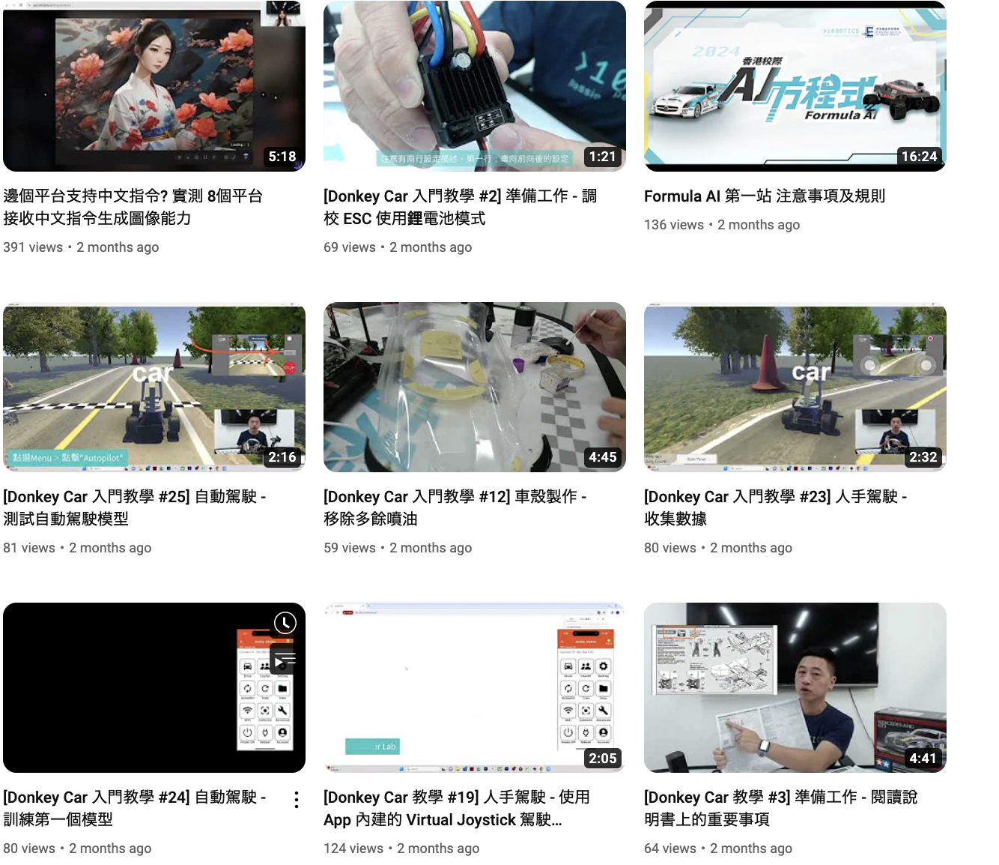
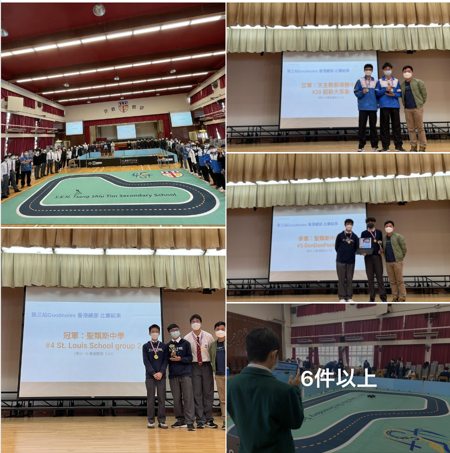
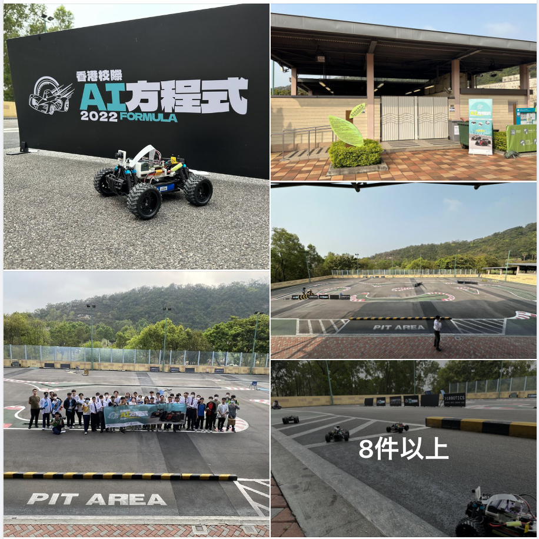
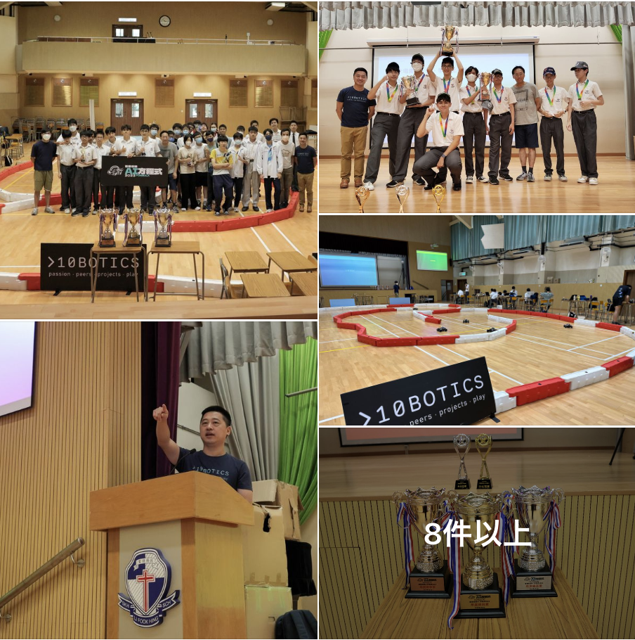
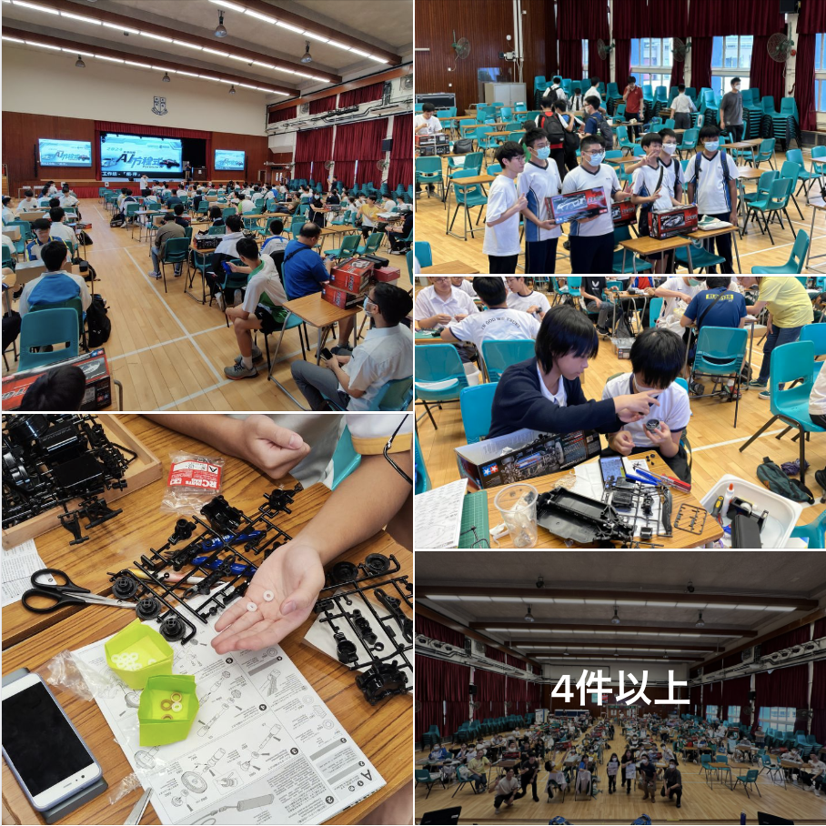
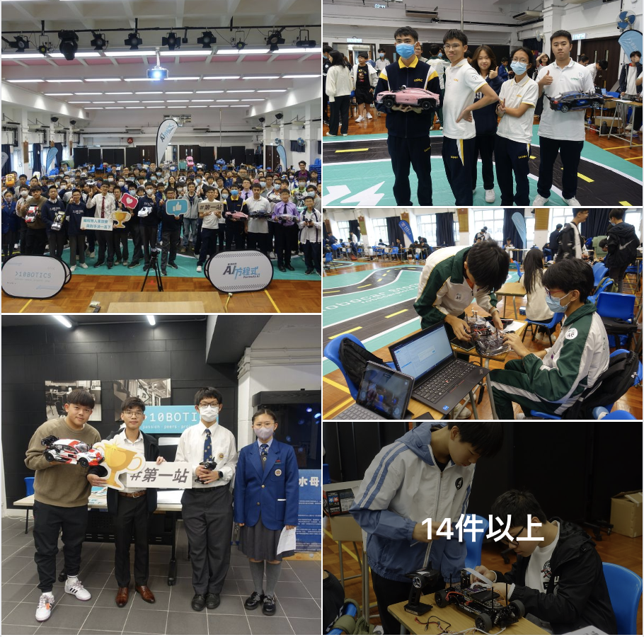
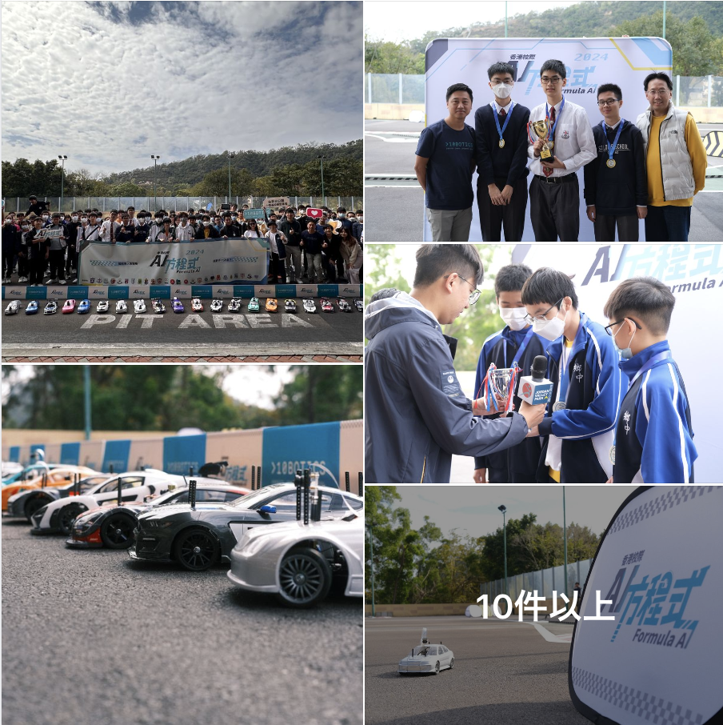

<small>

# https://10botics.com/

10Botics is a Hong Kong Science Park start-up company that has collaborated with more than 50 schools and educational institutions in the past.

- https://formula-ai.racing/

  

  - [Eligibility and fees](https://formula-ai.racing/%e5%8f%83%e8%b3%bd%e8%b3%87%e6%a0%bc%e5%8f%8a%e8%b2%bb%e7%94%a8-2024/)

    - Full-time primary and secondary students in Hong Kong must register in the name of the school
    - Entry fee: Free

</small>

- https://www.youtube.com/@10botics/videos

  

---

<small>

[2023年3月3日](https://www.facebook.com/10botics/posts/pfbid0qUAG4qViKDjTrxm8kDZogvkXLm1y8nLvShuzytpsCKJSPEJEo3k2MkDqqSbf1VzZl)

#香港校際AI方程式 #FormulaAI
全7レースの真ん中を迎えます。 先週の土曜日(2月25日)、FormulaAIの第4レグがSheng Kung Hui Tseng Shiu Tim 中学校で無事終了しました🎉
10校以上が参加し、生徒たちは前線レースで自己記録を更新し、多くのチームの中で目立つスキルを発揮しました。
🏆👏受賞された皆さん、改めておめでとうございます! 第5レースは3月18日にジョーダンバレーパークのリモートコントロールモデルレーシングトラックで行われます。 2週間後にジョーダンバレーパークでお会いしましょう!

</small>

----

<small>

[2023年3月20日 ](https://www.facebook.com/10botics/posts/pfbid02BLsa8m5oR1UCApWwxS45NR1qUEdCfJYcG8ECr8Cy3vuxSrYURFEmstMxtahR349gl)

#香港校際AI方程式 #FormulaAI
先週土曜日(3月18日)にヨルダンバレーパークでのフォーミュラAI第5弾が無事終了しました!
あなたの生徒が屋外フィールドで競技するのは初めてです。 大きな環境と見慣れないトラックデザインに直面する新たな挑戦です。 幸いにも、チームは問題を成功に解決し、参加者はそれを楽しんでいました。
フォーミュラAIの7レースが最後の2つに迫っており、イースターホリデー明け、第6レースがセントファス中学校で開催されます。 乞うご期待... 😎 😎

</small>

----

<small>

[2023年6月5日](https://www.facebook.com/10botics/posts/pfbid0zjN85m36xsVGYt6JKdhXq8yY6wk46cg4sb7xjjAy6VpvVvacpmQKbRAWSJwdhpn3l)

先週の土曜日(6月3日)、フォーミュラAI2022の第7レースがSheng Kung Hui Li Fu Hing中学校で無事開催されました。 合計7レースが無事終了しました 🥳
昨年11月のキングスカレッジの第一回目以降、十数校以上の学生が参加しています。 レース7ヶ月間、参加者は以前のクラスで学んだプログラミング知識を活かして自動運転車を制御し、レースごとに戦略調整を行い次のレースを勝ち取りました。 全ての生徒の努力と強さは過小評価できません。
計7レースの最後の出場となる、各チームが最高の頑張りを見せてくれました。 勝利を追いかけるリーダーチームもあり、最後の試合で都市に戻るために追いつくチームも多いです。 優勝チーム間の結果にほんの少しの差しか出ない競技が本格的に始まる。 トータルチャンピオンシップの栄光、第1準優勝、第2準優勝は誰だった? 結果は以下の通りです:
トータルチャンピオン:セントトーマス高校#5 ドンドンポンケン
準優勝:セントルイス学校グループ2
準優勝:セントフェス高校#33 ボーダー
👏👏👏受賞者の皆さん、おめでとうございます。大会に参加した教師と学生の積極的な参加とサポートに感謝します。 2023-2024年の新学期から、10BoticsはフォーミュラAIの第2版を開催します。 私たちの最新ニュースに目を向けることを忘れないでください!

</small>

----

<small>

[2023年10月7日](https://www.facebook.com/10botics/posts/pfbid0o5MV61b4Ws43JCi1bMX1pcMr5SDoXKRu9hY2ZysAsmGC4ftAo6tvSxXZJvtkdRdZl)

[#香港校際方程式2024] [#FormulaAI2024]
今年のフォーミュラAI 2024は、Guo Dusheng中学校での試合前のワークショップが始まりました。 25校以上から150名近くの生徒が集まり、新車の組み立てとテストを行いました。 香港の学生たちにとっては、本当に1分1秒の記録です。 最も多くの学生が同時に同じ場所で車を組み立てた。
今シーズンからTT02がチームに加わり、学生はクルマのパフォーマンスを向上させる機会が増え、各レースに特定のテーマとテストがあり、よりチャレンジングなレースになります。 実は、昨シーズンのコンペに参加経験のある生徒さんも多いのですが、今回のワークショップの生徒さんのクラスは、質問や交流の機会、先生を招いて一緒に車の組み立てまでする姿を見て、どんな風に作っているのか楽しみになりました。 進歩とパフォーマンスが良かった!
🎊次回から、学生たちは今シーズンの新たな挑戦に備えて集中トレーニングを開始します。 大会の第1節は2023年12月2日にロク・シャン・タン・ワン・ザンカイ中学校で行われます。 皆さまのご参加をお待ちしております。 じゃあまたね!

</small>

----

<small>

[2023年12月7日](https://www.facebook.com/10botics/posts/pfbid0329GhiYBuopVy2qZeYQMN8UHeNUb7LE1v4f942P2uTiLTEq9bdzTWYJmKLcEViFE6l)

[#香港校際方程式2024] [#FormulaAI2024]
10Boticsは、先週の土曜日(12月2日)#Lok Sin Tong Wong Chung Kai中学校で香港インターAIフォーミュラ2024の第一戦を開催しました。 20校近く、合計100名の生徒の積極参加、サポートのおかげで無事大会終了🌟🌟🌟. 2年連続で半数近くが出場し、今学年も優勝争いを続けたことは言うまでもありません。
今回のレースでは、参加チームはハンドコントロール、自動運転、ストレートロードレース用に自家組立車両を運んでいます。 ストレスフルでエキサイティングな雰囲気の中で、学生たちは技術に対する情熱と創造力を実践的な行動に変えます。 特に自動運転プロジェクトでは、学生は人間のコントロールなしに自動車が正確に軌道を完了できるようにするために機械学習の原則を理解する必要があります。
🎊香港インタースクールAIフォーミュラ2024が始まり、今後数ヶ月、複数の出場者が次の挑戦の足に備える集中トレーニングコースを継続します。 次のレースは2024年1月13日にジョーダンバレーパークリモートコントロールモデルトラックで開催されます。参加を楽しみにしています、そこで会いましょう!
#學界最大型既無人車比賽

</small>

----

<small>

[1月18日](https://www.facebook.com/10botics/posts/pfbid0WMEudiH3oyUSurARgCQ7F5cFrSoqJUMjmwTXZprEtC2ep3KvSnnpPoKrKKy3hnstl)

🏁 [#香港校際方程式2024] #FormulaAI2024 🏁
10Boticsは、土曜日(1月13日)に#Jordan Valley Parkで行われた香港インタースクールAIフォーミュラ2024にさらなるチャレンジを追加しました🌟20校近く、100人以上の学生の熱意のおかげでイベントを成功させました。
️レースはこれまでよりも広く、すべて屋外です。 日照の変化はデータ収集や車両制御に影響を及ぼし、精密な自動運転を実現しにくくなります。 喺 データを収集し、タイマーを完了するための限られた時間は簡単な仕事ではありません。学校内で両方のゲームをプレイする前よりもはるかに難しいです。
🌈 喺次の複数のレースでは、生徒たちは複数の練習機会を持っています。 それは単なるレースではなく、学びと成長の過程です。 すべてのストップ経験は、次のフィールドのゲーム改善のための貴重な機会を提供します。 次の目的地は3月23日にMaryknoll Middle Schoolで行われます。生徒の進歩を楽しみにしています! 👀 👀

</small>

