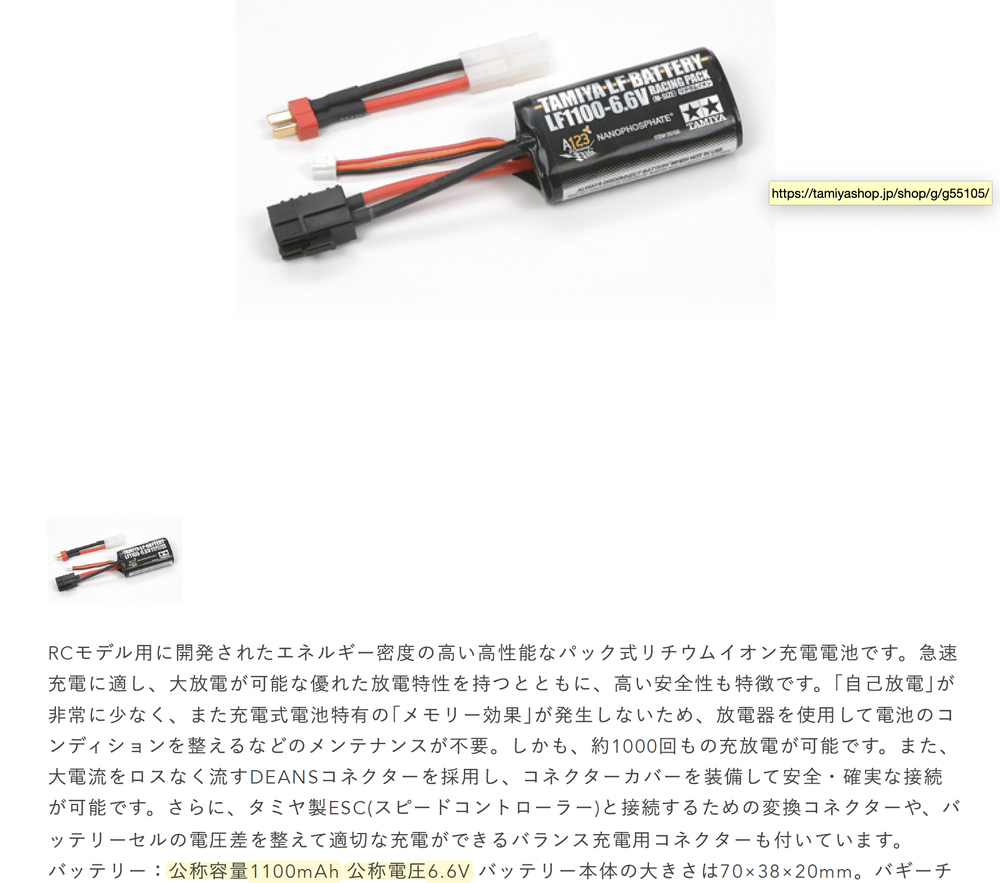

<style>
div.colwrap {
  background-color: inherit;
  color: inherit;
  width: 100%;
  height: 100%;
}
div.colwrap div h1:first-child, div.colwrap div h2:first-child {
  margin-top: 0px !important;
}
div.colwrap div.left, div.colwrap div.right {
  position: absolute;
  top: 0;
  bottom: 0;
  padding: 70px 35px 70px 70px;
}
div.colwrap div.left {
  position: absolute;
  top:40px;
  right: 50%;
  left: 0;
}
div.colwrap div.right {
  position: absolute;
  top:40px;
  left: 50%;
  right: 0;
}
li { font-size: 20px }

</style>

<div align="right"> 2023.08.25 山本直也 </div>

更新内容

1. PS３コントローラの利用は取りやめました。

1. プロポバッテリー FT2F1700BV2
  =>
  FT2F1700B V2 で　2100mAhではなく1700mAhに修正。製品ラベルは 6.4VDC-1700mAhが貼られている。


1. モバイルバッテリー (PD対応)のV数については ラズパイやJetsonの小型コンピュータに供給する5V/3Aを想定しています。


---
Email
* ymmtny@gmail.com

出展者ID
* M0218

---
出展者名
* 「AIでRCカーを走らせよう!」コミュニティ


---
## コントローラ

>作品のロボットはリモコンで操作しますか？>
>リモコンにリチウムイオン電池が使用されている場合はV数、容量、数量を例の通りに記載してください。

```
6.6v2100mAh*1 Turing
6.4v1700mAh*1 FT2F1700B
6.6v1100mAh*1 T7PXR
```

  - ~~PS3 コントローラ 1250mAh 3.7V  x1個~~ (PS3のコントローラは出展を取りやめました)

---
<div class="colwrap">
<div class="left">


  - プロポ用バッテリー

    - Turnigy nano-tech 2100mAh 2S, 6.6V x1個

</div><div class="right">
      
</div>

  ---
<div class="colwrap">
<div class="left">

  - FT2F1700B V2 1700mAh(6.4V) x１個　

    > プロポ_FUTABA(FT2F1700BV2 ) BA0140　送信機専用Li-Fe電池FT2F1700BV2 2セル 6.4V [BA0140] - 6,545円 _ SPIRAL - RC CAR SHOP Webストア.pdf
  </div><div class="right">
  
  </div>


  ---

  <div class="colwrap">
<div class="left">


  - プロポ (バッテイリ内蔵)
    - T7PXR(LiFe/6.6V/1100mAh) x１個　

</div><div class="right">
    
</div>


---


コントローラ（プロポ）だけでなく、追加のリチウムイオン電池/LiFeバッテリー、モバイルバッテリの使用予定がありましたので　合わせて記載してございます。

## リチウムポリマー電池
  ```
  7.6v6000mAh*2  Zeee
  6.6v1100mAh*2  Tamiya
  7.4v3800mAh*1 SUNPADOW
  ```

---
<div class="colwrap">
<div class="left">
  - Zeee 7.6V 100C 2S 6000mAhx 2個
  </div><div class="right">
    
    
</div>

---
<div class="colwrap">
<div class="left">
  - Tamiya LF1100-6.6V レーシングパック（M） x2個
  </div><div class="right">
    
  </div>

---
<div class="colwrap">
<div class="left">
  - SUNPADOW 7.4V / 3800mAh / 130C LiPo Battery x1個
  </div><div class="right">
    
    
</div>

---
## モバイルバッテリ

  ```
  3.7v5000mAh*1 Novoo
  5v10000mAh*1 INIU
  5v5000mAh*1 POWERADD
  5v6700mAh*1 RAVPower
  5v10000mAh*1 MOXNICE
  5v10000mAh*1 Anker
  ```
---
<div class="colwrap">
<div class="left">
  - Novoo PowerCube 5000 mAh x 1個
    - 5V/3A, 9V/2A, 12V/1.5A
    - 5V/2.1A
  </div><div class="right">
    
</div>

---
<div class="colwrap">
<div class="left">
  - INIU モバイルバッテリー (BI-B3)  5V 10000mAh x1個
    - 5V/3A
  </div><div class="right">
      
</div>

---
<div class="colwrap">
<div class="left">
  - POWERADD 5000mAh   2.4A   5v x 1個
  </div><div class="right">
    
</div>

---
<div class="colwrap">
<div class="left">
  - RAVPower 6700mAh モバイルバッテリー (5V/2.4A) x1個
  </div><div class="right">
    
</div>

---
<div class="colwrap">
<div class="left">
  - MOXNICE 10,000 mAh, PD18W(5v 2.4A)  x 1個
  </div><div class="right">
    
    
</div>

---
<div class="colwrap">
<div class="left">
  - Anker Power Bank (10,000 mAh, 30 W) x1個
  </div><div class="right">
    

    https://www.ankerjapan.com/products/a1256

  - USB-C : 5V⎓3A / 9V⎓3A / 10V⎓2.25A / 12V⎓2.5A / 15V⎓2A / 20V⎓1.5A (単ポート最大 30W)
  - USB-A : 5V⎓3A / 9V⎓2A / 10V⎓2.25A / 12V⎓1.5A (単ポート最大 22.5W)
  - 10000mAh ※モバイルバッテリー本体には5000mAh 7.2Vdc / 36Whで印字されていますが、本製品のセル容量は 10000mAh (2 × 5000mAh) です。

</div>

---
<div class="colwrap">
<div class="left">

## Li-Feﾊﾞｯﾃﾘｰ EA550R 550mAh 3.3V x10個
  ```
  3.3v550mAh*10
  ```
  </div><div class="right">
  
  </div>
