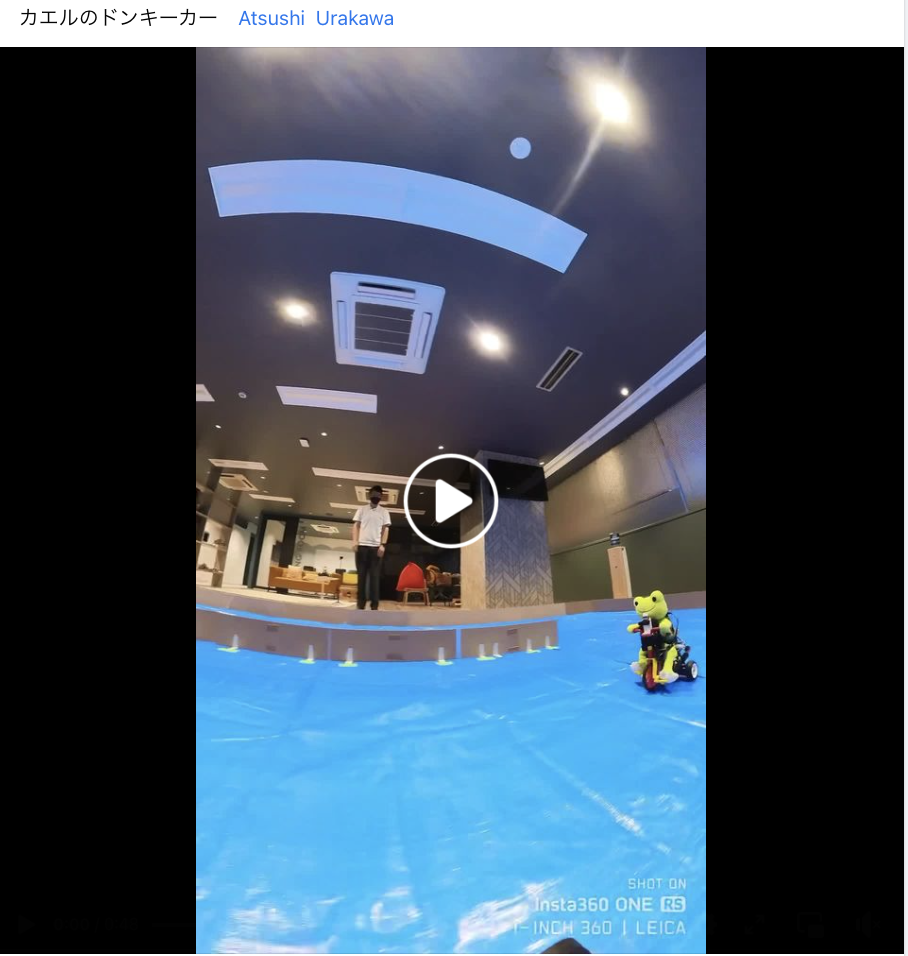
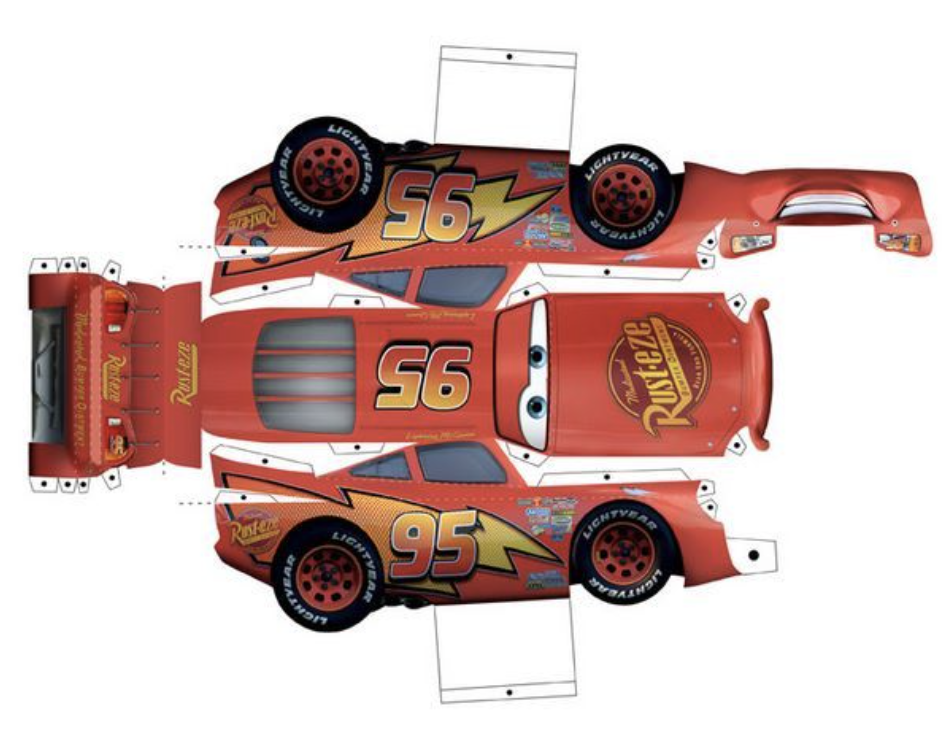
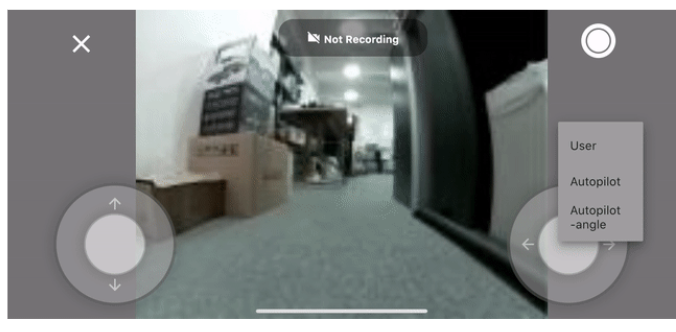
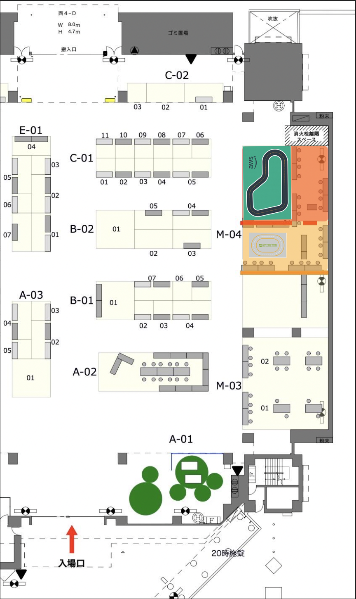
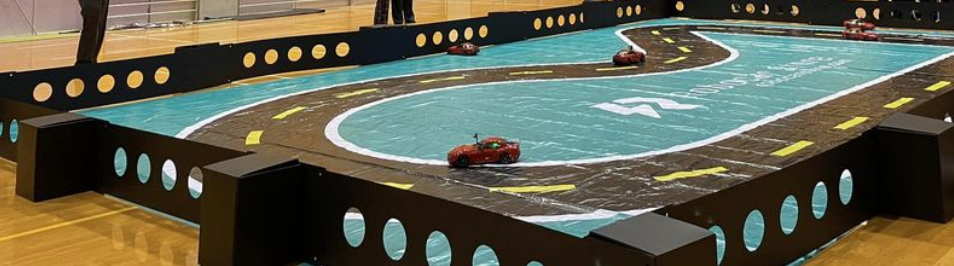

# (ドラフト）AIでRCカーを走らせよう！ MFT2023

<div align="right"> fb:naoya.yamamoto.3154 <br> <a href="https://www.facebook.com/groups/2249059025382644"> AIでRCカーを走らせよう </a></div>

[Maker Faire Tokyo １０月１４日（土）１５日（日)](https://makezine.jp/event/mft2023/)

## このイベントについて

　AIを搭載したラジコンカー（Donkey CarやJetRacer、自作の模型カー）や ロボットカーの体験イベントと走行会を行います。走らせるコースとしては、体験イベント向けのスペースで気軽に走らせることができるコースと、レースが行える走行会むけのコースの２つの空間が用意されます。

> MFT2019 https://robotstart.info/2019/08/29/donkeycar-maker-tokyo.html

> MFT 2022 https://ascii.jp/elem/000/004/107/4107194/


1.  **体験**

    トラックでは ラジコンやロボカーを動かしたり、触ったりすることができます。

    対象: 子供、AI/IoT初心者

    > 以下は 現在 検討中の企画候補となります。AIRCコミュニティの有志がインストラクターとなり、５分程度の時間、交代で子供たちが 用意されたラジコンカーを操作・体験します。

    - ラジコンカーを動かしみよう


      

      > 参考 [カエルのドンキーカー](https://www.facebook.com/reel/578585950672956)


    - ラジコンカーをデコってみよう

      > 手書きやテープなどで、ラジコン化のフレームや車体をデザイン、または Generative AIを利用した印刷可能な紙の車体を作れるイベントを計画中

      > 参考 https://www.pinterest.com/pin/309622543102147338/

        

      > 参考 モルカーデコレーション https://hobby.dengeki.com/news/1418267/

      > 参考 [誰でもカーデザイナーになれる？「画像生成AI」にクルマを描かせてみた 2枚目の写真・画像](https://response.jp/article/img/2023/05/17/371044/1886478.html)

    - ラジコンカーとIoT
      - Donkey Car とは?

        AI ラジコンカーの入門の解説と走行

        [Doneky Car アプリを使ってみる](https://medium.com/robocar-store/robocar-controller-quick-start-guide-bdf8cb16d7ce)

        

    - ロボットデモ

      MFTメーカとして参加した方々が利用可能なデモスペースとして、IoTロボットやモビリティを動かしてもらい、交流を促進する場所して利用。

    以下は これから 実施可能かを検討中の企画です。最新のテクノロジーをラジコンカーで使ってみる予定です。

      - chatGPT

        ラジコンカーと喋ってみよう

        > 参考 [ChatGPTからJetRacerを制御し、交差点で「右折」or「直進」を選択し、走行するスキルの構築に成功](https://twitter.com/gclue_akira/status/1634167593627164672)

      - NeRF

        ラジコンカーにiPhoneを乗せて、NeRFしてみよう

      - AR

        ラジコンカーにiPhoneを乗せて AR体験してみよう


2. **走行会** レース

    Donkey carやJetRacer など AI RC カーのタイムトライアルができるスペース。

    対象: 既にAIカーを動かしているメーカー（社会人、学生)

    - タイムトライアル部門
    - デジタルツイン

      　　学習走行＋トーナメント(2回 x 2日 )を実施、１回につき１時間半です。6台でトーナメントを行います。
  　最大参加者数は 8台 x 4の24名です。

Layout

  >佐々木陽
  AWSコースは、ラジコンスケールが1/16向けなので
  1/10のラジコンだとカーブが曲がれないかも

  >Satoshi Endo
  赤い線では無理というしかないですねー。で、原点に帰って、可能なコースをコンクリートの上にテープを貼ってつくるかですかねー。

- AWSコースがレース用 (要調整)

    [e:Invent 2018 Track　4.95m x 7.5m](https://www.robocarstore.com/collections/tracks/products/aws-deepracer-standard-track)


- Jetracerが体験用

  [JetRacer oval 2m x 3m](https://www.welectron.com/Waveshare-99001-Track-Map-for-JetRacer-PiRacer_1)


  


- 机・椅子

  長机 〇〇台、椅子〇〇台

- コースの外壁 (要検討)

  

---
## 運営チーム
Facebookグループ「AIでRCカーを走らせよう!」
https://www.facebook.com/groups/2249059025382644/

---
## 開催概要

### セミナータイトル

「AIでRCカーを走らせよう！ MFT2023」

### 開催日時

- 2023年10月14日 (土）12:00 - 19:00
- 2023年10月14日 (日）10:00 - 19:00

### 会場
東京ビッグサイト（東京国際展示場）　西3・4ホール
東京都江東区有明3-11-1

### 参加費
AIカー走行経験者／「AIでRCカーを走らせよう！ MTF2023」参加：無料

- Maker Farie Tokyo 2023の参加者である必要があります。参加料は以下のとおりです。

  ```
  前売：
  当日：
  ```

  詳しくはMaker Faire Tokyo 2023公式サイトをご覧ください。
　
  - https://makezine.jp/event/mft2023/

- 技術サポートをしていただける方には数限定ですが入場パスをご用意いたしますのでアンケートでその旨お答えください。
- Donkey Carや設定用PCをお持ちいただく必要がありますのでご注意ください。

### 対象者

  AIカーの走行経験者

### 定員

24人

### 受講に必要な機材について（受講前に必ずご確認ください）
- Donkey Car、JetRacer、自作AIカーのいずれか、コントローラ

    > ただし、今回使用予定のコースで走行するのに相応しい本体サイズ、重量、走行スピード、動力のものに限らせていただきます。

- 本体サイズ、重量、走行スピード等が、JetRacer (1/10) / Donkey Car（1/16）と著しく異なる場合は事前に問い合わせください。

  > 合致しない場合は、当日、走行をお断りする場合がありますのでご注意ください。

  > PCまたはMac（Chromeブラウザがインストールされている必用があります）

### 機材のお貸し出しについて

  ネットワーク回線 (要検討)

### 主催


### 共催


### 協力

### 協賛

### 免責事項
　会場の無線環境によってAIカーの無線コントロールが難しくなる可能性があります。

- 開催内容は予定です。都合により変更・中止となる場合があります。
- 定員となり次第申込受付終了とさせていただく場合がございます。
- お申込み（チケットの購入）前に、下記の『開催に関する注意事項』を必ずお読みください。

---------------------------------------------
## 開催に関する注意事項（お申込み前に必ずご一読ください）

　本イベントへのご参加にあたり、予めご確認いただきたい点についてのご説明です。下記３点について、お申込みの前にご一読くださるようにお願いを申し上げます。

1. 当日会場への入場について

  受付は会場となる、東京ビッグサイトのMaker Faire Tokyo 2023会場内となります。
  飲食や交通などは、Maker Faire Tokyo 2023 公式ページを確認してください。

2. 当日スムーズにご入場いただく為、当日までにお送りするメールを漏らさずご確認ください。

  スマートフォンをお持ちの方は、お手持ちのデバイスへ Peatix アプリ をダウンロードしてください。

  - ＜iPhoneをお使いの方＞ http://ptix.co/XXXXX
  - ＜Androidをお使いの方＞http://ptix.co/XXXXX

    アプリ内に入場チケットがございます。「購入されたチケット名と枚数」および「チェックイン」ボタンが表示された画面を受付にてご提示ください。
    「チェックイン」ボタンは受付スタッフが確認の上で押しますので、ご自身では押さないようにしてください。
    スマートフォンをお持ちでない方、もしくはアプリをダウンロードできない方は、購入完了メール内の “ウェブで確認”より表示されるQRコード、あるいはQRコードが印刷された用紙を受付にてご提示ください。

    携帯電話（フィーチャーフォン）でお申し込みの方は、お申込み時にご登録いただくメールアドレスが携帯電話の場合、迷惑メール防止の為に受信設定をしていると、チケットに関するご案内メールを受け取れない場合があります。受信設定をしている場合は「@peatix.com」からのメールが受け取れるよう設定の上、支払い手続きを行ってください。

3. イベントに関するご連絡／お知らせなどの確認方法について

    イベントに関する事務連絡は『Peatix メッセージ機能』を通じてお送りいたします。
    事務局がメッセージを送付すると、Peatix へご登録されているメールアドレス宛に、メッセージが届いている旨の自動メールが配信されます。
    また Peatix アプリをご使用の場合は、アプリ下部にある『プロフィール』タブのなかに、ご自身のアカウントへ届いているメッセージ一覧を確認いただける機能もございます（アプリからの通知を許可しておくと、メッセージ受信時のご確認に便利です）。

    特に開催日の前後は、事務局からご連絡をお知らせする機会が発生しやすいため、Peatix へご登録のメールアドレスや、Peatix アプリをご確認くださるよう、ご協力のほど宜しくお願い申し上げます。

---------------------------------------------
## チケット受渡方法

チケットお申込み後、登録されたメールアドレスにQRコード付Eチケットメールをお届け致しますので、イベント当日、開場受付にてメールの画面をご提示いただくか、またはプリントアウトした用紙をお持ちください。上記でご説明している Peatix のスマートフォンアプリが便利です。

---------------------------------------------
## イベントに関するお問い合わせ先：

```
```