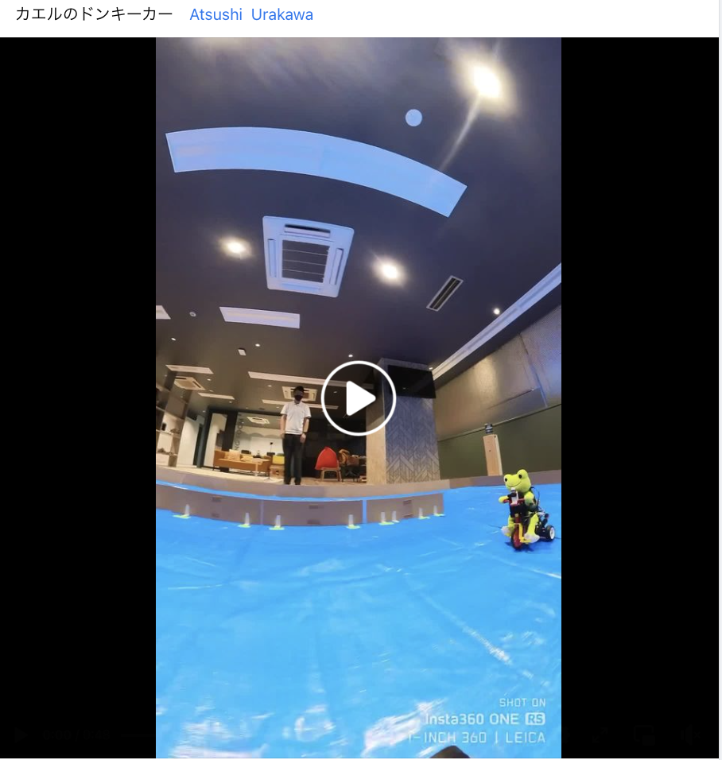
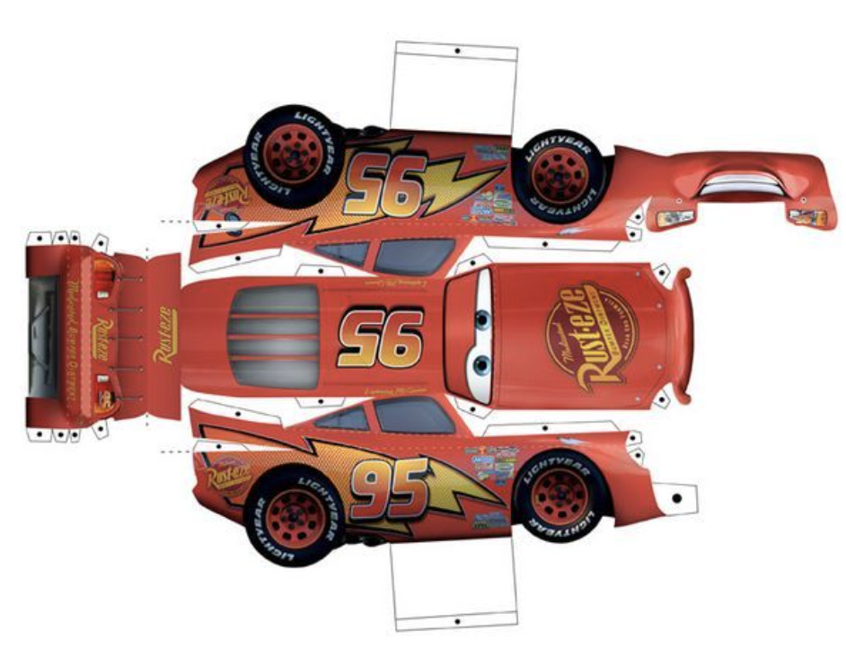
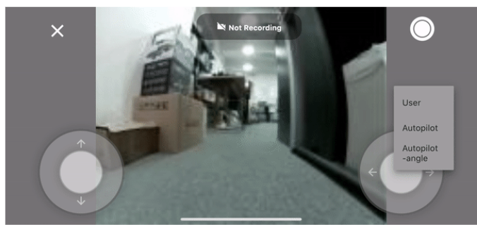
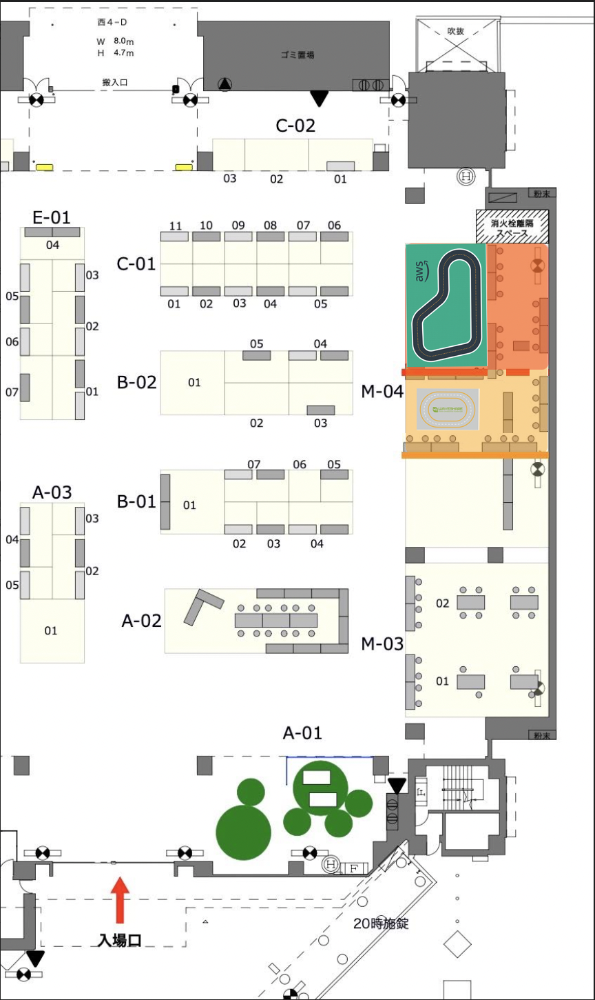
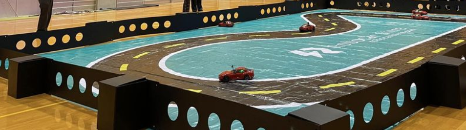

連絡・調整事項

- [x] 主催は 有志の 「のAIでRCカーを走らせよう」のコミュニティで良いか？

  > 2019年と同じだと https://peatix.com/event/963181?lang=ja
  > オライリージャパンの主催プログラムとなりますが、運営面で角川アスキー総合研究所が協賛、企画でフェイスブックグループのAIでRCカーを走らせよう! が協力

    フェイスブックグループのAIでRCカーを走らせよう!
  - https://www.facebook.com/groups/2249059025382644/

    コミュニティ管理者
    - 遠藤 諭
    - 佐々木 陽
    - 山本 直也
- [ ] 危険物申請

    >パソコンやスマートフォンなど市販の家電製品への充電に使⽤する際のリチウムイオン電池のモバイルバッテリは申請不要です。

    それ以外の使用では 申請が必要です。下記のgoogle spreadsheetにご使用されるバッテリの製品名などを記載してください。

    - https://docs.google.com/spreadsheets/d/163RyX407vJxyzI4dEilmphnCulDfDH61qmqXMP91svM/edit?usp=sharing

- [ ] コースと外壁、床

- [ ] 内容とタイムテーブル

  - 1日目
    - 午前
        - フリー部門: 学習
        - レース部門: 学習
        - フリー、レース部門: 走行
    - 午後
      - ① 子供むけ体験会
      - ② フリー走行/モビリティ交流会

  - 2日目
    - 午前
        - レース部門: 予選/レース
        - フリー部門:走行
    - 午後
      - ① 子供むけ体験会
      - ② フリー走行/モビリティ交流会

- [ ] 募集と参加費

  フリー走行枠とレース枠で、AI ラジコンカーのユーザを合計 2４名を参加者として、募集する。どちらの枠も参加者が走行できる車体(Donkey Car, Jet Racer、その他ロボカー)を持参することが参加条件です。

  - MFT公式 事前チケット(1000円)
  - 机・椅子などの備品代 (3000円)

  合計 4000円が参加費

  語句について

    - フリー走行枠

      主に Donkey Carを対象として、コースを周回できるかを目的とする

      https://www.donkeycar.com/

      ニューラルネットの教師あり学習

    - レース枠

      Jetracerなどの速さを競う部門、２台づつのトーナメント形式で、競争を行う

      https://fabo.store/collections/jetracer

      ResNet,転移学習

- [ ] 事前講習会

  9月 都内でDonkey Carの講習会を行い、MFT当日のフリー走行部門のための予告と参加者を募集する

  - Donkey Car S/Wのアップデート
  - ローカルPCでの学習の講習
  - AI走行の実施

# (ドラフト）AIでRCカーを走らせよう！ MFT2023

 fb:naoya.yamamoto.3154  <a href="https://www.facebook.com/groups/2249059025382644"> AIでRCカーを走らせよう </a>

[Maker Faire Tokyo １０月１４日（土）１５日（日)](https://makezine.jp/event/mft2023/)

## このイベントについて

　AIを搭載したラジコンカー（Donkey CarやJetRacer、自作の模型カー）や ロボットカーの体験イベントと走行会を行います。走らせるコースとしては、体験イベント向けのスペースで気軽に走らせることができるコースと、レースが行える走行会むけのコースの２つの空間が用意されます。

> MFT2019 https://robotstart.info/2019/08/29/donkeycar-maker-tokyo.html

> MFT 2022 https://ascii.jp/elem/000/004/107/4107194/

1.  **体験**

    トラックでは ラジコンやロボカーを動かしたり、触ったりすることができます。

    対象: 子供、AI/IoT初心者

    > 以下は 現在 検討中の企画候補となります。AIRCコミュニティの有志がインストラクターとなり、５分程度の時間、交代で子供たちが 用意されたラジコンカーを操作・体験します。

    - ラジコンカーを動かしみよう

      

      > 参考 [カエルのドンキーカー](https://www.facebook.com/reel/578585950672956)

    - ラジコンカーをデコってみよう

      > 手書きやテープなどで、ラジコン化のフレームや車体をデザイン、または Generative AIを利用した印刷可能な紙の車体を作れるイベントを計画中

      > 参考 https://www.pinterest.com/pin/309622543102147338/

        

      > 参考 モルカーデコレーション https://hobby.dengeki.com/news/1418267/

      > 参考 [誰でもカーデザイナーになれる？「画像生成AI」にクルマを描かせてみた 2枚目の写真・画像](https://response.jp/article/img/2023/05/17/371044/1886478.html)

1. **理解**

    - 展示ボード

      - 簡易のA1程度の説明板を用意
      - 部品・ハード面はラズパイなど貼り付けておく。

    - ラジコンカーとAIの仕組みの解説

      - Donkey Car とは?

        AI ラジコンカーの入門の解説と走行

        [Doneky Car アプリ](https://medium.com/robocar-store/robocar-controller-quick-start-guide-bdf8cb16d7ce)

        

2. **走行会**

    Donkey carやJetRacer など AI RC カーのタイムトライアルができるスペース。

    対象: 既にAIカーを動かしているメーカー（社会人、学生)

    - ドンキーカー 部門

      募集人数: 12人

      Donkey Carなどで、AIによる自動走行でコースを脱線することなく周回できることにチャレンジする

    - レース部門

      募集人数: 12人

      JetRacerやデジタルツインの仕組みを利用したラジコンカーで、如何に早くコースを自動走行できるかを主眼に、レースを実施する

      - 予選 (一台づつ)

          - 3周する時間を計測
          - 上位 8台がトーナメントに進みます。

      - トーナメント (２台で 競走)

          - 一回戦  4試合
          - 準決勝  2試合
          - 決勝    1試合

3. **モビリティ・ロボット交流会**

    MFTメーカとして参加した方々が利用可能なデモスペースとして、IoTロボットやモビリティを動かしてもらい、交流を促進する場所としてオープンに利用可能とする。

---
Layout

  原点に帰って、可能なコースをコンクリートの上にテープを貼って作る

  > 参考情報、既存のコースサイズは以下となります
  - AWSコースがレース用

      [e:Invent 2018 Track　4.95m x 7.5m](https://www.robocarstore.com/collections/tracks/products/aws-deepracer-standard-track)

  - Jetracerが体験用

    [JetRacer oval 2m x 3m](https://www.welectron.com/Waveshare-99001-Track-Map-for-JetRacer-PiRacer_1)

  

- 机・椅子

  長机 １２台、椅子２４脚

- コースの外壁 (要検討)

  > ダンボールで自作する予定

  

---
## 運営チーム
Facebookグループ「AIでRCカーを走らせよう!」
https://www.facebook.com/groups/2249059025382644/

---
## 開催概要

### セミナータイトル

「AIでRCカーを走らせよう！ MFT2023」

### 開催日時

- 2023年10月14日 (土）12:00 - 19:00
- 2023年10月14日 (日）10:00 - 19:00

### 会場
東京ビッグサイト（東京国際展示場）　西3・4ホール
東京都江東区有明3-11-1

### 参加費
AIカー走行経験者／「AIでRCカーを走らせよう！ MTF2023」参加：4000円 (MFTチケット込み)

  > (要調整) 机・椅子、コース設置費用で 3000円 x 24人 = 72,000 円 は確保したい。MFT入場料で + 1000円で 参加に 4000円
  >  MFT公式のチケットは、公式で購入、コース利用料 3000円は会場で、直接徴収する

### 対象者

  AIカーの走行経験者

### 定員

24人

- フリー走行部門 12人
- レース部門     12人

  　WiFi/光回線の提供はありません。参加者個人で モバイルルータなどの通信回線をご用意ください。

  本体サイズ、重量、走行スピード等が、JetRacer (1/10) / Donkey Car（1/16）と著しく異なる場合は事前に問い合わせください。

### 免責事項
　会場の無線環境によってAIカーの無線コントロールが難しくなる可能性があります。

- 開催内容は予定です。都合により変更・中止となる場合があります。
- 「AIでRC カーを走らせよう」の参加申し込みには、定員となり次第申込受付終了とさせていただく場合がございます。

## イベントに関するお問い合わせ先：

- Email: support@kwiksher.com

  > 他 fb group, fabo discordを予定

---
# 事前 ドンキー講習会

### 日時
### 場所
### 受講に必要な機材について（受講前に必ずご確認ください）
- Donkey Car、自作AIカーのいずれか、コントローラ

    > ただし、今回使用予定のコースで走行するのに相応しい本体サイズ、重量、走行スピード、動力のものに限らせていただきます。

  > 合致しない場合は、当日、走行をお断りする場合がありますのでご注意ください。

  > PCまたはMac（Chromeブラウザがインストールされている必用があります）

### 機材のお貸し出しについて

> 株式会社 Faobの協力により、Donkey Carの車体の貸し出しを検討中

### 共催？

### 協賛?

> 2019は、NVIDIA

