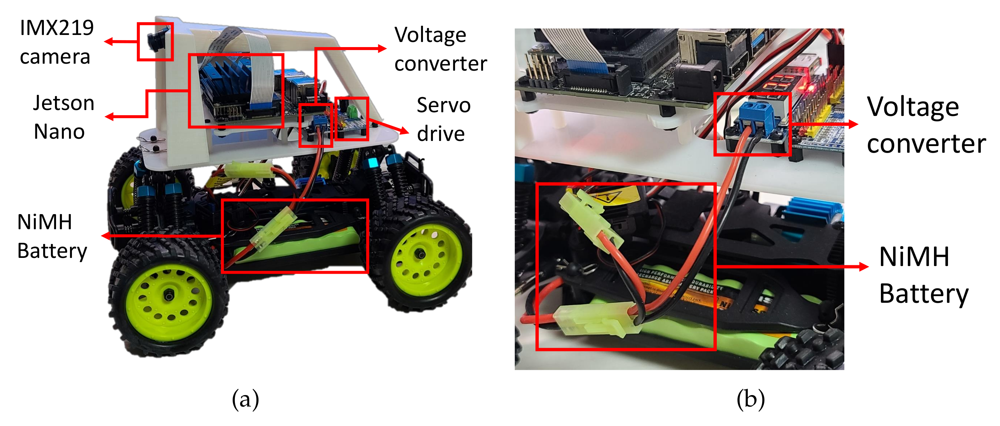

<small > FacebookグループのコミュニティURL  

</small>

# AIでRCカーを走らせよう！ コミュニティ

- **AIカーの魅力と可能性**：AI（人工知能）で自動走行する模型の自動車「AIカー」
- **AIカーの今後の展望**：AIカーをレースのような形で突き詰めることで、自動運転の技術革新につながる可能性を示唆。
- **AI/ロボットの楽しさや教育性**: Generative AIやIoT, メカトロニクスを伝える。

 

The next big thing will start out looking like a toy   <small>Innovators's Dilemma by Clay Christensen</small>

<small>
  AIやIoT・ロボットに取り組む方ならば、 誰でも入れるオンライングループです
 2023.10.14
</small>

---
<!--_header: 'https://www.mdpi.com/2079-9292/10/17/2102'-->

 

カメラ、コンピューター、モータ制御
1. 人間が操作して10～15周くらいコース上を走らせます
2. 人間の操作からAIが運転方法を取得(AIの学習モデル構築)
3. カメラの画像からAIが「こんな風景のときは“ステアリング”と“スロットル”こうだったよねと自動走行します。

---
chatGPTと同じTransformerのAIモデルへと進化中

---

