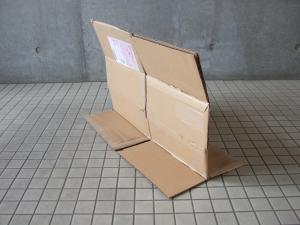
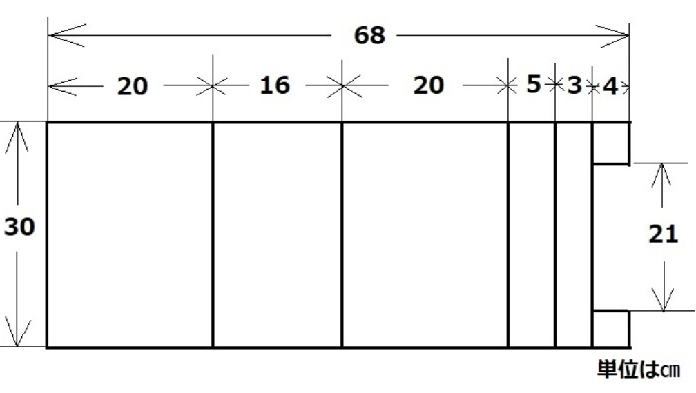

- [x] 出展内容調査フォーム  In Progress
- [x] 計画・日程 In Progress
- [ ] 展示・備品代 支払い 7/12?

----

コース

- [ ] 搬入補法？
   - [ ] 掛川から軽トラを持ってくることも可能だが、、
- [ ] ダンボールの入手方法、保管場所は? Fabo@秋葉原？
  - [ ] 養生テープ
  - [ ] 電源タップ

    ダンボール 52cm ≒ 520 /24.7 = 21.0 px

    - Area TOP 208x245 ≒ 5137 x 6051　≒ 5m x 6m
    - Area Bottom 316x120 ≒ 7805x 2964 ≒ 8m x 3m

    4200/170px = 24.7

    => 35枚くらい

    
    
    

    https://rmenx13.hatenablog.com/entry/2022/11/01/060000

    
    
    

    http://mago.pepper.jp/danbo-img/60/mago_Partition.pdf

    {{}}


https://www.researchgate.net/publication/351455198_A_Gamified_Simulator_and_Physical_Platform_for_Self-Driving_Algorithm_Training_and_Validation


---
計画・日程
- [x] スケジュール
  - [x] 募集
  - [x] 事前走行会
    > ~~会津？~~


https://kitabunka.or.jp/cocokita/


  事前ドンキー

  https://c1race.com/watching_2023/

  小学生にホイールのデザインと塗り絵体験コーナー
  https://car.watch.impress.co.jp/docs/news/1500292.html

  「トヨタRCスクール」、競技会「トヨタチャレンジカップ」を行なうイベント
  https://car.watch.impress.co.jp/docs/news/1492345.html

  https://toyotarccarclub.boo-log.com/

  有料施設
  - https://kitabunka.or.jp/cocokita/
  - https://sooo-dramatic.com/rental
  - https://puzzle-scs.jp/akb/cafe/rental/jirei-c
  - https://lifork.jp/akihabara2/lounge.html

----

メール

1. スペース、レンタル備品の確認

    ||ウェブ申込|メール 5/31|
    |:------|:------|:-----|
    |■出展スペース|4,200*4,200mm| オレンジエリアだと 8m x 12mほど|
    |■テーブルの数|4本|12本 x 3000円 = 36000円|
    |■椅子の数|16脚|24脚 x 500円 = 12000円|
    |■電源容量(W数）|2,000W|3000W <br>100v電源（1,501w〜2,000wまで） 12,000円 x 2 = 24000円|
    |■出展者タグ枚数|16枚|24枚数|


  - https://makezine.jp/event/mft2023/callformakers/#faq

    ```
    3. 出展料、レンタル備品、
      電源のお支払い
      2023年7月12日（水）

      お支払いにはクレジットカード決済（出展承認メールのURLからSquareにアクセスしてお支払い）、銀行振り込みをご利用いただくことができます。
      お支払い先は、出展承認メールにてお知らせします。期日までにお支払いが確認できない場合は、出展を取り消すこともあります。
    ```

    ```
      ---------- Forwarded message ---------
      From: Hideo Tamura <tamura@oreilly.co.jp>
      Date: Tue, Jul 11, 2023 at 3:50 PM

      なお、ご請求なのですが、追加などが発生する可能性もあり、
      会期後請求にさせていただければと思っております。
    ```

2. 「出展内容調査」「危険履申請」の提出　7/24（月）締切

  - 火気・危険物に関する申請書
  - 展示レイアウト図
  - 申請項目に該当する物品の製品カタログ または安全データシート

    https://makezine.jp/event/wp-content/uploads/sites/2/2023/05/kikenbutsu_Maker.pdf

    モバイルバッテリー(リチウムイオン電池)

    > ラジコンカーのバッテリーもモバイルバッテリーだろう 内臓と言えるのだろう (スマホのバッテリーやパソコンも交換可能の場合もあるし)

    - 作品の電源としての使⽤ではなく、**パソコンやスマートフォンなど市販の家電製品への充電に使⽤する際には対象外**

      

      [sample_shinseisho.pdf](https://makezine.jp/doc/MFT2023_maker_kikenbutsu.zip)

      - パソコンやスマートフォン、携帯電話、デジタルカメラなど市販の家電製品に内
        蔵されているリチウムイオン電池以外の、電子部品として販売されているリチウ
        ムイオン電池(リチウムポリマー電池も含む)が対象です。

        > 家電製品に内蔵されているリチウムポリマー電池もリチウムイオン電池の範疇ですよね？！

        

3. プレゼンテーションなどのお申し込みについて

4. 製作途中の様子の共有のお願い

---


---
AI_RC_Car_MFT2023_plan.md.pdf

  

