

# Wammyで AI ラジコンカーをデコレーション

<small > AIでRCカーを走らせよう！MFT2023  2023.08.25</small>

> コクヨ・Wammy（ワミー） https://www.kokuyo-st.co.jp/stationery/wammy/  曲げたり間を通したりして様々なつなぎ方ができ、アイデア次第で多彩なカタチが作れます

---

---

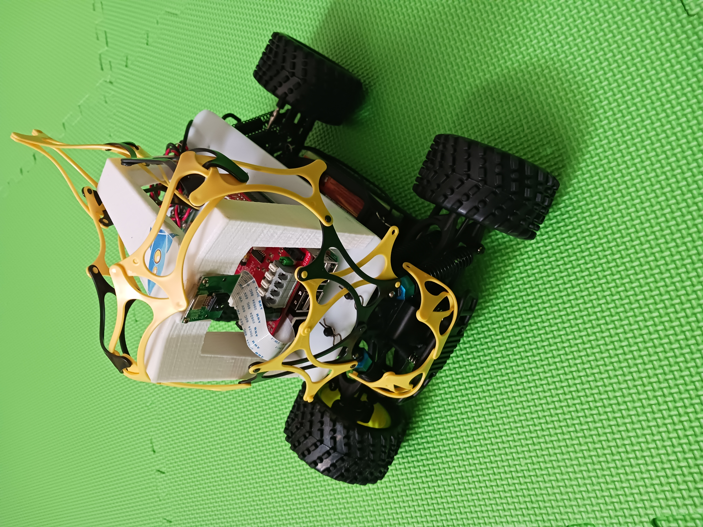

---

現在

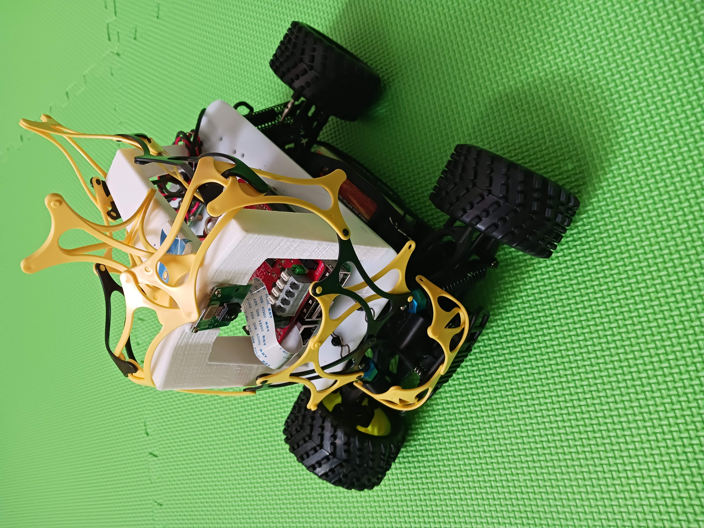

---
<!--_header: 'https://www.facebook.com/594Wammy'-->

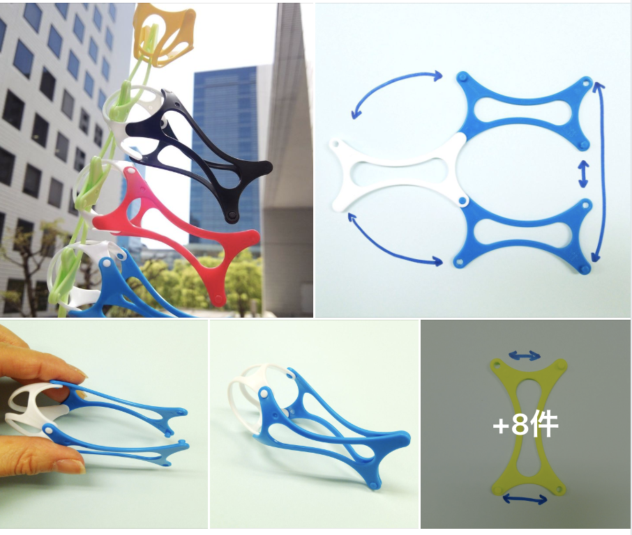

---
<!--_header: 'https://www.facebook.com/594Wammy'-->

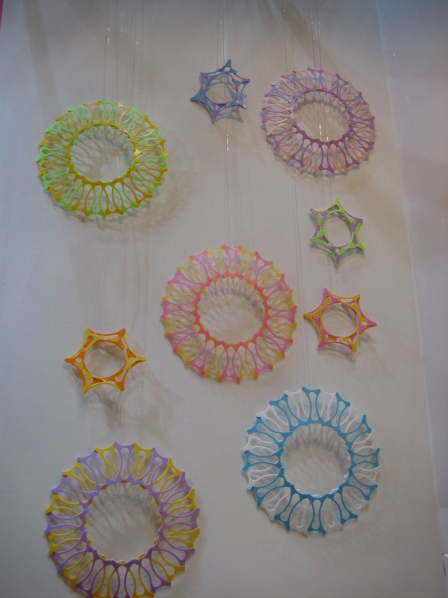

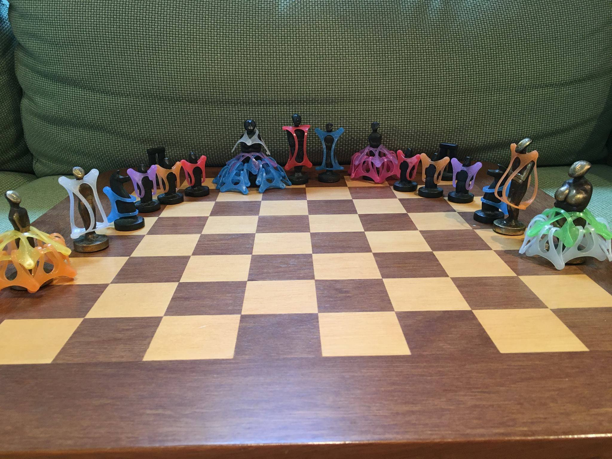

---
<!--_header: 'https://www.facebook.com/594Wammy'-->

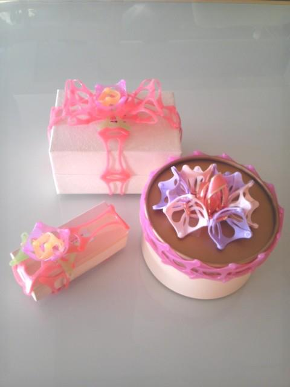

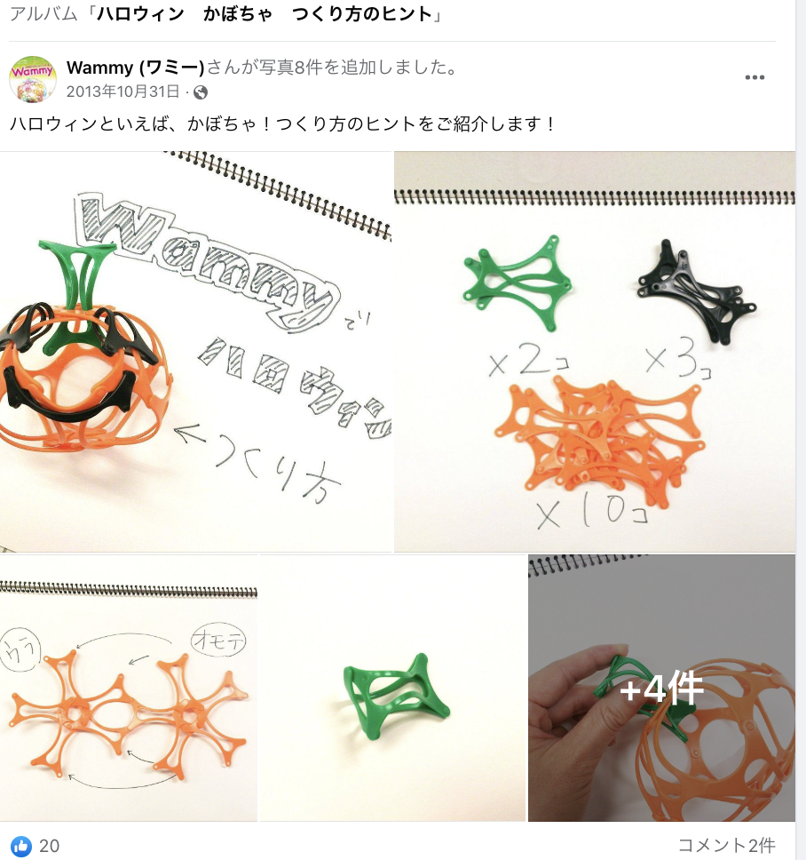

---
<!--_header: 'https://www.facebook.com/594Wammy'-->

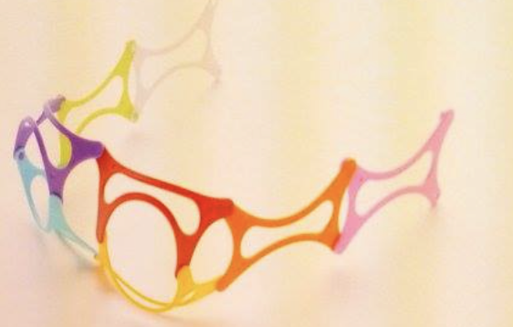

---
<!--_header: 'https://www.facebook.com/594Wammy'-->

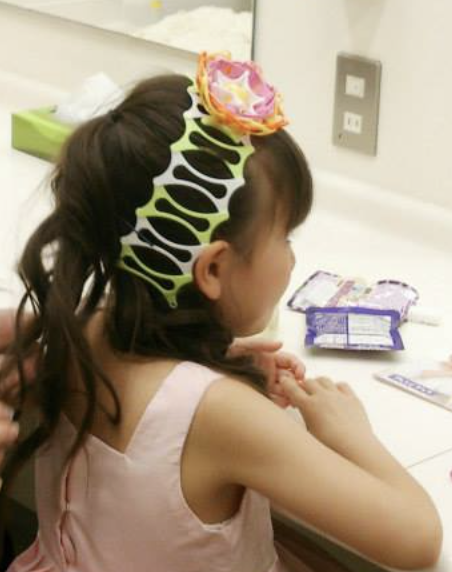

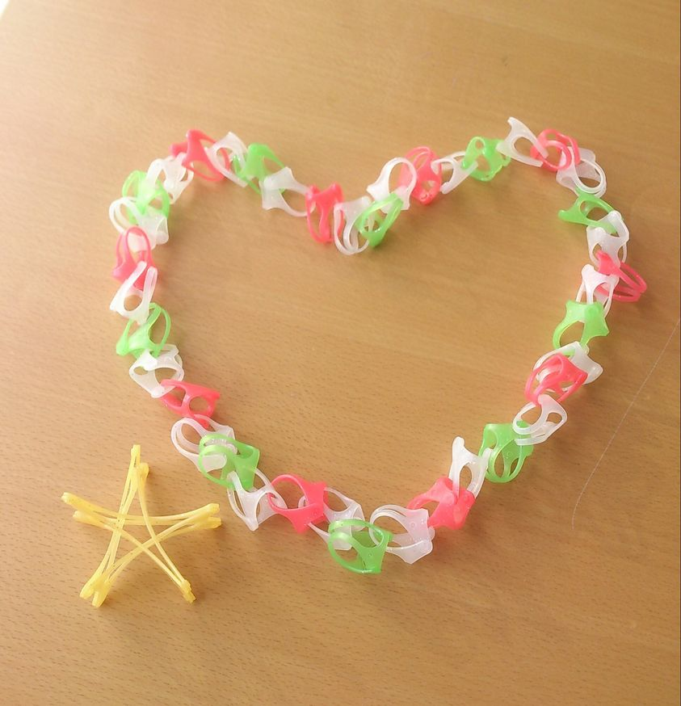

---

- https://ameblo.jp/hirosakihanazonohoikuen/entry-11455853923.html

- https://www.kokuyo-st.co.jp/stationery/wammy/for-example/index.html

----

- コクヨ・Wammy（ワミー）
  https://www.youtube.com/watch?v=LJyTFeXtvdY

  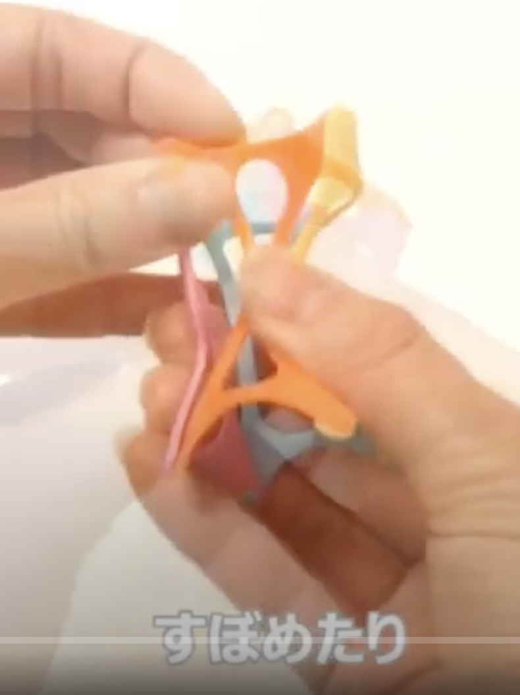

- https://www.youtube.com/watch?v=Lh6YT3sxfZQ

  【ワミー】ボールをつくる（5才から） #家で一緒にやってみよう
    https://www.youtube.com/watch?v=G9ed_gU-q6o

  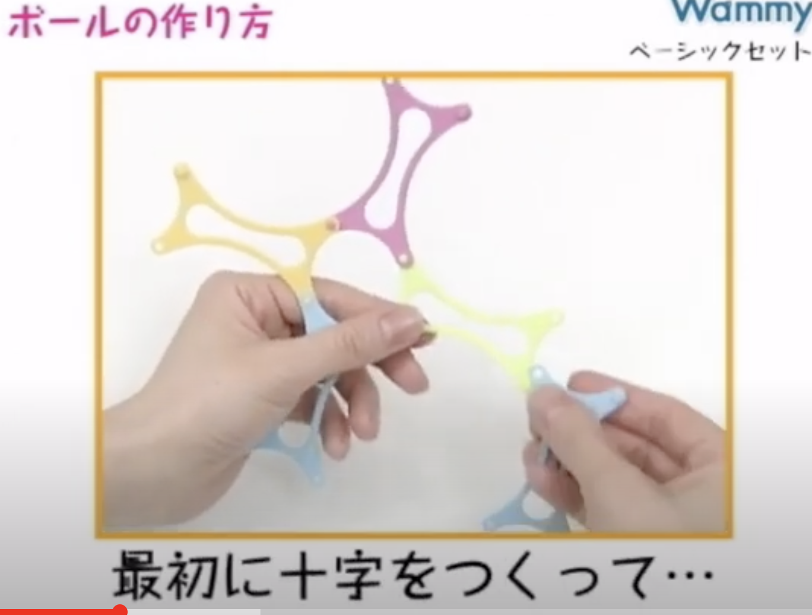

