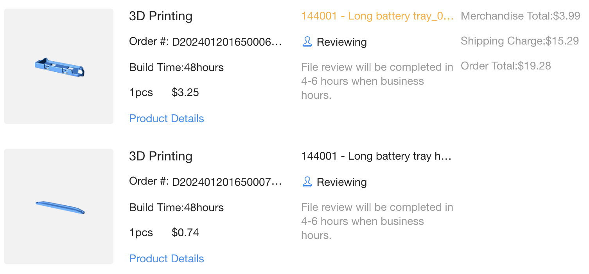
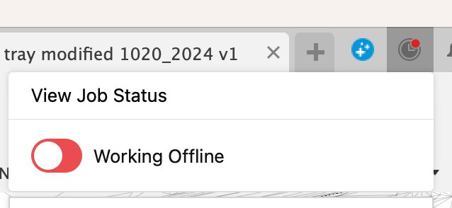
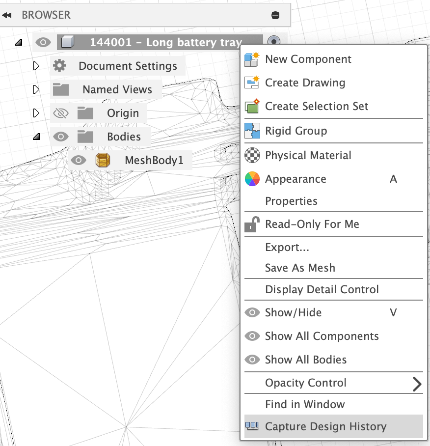
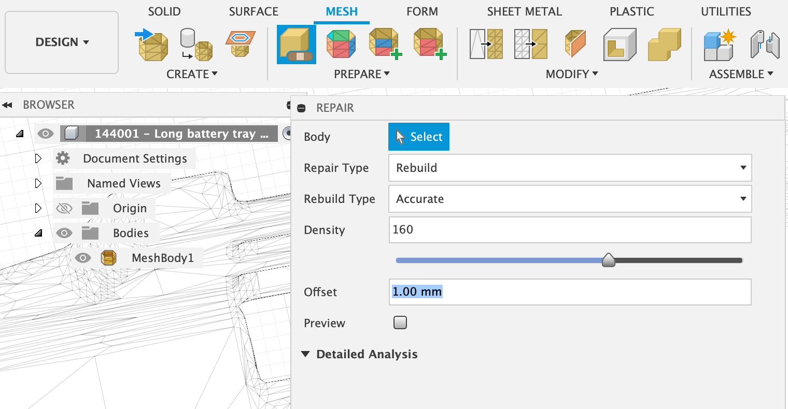
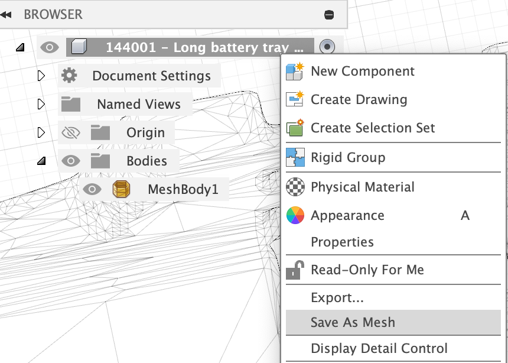
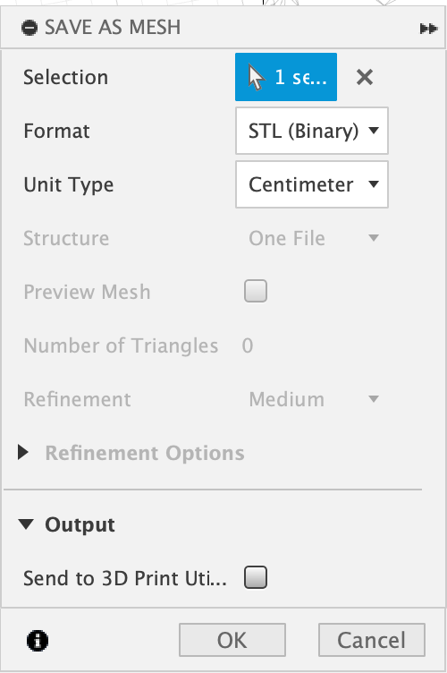

wltoys

long-battery-tray-for-wltoys-144001-144002-144010/

- 144001 - Long battery tray battery wedge.STL
- 144001 - Long battery tray holding plate.STL
- 144001 - Long battery tray studs.STL
- 144001 - Long battery tray.STL

https://jlcpcb.com/

> SLA(Resin)のWhiteが 48hours, $20

{{}}

STLのチェック

> HX80G Z:\home\ymmtny\projects\STLCHK_Light

http://www4.kwix.co.jp/premium/stlchecktool/

## Fusion 360

1. working offline

  {{}}

1. desing history off

  {{}}

STL

1. Open STL
1. Repair or Make Solid Body to patch it

    - Rebuil
    - Accrrate
    - Density 160
    - Offset 1mm

    {{}}

  Sold Body for patching

  1. Create a solid body
  2. Mesh Create Tesselate
  3. Mesh Combine

1. Save As Mesh

    {{}}

   - centimeter

    {{}}

=> 144001 - Long battery tray_0120.stl

## MeshLab

[Fusion360（無料版）でメッシュデータを自由に変形](https://www.kazuban.com/blog/mesh-to-solid/)

[STLをクアッドメッシュに変換してFusion360でいじり倒す準備をする](https://note.com/newspeak/n/nd0d3c6127a47)

1. メッシュの要素数を減らす
1. ポリゴンメッシュをクワッドメッシュに変換する

    Filters > Polygonal and Quad Mesh > Turn into Quad-Dominant mesh

    - Better quad shape

1. Export Mesh As…でファイル形式を「.obj」

  - Convert triangles to polygons

=> 144001 - Long battery tray.obj

---

Misc

- [Fusion360でSTLを編集できる！ReCap Photoの使い方・前編](https://makerslove.com/18391.html)

-  https://voltechno.com/blog/fusion360-stltosolid/

  角柱には　サブスクリプションが必要

wall thikness

- https://i.materialise.com/en/learn/wall-thickness-analysis
- https://www.shapeways.com/blog/archives/40936-visualizing-wall-thickness-in-a-3d-model.html

- https://3dprinting.stackexchange.com/questions/5062/how-to-make-walls-thicker-using-meshmixer-or-meshlab

  make solid. Set the mode from fast to accurate.
  I set the solid accuracy and mesh density to anywhere from 300 to 500.
  Then I slowly increase offset distance until the holes are sealed.
  I leave the minimum thickness at 0 because it doesn't appear to help much.

crossed

- https://www.sculpteo.com/blog/2017/08/29/3d-printing-failure-how-to-avoid-crossed-volumes-on-your-3d-model/
