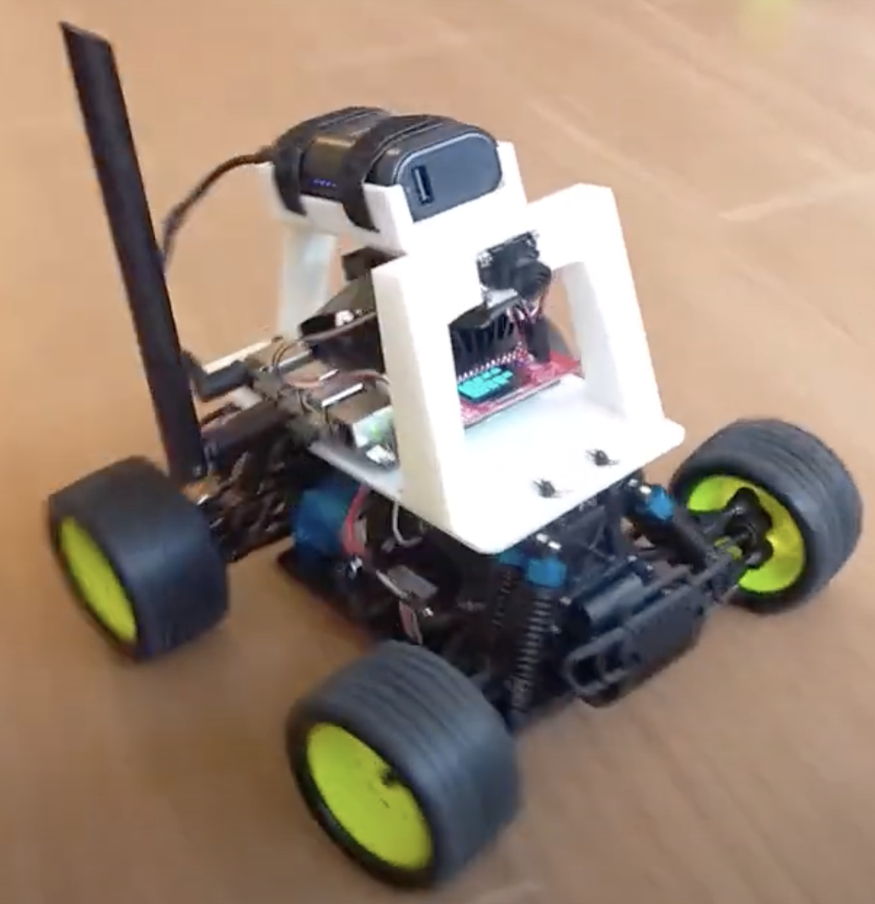
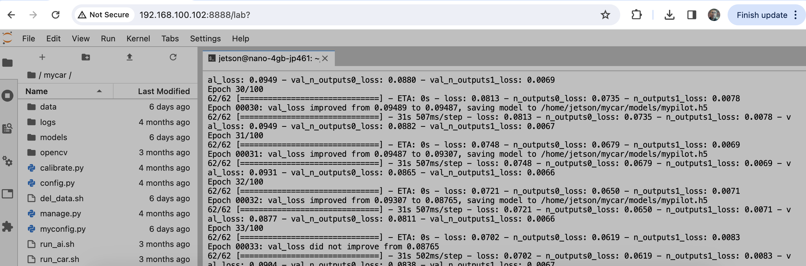
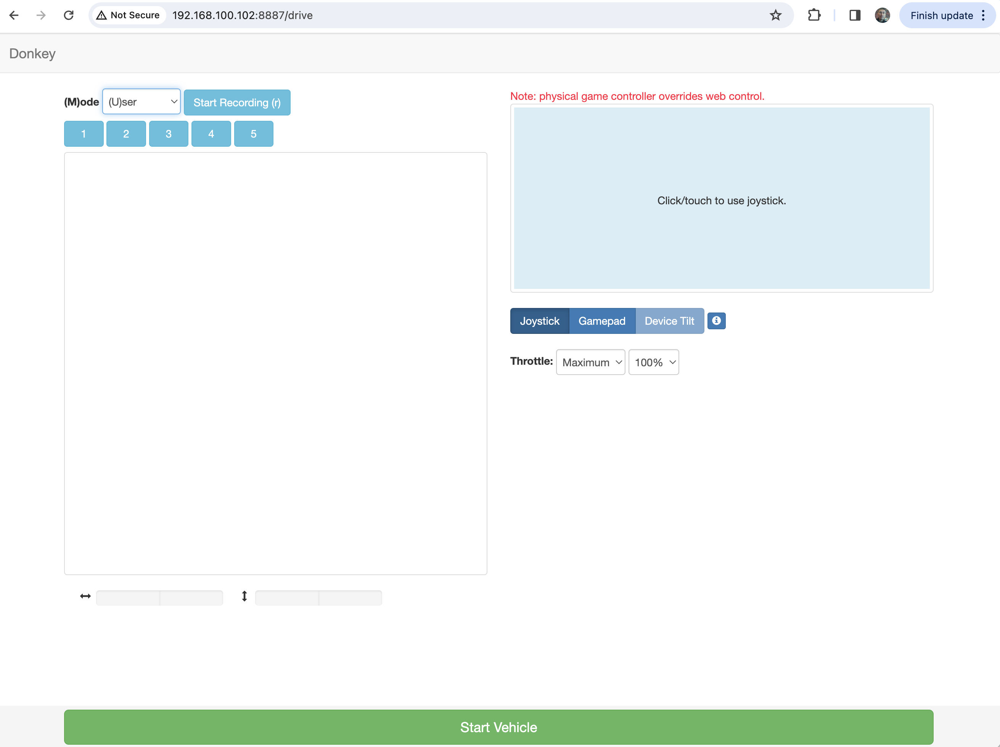

### Jetson Nano ドンキカー

{{}}

{{}}

## 概念図

  ```mermaid
  graph TB
  subgraph Donkeycar
    subgraph jetson[Jetson nano]
      jupyter[jupyter service]
      app[donkeycar v4.5.0]
    end
    mobile([モバイルバッテリー])
    yokomo([ラジコンバッテリー])
    switch([ラジコンスイッチ])
    stirring
    motor
    controller
    app-.-controller
    controller -.- motor
    controller -.- stirring
  end

  subgraph joystick[ゲームパッド]
    buttonB([Bボタン 記録 On/Off])
    buttonA([Aボタン 削除5秒])
    start([startボタン 切り替え 手動・Auto])
    stickL([左ジョイスティック ハンドル])
    stickR([右ジョイスティック アクセル])

  end

  joystick -.- app

  subgraph pc[PC]
    browser([chrome browser <br> del_data<br>run_car<br>run_train<br>run_ai])
  end
  browser -. http://host_addr:8888 .-jupyter

  USBAdapter([USB充電])
  mobile -.- USBAdapter
  LiFeAdapter([充電器/放電器])
  yokomo -.-LiFeAdapter

  WifiSpot[無線LAN DONKEY0001]
  WifiSpot -.- Donkeycar
  WifiSpot -.- pc

  ```
----

## ワークフロー

1. 学習のための走行データの取得

    ```mermaid
    graph LR

    subgraph ラジコン
      hw[電源ON ラジコン、ゲームパッド]
    end

    subgraph PC
      del[前回のデータを消す del_data]
      run[走行 run_car]
      stop[狩猟 run_carをキャンセル]
    end

      hw -.-> del
      del -.-> run

    subgraph ゲームパッド
      drive[走行 15周 Bボタンで記録 On/Off]
    end

    run -.->drive
    drive -.-> stop
    ```

1. 学習

    ```mermaid
    graph LR

    subgraph ラジコン
      state[停止状態 電源はそのままでOK]
    end

    subgraph PC
      train[学習 run_train 10-20分]
    end
    ```

1. AI 走行

    ```mermaid
    graph LR

    subgraph ラジコン
      stateOK[自動走行状態]
      stateNG[衝突して止まった]
    end

    subgraph PC
      auto[AI走行 run_ai]
      stop[終了 run_aiをキャンセル]
    end

    subgraph ゲームパッド
      drive[startボタンで走行切り替え]
      userangle[ジョイスティックで後進させて位置を戻す]
    end

    auto -.->drive
    drive-.->stateOK
    stateOK -.->stateNG
    stateNG -. startボタン.->userangle
    userangle -.startボタン.-> drive
    stateOK -.-> stop
    ```
1. 状態チェック

  ```mermaid
  graph RL

    subgraph ラジコン
      battery[ラジコン バッテリー]
      wheels[車輪]
      subgraph jetson
        WiFi
        camera[カメラ]
        mobilebattery[モバイルバッテリ]
        donkey[donkey web server]
        jupyter[jupyter server]
      end
    end

    subgraph ゲームパッド
      batterycell[乾電池]
      mode[モード]
      inut[XInputとDirectInpu]
    end

    subgraph 予備バッテリー
      battriesUsed[バッテリー 使用済]
      battriesNext[交換用バッテリー]
      adapterCharge[充電器]
      adapterDischarge[放電機]

      adapterCharge -.- battriesNext
      adapterDischarge -.- battriesUsed
    end

    subgraph PC
      chrome[ブラウザ]
    end

    WiFiSpot[無線LANスポット Dokey001]

    chrome -. http:<IP>:8888 .- jupyter
    chrome -. http:<IP>:8887 .- donkey
  ```

  - [ ] ラジコンカーとJetsonが走行可能な状態か？

     run_car または run_aiを実行後に、http://<ip>:8887 をブラウザで開いてみてください。

     jupyternoteのブラウザ画面のrun_car/run_aiのログにエラーが出力されていないかを確認してください。

  - [ ] 走行データの記録ができたか？

    画像ファイルの数を確認する

    ```
     ls -l ~/mycar/data/images | wc-l
    ```

 - [ ] 学習ができたか？

    run_trainのログで状態を確認してください。

    - epocの出力が正常に終了したことを確認してください。

      画像ファイルがないなどのエラーの場合は、すぐに終了します。

    - mypilot.h5が保存された旨のログが出力されます。


- [ ] 自動走行が期待された結果にならない。

    学習データに正常な走行には不必要な衝突などのデータが混じっている可能性があります。

    - raspi用PCに構築された donkeycarの環境で、donkey uiを実行してデータを確認できます。

      > raspiの手順を参考 raspi.md

      1. raspi用ホストPCで conda activate donkey
      1. rsyncでホストPCに mycar/dataフォルダをコピーする。
      1. donkey uiをたちあげて、tab managerで確認

          ```
          conda activate donkey
          cd ~/projects/mycar

          rsync -rv --progress --partial jetson@<IP>:~/mycar/data/  ./data/

          donkey ui
          ```


------

## 事前準備

- 展示用の無線LANスポット(DONKEY001) の電源をON

- 搭載されたJetson Nanoとラジコンカーのそれぞれのバッテリーが十分に充電しておく

  - ラジコンカーバッテリー
  - jetson nano用バッテリー

- ラジコンとJetsonNanoの電源をONにします。

  - 無線LANスポット: DONKEY001に自動で接続されます。

      > インターネットに接続していない無線LANスポットです

      >　パスワード: 1が８個

    - 固定IP デモ１号機と２号機に割り振られています

      - 192.168.100.101
      - 192.168.100.102

----
## 操作

PCブラウザでJupyter notebookからドンキカーに走行データ記録、学習、自走走行のコマンドを実行します。

{{}}

ラジコンカーに搭載されたJetson nanoにある以下のシェルコマンドがJupyter notebook経由で使用可能になっています。

PCを無線LANスポット: DONKEY001に繋ぎ、Chormeブラウザで　http://<Jetson nano IP アドレス>:8888ポートでjupyter notebookを開きます。

例 １号機

http://192.168.100.101:8888

1. del_data.sh
1. run_car.sh

    ゲームパッド
    - Bボタン(記録 on/off)
    - Aボタン

      衝突などのエラー操作があった時に、直前の10秒のデータを消去します


1. run_train.sh
1. run_ai.sh

    ロードするまで１０秒弱。 8887ポートで下記のDonkey Monitorが開きます。


    - Joystick

      Select button switches modes - "User, Local Angle, **Local(angle and throttle)**"

      - F710 では startボタンで走行が手動・自動が切り替わります。

    - http://192.168.100.101:8887

      Donkey Monitorでも　 mode: Localを選択することで　AI自動走行が実施されます。

      {{}}

