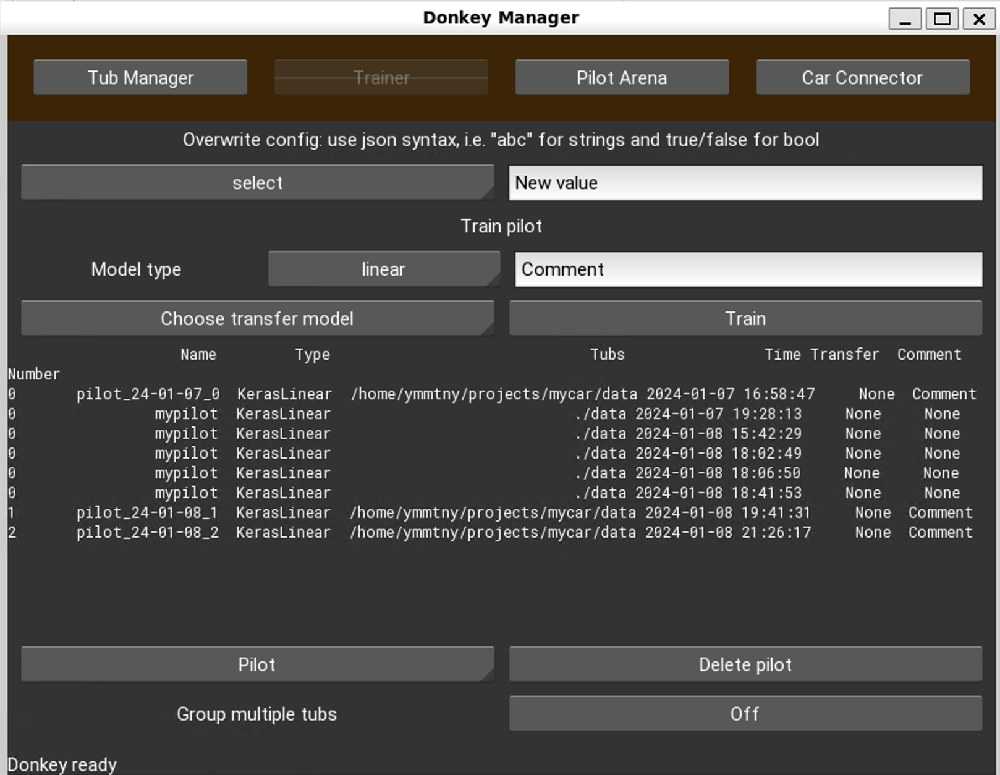



## Raspi Donkey カー

同じ .imgを使用 (HX80G > AI RC Car/raspi3_buster_donkey の.imgを利用)
- **donkey-blue.local**
  - 192.168.100.111
  - throttle, steeringのPWM_STEERING_PINとPWM_THROTTLE_PINの番号を入れ替え
  - THROTTLE_FORWARD_PWM, THROTTLE_REVERSE_PWMも抑えた値に変更
  - JOYSTICK_MAX_THROTTLEを1.0に変更
  - [ ] run_ai.service 設定
  - [ ] train behavior
  - [ ] stop sign

    myconfig.py
    ```
    TRAIN_BEHAVIORS = True
    BEHAVIOR_LIST = ['Left_Lane', "Right_Lane"]
    BEHAVIOR_LED_COLORS = [(0, 10, 0), (10, 0, 0)]  #RGB tuples 0-100 per chanel

    ```

    ```
    python manage.py drive --js --model models/my_beh.h5 --type behavior

    donkey train --tub ./data --model ./models/mypilot_behvior.h5 --type behavior
    ```

    ```
    user/throttle > 0.01  and user/throttle < 0.9
    ```

    ```
     def run(self, mode, recording, recording_alert, behavior_state, model_file_changed, track_loc):
     ```rm

- donkey-endo.local
  - 192.168.100.108
  - [x] run_ai.service 設定済み

{{}}

## 概念図

  ```mermaid
  graph TB
  subgraph Donkeycar
    subgraph raspi[raspi 3B+ donkey-endo]
      app[donkeycar v4.5.0]
      mycardata([mycar/data])
      mycarmodels([mycar/models])

    end
    mobile([モバイルバッテリー])
    battery([ラジコンバッテリー])
    switch([ラジコンスイッチ])
    stirring
    motor
    controller
    app-.-controller
    controller -.- motor
    controller -.- stirring
  end

  subgraph joystick[ゲームパッド]
    buttonB([Bボタン 記録 On/Off])
    buttonY([Yボタン 削除5秒])
    buttonA([Aボタン 緊急停止])
    start([startボタン 切り替え 手動・Auto])
    stickL([左ジョイスティック ハンドル])
    stickR([右ジョイスティック アクセル])

  end

  joystick -.- app

  subgraph pc[Windows WSL Ubuntu 20.04]
    subgraph mycar[home/ymmtny/projects/mycar]
      data([./data])
      models([./models])
      donkey-ui([donkey ui])
      train([donkey train --tub ./data --model ./models/mypilot.h5])

      data -.-> train
      train -.-> models
    end


    subgraph vscode[ssh donkey-endo]
      drive([python manage.py drive --js])
      driveWithModel([pythn mange.py drive --js --model ./models/mypilot.h5])
    end
  end

  pc -. ssh .- raspi

  data -. rsync .- mycardata
  models -. rsync .- mycarmodels

  donkey-ui -.cleaning.->data

vscode -.ssh.- raspi

  USBAdapter([USB充電])
  mobile -.- USBAdapter
  batteryAdapter([充電器])
  battery -.-batteryAdapter

  WifiSpot[無線LAN DONKEY0001]
  WifiSpot -.- Donkeycar
  WifiSpot -.- pc

  ```

---
## Windows WSL Ubuntu 20.04

ホストPCの環境は HX80GのミニゲーミングPCに構築

{{}}

キーボードとマウスを繋げてください。ヘッドレスでの利用も可能です、Windows Remote Desktopで別のマシンから遠隔アクセス可能です。

Raspiドンキーカーと同じ無線WiFiに接続してください。

> jetson nano ドンキーカーの無線WiFi DONKEY001である必要はありません。例 スマホテザリングなどで、任意のインターネットが利用可能なWiFiスポットに ドンキーカーとHX80GのミニゲーミングPCが接続していれば動作します。

 <div style="page-break-before:always"></div>

### アクセス

- ユーザ: ymmtny
- パスワード: !DonkeySkipCity2024

  ネットワークからアクセス可能な共有フォルダとして SMBで Users/ymmtnyフォルダにアクセス可能です。

  - ホスト名: smb://kwiksher-hx80g

  {{}}


Ubuntuは、Z: ドライブにもマウントしてあります。

{{}}

---

 <div style="page-break-before:always"></div>

### raspi img

raspiのイメージのバックアップが AI RC Car/raspi3_buster_donkey フォルダに格納されています。

- pi-image.img

{{}}

EtcherもWin32DiskManagerもインストール済みです。

---

### doc

この解説のウェブページは、C:/Users/ymmtny/Documents/のdocフォルダに格納されています。
hugo.exeを起動してウェブサーバがローカルに立ち上がります。

```
hugo.exe server
```


#### WiFi 接続

raspiドンキーカーを任意のWiFiに接続する場合は、**wpa_supplicant**のファイルを用意して、SDカードに書き込んでください。

---

 <div style="page-break-before:always"></div>

### vscode - mycar

vscodeのWSLアクセスで ~/projects/(WSL:Ubuntu) を開きます

{{}}

{{}}

例 左のターミナルが、sslのmycar環境で、右がsshしたraspiのコンソールです。

```
cd mycar
conda activate donkey
donkey ui
```

{{}}

注意

- 英語キーボード切り替え
  =>
    Microsoft Remotedesktop App > Connections > Keyboard Mode > Unicodeにする

    =>
      powser shellで入力できない、元のscancodeに戻す

- vscodeの EmacsキーのエクステンションでEmacsキーになってます。

---

### donkey web

```
python manage.py drive --js
```
- http://donkey-endo.local:8887

  - [ ] カメラ画像が正しく表示されていること
  - [ ] F710のゲームパッドの動作
    - [ ] 真ん中のLogicoolと書かれたボタンを押します。
    - [ ] ジョイスティック アクセル
    - [ ] ジョイスティック ハンドル
    - [ ] Bボタン データ記録 On/Off
    - [ ] Yボタン 直前のデータを消去
    - [ ] Aボタン 緊急停止

  > ターミナルにログが出てきます。

  > 問題なければ、走行データの記録が可能です、コースにて走行してください。Bボタンで記録がOn/Offします。

{{}}

{{}}

---

### コンソール操作

1. calibrate in raspi

    ```
    donkey calibrate --channel 1 --bus=1
    donkey calibrate --channel 0 --bus=1
    ```

1. drive in raspi

    ```
    python manage.py drive --js
    ```

    https://docs.donkeycar.com/guide/get_driving/

   - 100 records (5 seconds at 20 hz drive loop).
   - 10-20 laps of good data (5-20k images)

   => 5分-10分で 6000-12000 records


1. train in PC

    https://docs.donkeycar.com/guide/deep_learning/train_autopilot/

    ```
    rsync -rv --progress --partial pi@donkey-endo:~/mycar/data/  ~/projects/mycar/data/

    cd ~/mycar
    donkey train --tub ./data --model ./models/mypilot.h5
    ```

   <div style="page-break-before:always"></div>


    FYI..
    - 8000枚　10分
    - 14985 30秒/epoc  20分
    - 19915 40秒/epoc  22分
    - 19915 + 9016 50秒/epc 27分

      > donkey train --tub ./data_0108,./data_0110 --model ./models/mypilot.h5

      > intel macbookpro 2020 だと 19915 60秒/epoc 46分

1. copy back in PC

    ```
    rsync -rvt --progress --partial ~/projects/mycar/models/ pi@donkey-endo:~/mycar/models/
    ```

     > タイムスタンプオプション t

1. auto pilot in raspi

    ```
    cd ~/mycar
    mypilot=pilot_24-01-07_0.tflite
    python manage.py drive --js --model ./models/$mypilot --type tflite_linear
    ```

    例
    ```
    python manage.py drive --js --model ./models/mypilot.h5
    python manage.py drive --js --model ./models/pilot_24-01-08_1.h5
    python manage.py drive --js --model ./models/pilot_24-01-08_1.tflite --type tflite_linear
    ```

    - startボタン 切り替え 手動・Auto

      Select button switches modes - "User, Local Angle, **Local(angle and throttle)**"

      startボタンで走行が手動・自動が切り替わります。

    - Aボタン(緊急停止)

      衝突した場合は Aボタンを押す。 startボタンでユーザ操作またはLocal Angleにして、後退させて再度自動走行を実施

---

 <div style="page-break-before:always"></div>

### donkey ui

donkey ui を起動して、Tub Managerで走行データの確認が可能です,
Trainerも動作します。

> Pilot ArenaとCarConnectorの動作確認は未実施です。

```
donkey ui
```

{{}}

{{}}