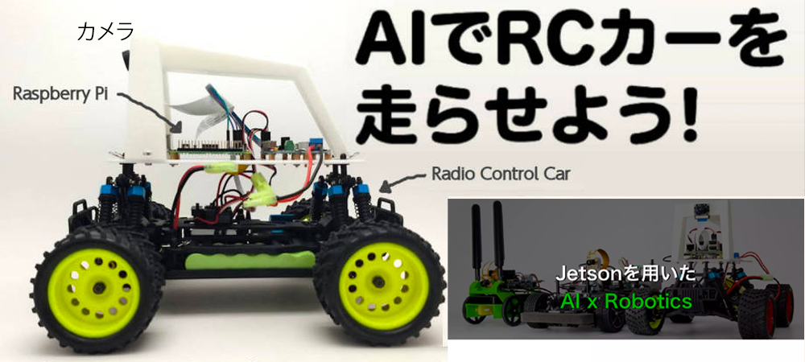
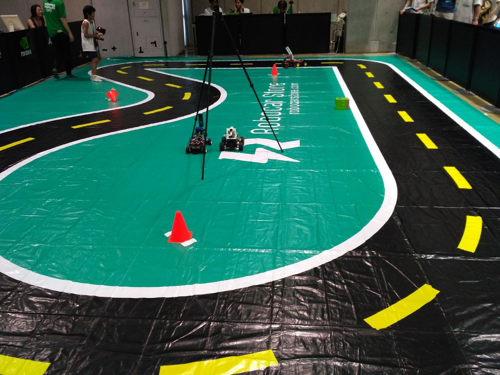
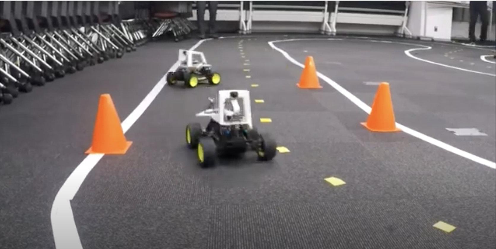
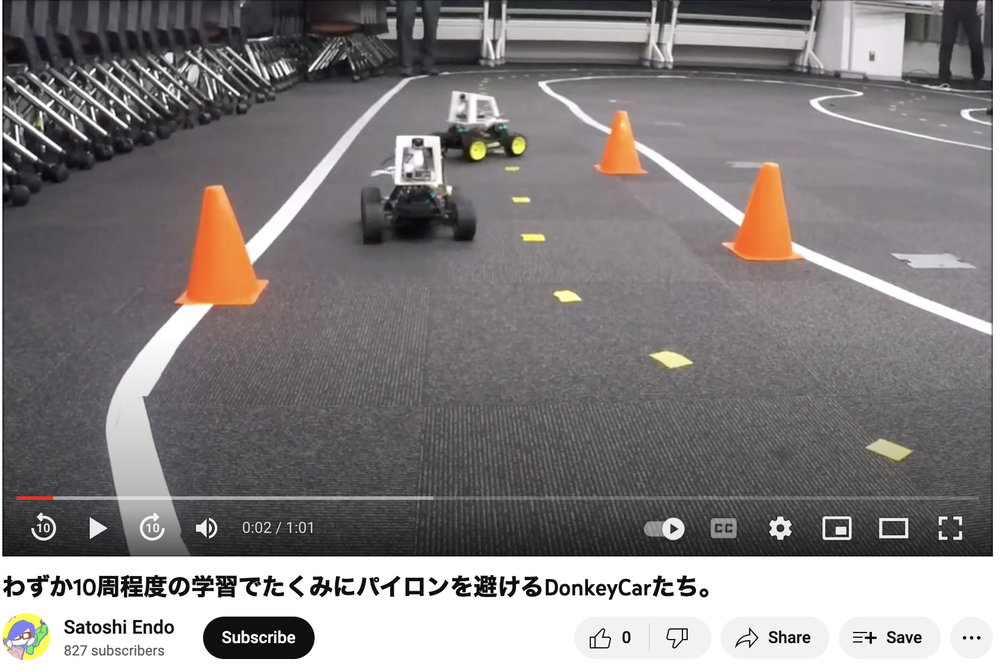
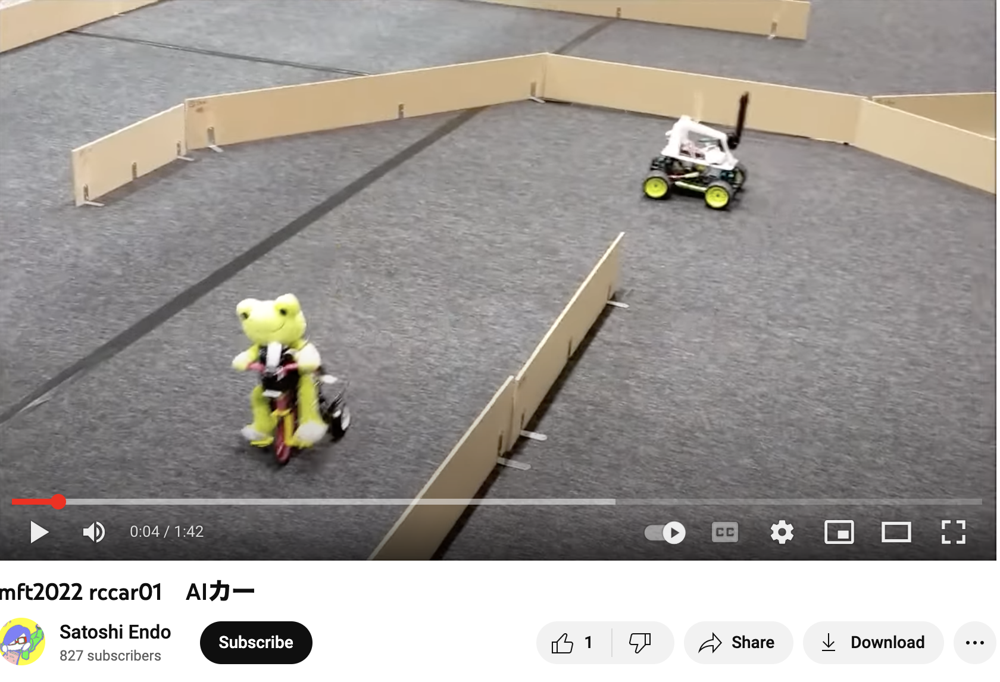
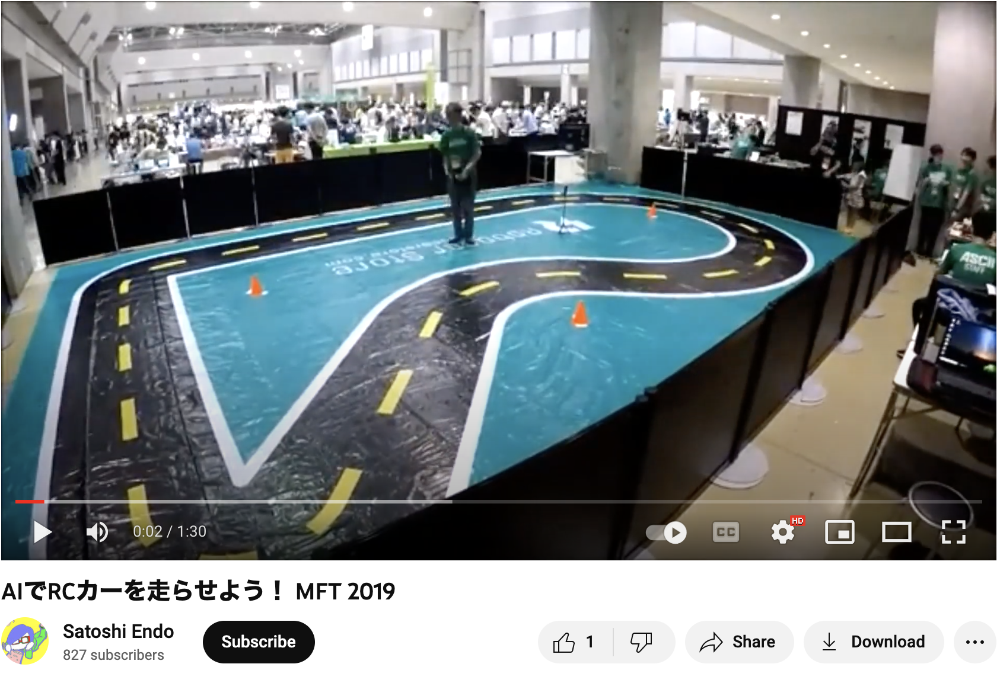

1-1. 出展者名
* 「AIでRCカーを走らせよう!」コミュニティ

1-2. 出展者名ふりがな
* 「AIでRCかーをはしらせよう!」 コミュニティ

1-3. 出展者名の英語表記

* AI RC Car Community

1-4. 代表者名（姓）

1-5. 代表者名（名）

1-6. 代表者名（姓）ふりがな

1-7. 代表者名（名）ふりがな

1-8. 代表者のメールアドレス

1-9. 代表者のメールアドレス（確認）

1-10. 代表者の携帯電話番号（半角）

1-11. 代表者の住所（郵便番号）

1-12. 代表者の住所（都道府県）

1-13. 代表者の住所（市区町村・番地）

1-14. 代表者の住所（建物名・部屋番号・社名）


1-17. 出展者のプロフィール

* 市販のラジコンカーを深層学習のAIで走らせている人たちの集まりです。

2-1. 作品名またはプロジェクトの名称

* AIでRCカーを走らせよう!

2-2. 作品名またはプロジェクトの名称の英語表記

* AI RC Car Community

2-3. 出展内容の紹介文

  AIを搭載したラジコンカー（Donkey CarやJetRacer、自作の模型カー）や ロボットカーの体験イベントと走行会を行います。体験イベント向けのスペースでAIラジコンやロボカーを走らせたり、出展者によるAI RCカーのレースが実施されます。

2-4-a. ウェブサイトのURL（1）

* https://www.facebook.com/groups/2249059025382644/

  facebook グループ: AIでRCカーを走らせよう！

2-6-a. 出展カテゴリ（第1希望）

  AI

2-6-b. 出展カテゴリ（第2希望）

  モビリティ

2-7-a. 写真のURL（1）出展者ページ公開用

- 

2-7-b. 写真のURL（2）事務局参考用（非公開）

- 

2-7-c. 写真のURL（3）事務局参考用（非公開）

- 

2-7-d. 動画のURL（1）出展者ページ公開用

- https://www.youtube.com/watch?v=IXu2-TZHK6M

  

2-7-e. 動画のURL（2）事務局参考用（非公開）

- https://www.youtube.com/watch?v=QCyifKrH5Qo

  

2-7-f. 動画のURL（3）事務局参考用（非公開）

-  https://www.youtube.com/watch?v=rVEj5Z-guiA

    

2-8-a. 会場への持ち込み作品・機材

- 参加者 24名を予定 各自 ラジコンカーとパソコンを持参

- ラジコンカー 1/10 サイズ(全長 約 45cm) 、RaspberryPiやJetsonNanoを搭載、と制御用 プロポ・ゲームパッド,ノートパソコン

- コースの外壁のダンボール・板 で 6m x 10mほどの外枠を準備

- 養生テープ、コースに設置するパイロン 16個

- 紹介チラシ200部など, 展示用ボード(90cm x 60cm)

- 動画撮影用カメラ、三脚

- タブレット、モニター

2-8-b. 会場への持ち込み機材（申請が必要な物）

*　特になし

3-2. スペース

*  4,200*4,200mm (選択可能な最大サイズ)

    >  予定 オレンジエリアだと 8m x 12mほど

3-3. テーブルの数 (1本につき3000円)

*  4 (選択可能な最大数)

    >  予定 12本 x 3000円 = 36000円

3-4. 椅子の数 (1脚につき500円))

*  16 (選択可能な最大数)

    >   予定 24脚 x 500円 = 12000円

3-5. 必要な最大電源容量（W数）

*  2000 (選択可能な最大数)

    >  予定 3000?

    > 100v電源（1,501w〜2,000wまで） 12,000円 x 2 = 24000円

3-6. 出展者タグの枚数

*  16 (選択可能な最大数)

    >  予定 24

3-7. タグケース

*  希望しない

3-8. お支払い方法

*  クレジットカード決済
*  銀行振り込み

---
6-1. その他、不明な点や事務局へのご要望

  メールにて ご依頼しているスペースと備品ですが、以下の内容を予定しております。
  ```
  3-2. スペース

    >  予定 オレンジエリアだと 8m x 12mほど

  3-3. テーブルの数 (1本につき3000円)

      >  予定 12本 x 3000円 = 36000円

  3-4. 椅子の数 (1脚につき500円))
      >   予定 24脚 x 500円 = 12000円

  3-5. 必要な最大電源容量（W数）

      >  予定 3000W

      > 100v電源（1,501w〜2,000wまで） 12,000円 x 2 = 24000円

  3-6. 出展者タグの枚数

      >  予定 24
  ```
