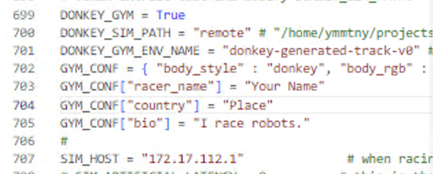

HX80G ユーザ名

- user:ymmtny w/o @gmail.com
- password:s****1

  >!DonkeySkipCity2024 に変更した

- [ ] wsl ubuntuをSSHで外からアクセス (未実施)

  https://qiita.com/yuta-katayama-23/items/fad6928f37badf3391f2

---

### FAQ

- 英語キーボードになってしまう
  =>
    Microsoft Remotedesktop App > Connections > Keyboard Mode > Unicodeにする

    =>
      powser shellで入力できない、元のscancodeに戻す

- How to Install OpenGL in Ubuntu in WSL2

    https://gist.github.com/Mluckydwyer/8df7782b1a6a040e5d01305222149f3c

    https://askubuntu.com/questions/1451610/mesa-loader-failed-to-open-swrast-ubuntu-20-04

    ```
    sudo ln -s /usr/lib/x86_64-linux-gnu/dri/swrast_dri.so /usr/lib/dri/
    sudo ln -s /usr/lib/x86_64-linux-gnu/dri/radeonsi_dri.so /usr/lib/dri/
    ```

    anacondaとOpenCVで”libstdc++.so.6: version `GLIBCXX_3.4.30' not found”が出たときの対処
    https://qiita.com/dekavit/items/a6a62044d91a05feccc8

    ```
    conda install -c conda-forge gcc=12.1.0
    ```

- donkey carの環境

  - conda install python=3.6

  - opencv python headless

    ```
    sudo apt install python3-opencv
    pip install opencv-python==4.5.1.48
    ```

  - donkey ui

    https://docs.donkeycar.com/utility/ui/

    The car connector - can pull tub data from the car and push back trained pilots or even start/stop the car.
    The screen does **not work under windows**.

    - Cythonのバージョンエラーの対処

      setup.py
      ```
      Cython==0.29.36
      numpy==1.18.5
      ```

     tf関連のインストールは、-e .[tf]

      ```
      pip install -e .[tf]
      ```

    [AMD GPUs don't work with CUDA, and the DALL-E Playground project only supports CUDA](https://stackoverflow.com/questions/72588819/how-to-make-amd-gpu-available-by-wsl-for-use-with-dall-e-playground-ai-sever)

- 4.5.0に変更

  https://docs.donkeycar.com/guide/host_pc/setup_ubuntu/

  ```
  git checkout tags/4.5.0 -b 4.5.0

  pip install -e .[pc]
  conda update -n base -c defaults conda
  conda env remove -n donkey

  donkey createcar --path ./mycar
  ```

 - 　参考 donkey v5.0.dev3 ...
    ```
    python -c 'import tensorflow as tf; print(tf.__version__)'
    2.9.1
    python -c "import cv2; print(cv2.__version__)"
    4.8.0
    python -c "import numpy; print(numpy.version.version)"
    1.25.0
    ```


    - 4.5.0 raspiのインストール
      ```
      conda update -n base -c defaults conda
      conda env remove -n donkey

      git fetch --all --tags -f
      latestTag=$(git describe --tags `git rev-list --tags --max-count=1`)
      echo "the latest tag is $latestTag"
      git checkout 4.5.0
      pip install -e .[pi]
      ```

---

### Misc

Unity Plateau

  Window > Rendering > Environment > Fog をオフにする

  

[Donkey Simulatorのインストール手順(ubuntu 18.04編)](https://qiita.com/arigadget/items/712cf0b0ef3b25c17c83)

1. start DonkeySwimWin/donkey_sim.exe

1. mysim

    myconfig.py

    

    - SIM_HOST : 172.x.x.1

    HX80Gのhostaddressは WSLを起動すると変わる

    if /dev/input/js0 is available,
      ```
      python manage.py drive --js
      ```

  manage.py why???
    return False #recording

- WSL USB

  https://learn.microsoft.com/en-us/windows/wsl/connect-usb

  not working for PS3 controller

- gym donkey doc

  https://gym-donkeycar.readthedocs.io/en/latest/

- https://tex2e.github.io/blog/windows/RDP-from-macos


- https://github.com/openai/gym/issues/3200

  pip install --upgrade setuptools==66


- Inbounds

  {{}}

- Outbounds

  {{}}


https://learn.microsoft.com/en-us/windows/wsl/tutorials/gpu-compute

  Windows11+AMD Radeon GPUにDirectML(DirectX+WSL2)を利用したTensorFlow/Pytorch環境をセットアップした
  https://kenkento.hatenadiary.com/entry/20220822/1661176381


```
sudo apt-get install libgl1
```


{{}}


https://www.hackster.io/wallarug/donkey-car-simulator-with-real-rc-controller-628e77

https://gymnasium.farama.org/environments/third_party_environments/#autonomous-driving-environments