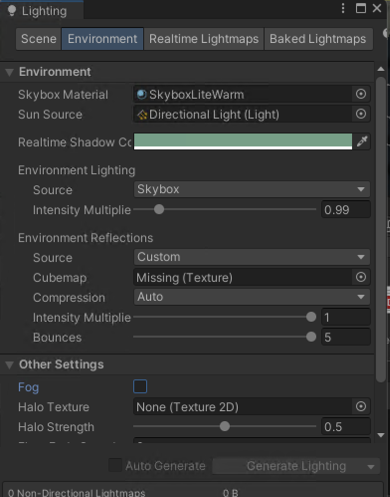
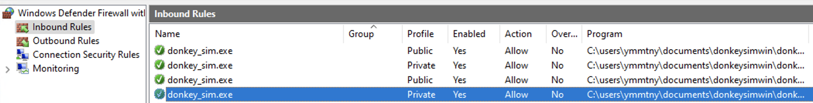
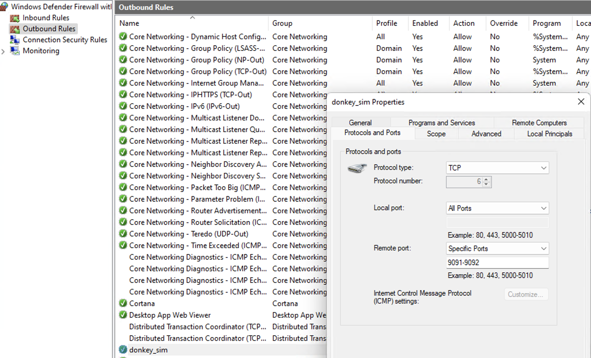
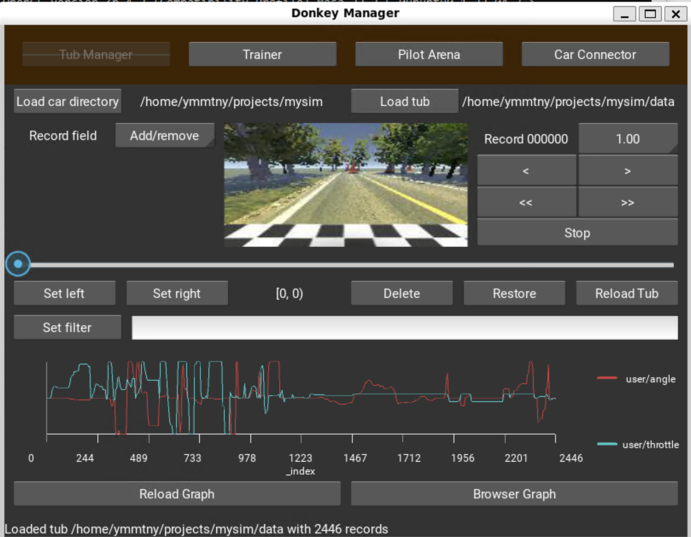

Unity Plateau

  Window > Rendering > Environment > Fog をオフにする

  

[Donkey Simulatorのインストール手順(ubuntu 18.04編)](https://qiita.com/arigadget/items/712cf0b0ef3b25c17c83)

1. start DonkeySwimWin/donkey_sim.exe

1. mysim

    myconfig.py

    

    - SIM_HOST : 172.x.x.1

    HX80Gのhostaddressは WSLを起動すると変わる

    if /dev/input/js0 is available,
      ```
      python manage.py drive --js
      ```

  manage.py why???
    return False #recording

WSL USB
  https://learn.microsoft.com/en-us/windows/wsl/connect-usb

  not working for PS3 controller

gym donkey doc
  https://gym-donkeycar.readthedocs.io/en/latest/

https://tex2e.github.io/blog/windows/RDP-from-macos


https://github.com/openai/gym/issues/3200

pip install --upgrade setuptools==66


Inbounds

  {{}}

Outbounds
  {{}}


https://learn.microsoft.com/en-us/windows/wsl/tutorials/gpu-compute

  Windows11+AMD Radeon GPUにDirectML(DirectX+WSL2)を利用したTensorFlow/Pytorch環境をセットアップした
  https://kenkento.hatenadiary.com/entry/20220822/1661176381


```
sudo apt-get install libgl1
```


{{}}


https://www.hackster.io/wallarug/donkey-car-simulator-with-real-rc-controller-628e77

https://gymnasium.farama.org/environments/third_party_environments/#autonomous-driving-environments