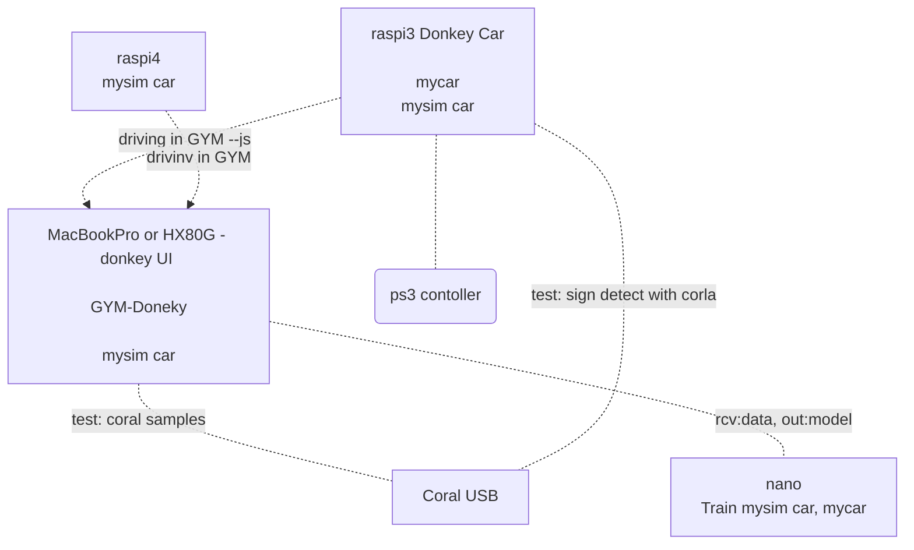
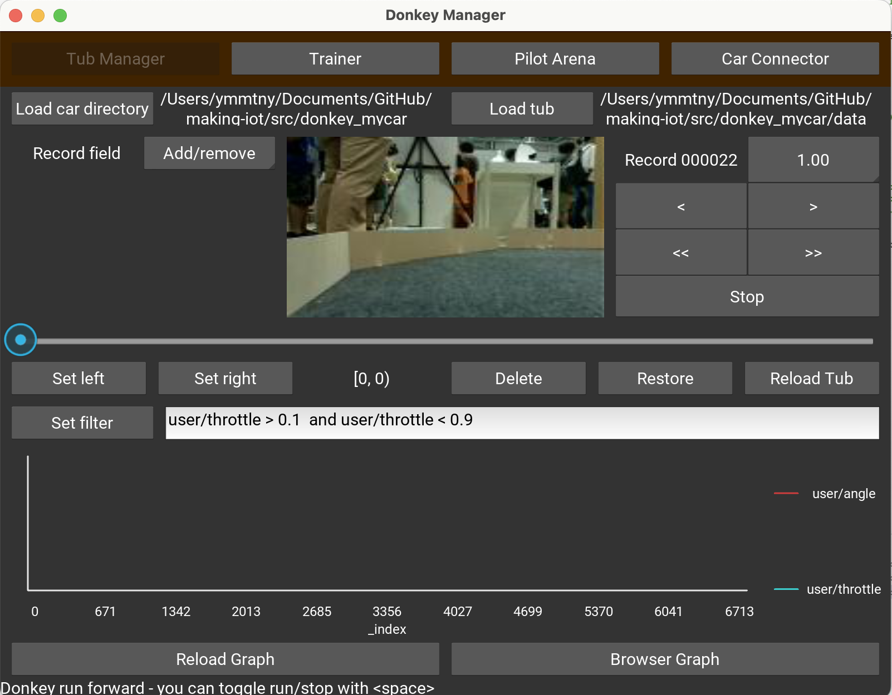
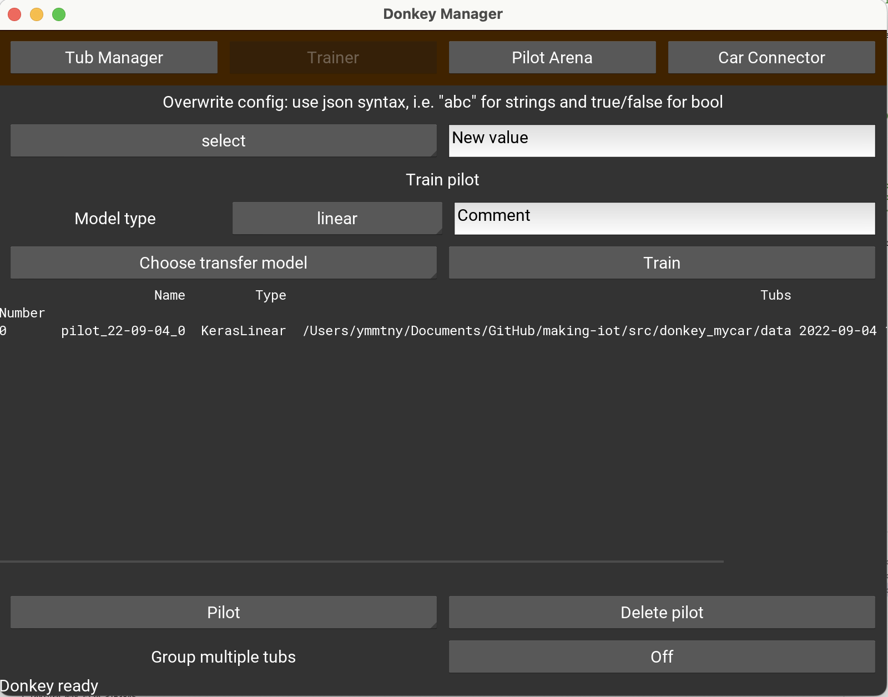

MFT2023
- [ ] 8/1 申し込み開始
- [ ] 子供むけ 車体お絵描き
    - [ ] [ FMプロポ](https://note.com/gc_akira/n/nbbdc9137699a)
- [ ] 説明ボード
- [ ] コース

    https://www.researchgate.net/publication/351455198_A_Gamified_Simulator_and_Physical_Platform_for_Self-Driving_Algorithm_Training_and_Validation

    ↑ このPaperに掲載されていたコース(tack)　1/10 で曲がれるみたいですね

    パズルマット 60cm x 16 枚数で 6000円
      https://www.monotaro.com/p/6251/6573/

GYM Donkey Map
- [ ] plateau road, terrain, buildings
- [ ] Unity create track

  https://github.com/tawnkramer/sdsandbox/blob/master/docs/guide/create_a_track.md

  - Prefab/object
  - Game Object Path (PathCreator)

  https://github.com/tawnkramer/sdsandbox/blob/master/docs/advanced/path_manager.md

---


1. Setup
    - [ ] raspi3 Doneky Car
      - [ ] update
      - [ ] Coral TPU
        - [ ] stop sign detection ⭐️

    - [ ] raspi4 ⭐️
      - [ ] connect with SSH/VNC
      - [ ] update
      - [ ] does solar2D work?

    - [ ] nano ⭐️
      - [ ] connect with SSH/VNC
      - [ ] update
      - [ ] does solar2D work?

1. Driving
    - [ ] MacbookPro Unity GYM-Doneky
    - [ ] mysim car
      - [ ] from MackbookPro
      - [ ] from raspi4 ⭐️
      - [ ] from nano
      - [ ] from raspi3 Donkey Car
        - [ ] ps3 controller with python manage.py drive --js ⭐️

    <br>

    > all of them are controlled via browser with PS3 controller on mac or HX80G

    > or python manage.py drive --js enable to use the connected controller on raspi4, nano or raspi3 Donkey Car

    > can it be a virtual racing demo?

1. Train

    > Donkey UI works except jetson nano.

    - [ ] MacbookPro
      - [ ] rsync data from
        - [x] raspi3 Donkey Car
        - [x] raspi4 mysim
        - [ ] nano mysim

    - train mysim/data
      - [x] mac
      - [x] HX80G
      - [x] jetson nano ⭐️ (use console donkey train ...)


1. AI Pilot on GYM-Doneky each mysim car
    - [x] HX80G mysim
    - [x] raspi3 Donkey Car' mysim
    - [x] raspi4 mysim
    - [ ] nano mysim ⭐️


---

| H/W                           | Win              | Mac            | Raspi4 | Jetson nano  | Raspi3 donkey-kwiksher | nano-kwiksher      | skipcity donkey nano   |
|:------------------------------|:-----------------|:---------------|:-------|:-------------|:-----------------------|:-------------------|------------------------|
| donkey version                | 5.0 dev3         | 4.5.0          | 4.5.0  | 4.5.0        | 4.5.0                  | 4.5.0              |4.5.0|
| tf                            | 2.9.1            | 2.2.0          | 2.3.0  | 2.5.0        | 2.2.0                  | 2.4.1              |2.3.1|
| numpy                         | 1.25.0           | 1.18.5         | 1.18.5 | 1.19.0       | 1.18.5?                | 1.18.5<br>=>1.19.0 |1.19.0|
| cv                            | 4.8.0            | 4.8.0          | 4.7.0  | 4.1.1        | ?????                  | 4.6.0<br>=>4.4.0   |4.1.0|
| jetpack                       |                  |                |        | 4.5.1-b17    |                        | 4.6.1              |4.6.1|
| OS                            | WSL Ubuntu 20.04 | miniconda      | Buster | Ubuntu 18.04 | Buster                 | Ubutu 20.04        ||
| python                        | 3.9.18           | 3.9.5          |        | 3.6          |                        | 3.8.10             |3.6|
| scikit                        |                  |                |        |              |                        | 0.19.3             ||
| typing-extensions             |                  |                |        |              |                        | 3.7.4.3<br>=>4.7.1 ||
| donkey ui                     | ✔️                | ✔️              | NS     | NS           | NS                     | (todo)             ||
| donkey train (console)        | ✔️                | ✔️              | NS     | NS           | NS                     | ✔️                  ||
| web contoller (browoser 8887) | ✔️                | ✔️              |        |              |                        |                    ||
| ps3 contoller<br>(gamepad)    | ✔️<br>(browser)   | ✔️<br>(browser) |        |              | ✔️<br>(--js)            |                    ||
| mysim                         | ✔️                | ✔️              | ✔️      | ✔️            | ✔️                      | ✔️                  ||
| mycar                         |                  |                |        |              | ✔️                      |                    ||

- jetson nano|

  is modified **w/o aufumentations**, and myconfig.py for BATH_SIZE 4
  and 4.5.0 requires numpy 1.19.0, so tf 2.3.1 does not work. Use tf 2.5.0

  [Ubuntu 20.04 image](https://github.com/Qengineering/Jetson-Nano-Ubuntu-20-image)
    - Update OpenCV (4.8.0)
    - Update PyTorch (1.13.0)
    - Update TorchVision (0.14.0)
    - New: TensorRT (8.0.1.6)
    - JetPack 4.6.1,

    - opencv-python-headless is built

      by donkecar setup

        - opencv-python 4.6.0.66 requires numpy>=1.19.3; python_version >= "3.6" and platform_system == "Linux" and platform_machine == "aarch64", but you have numpy 1.19.0 which is incompatible.
        - tensorflow 2.4.1 requires numpy~=1.19.2, but you have numpy 1.19.0 which is incompatible.

        > ~= means at least 1.19.2. It will favour a greater version but in the 1.19.* series, not 1.20.*.

        > https://stackoverflow.com/questions/70950572/which-version-of-tensorflow-is-compatible-with-numpy-1-19-1

       - donkey ui fails to start

          ```
          WARNING:kivy:stderr: It seems that scikit-image has not been built correctly.
          ```

          =>
            export LD_PRELOAD=/usr/lib/aarch64-linux-gnu/libgomp.so.1


          ```
          ImportError: cannot import name 'Concatenate' from 'typing_extensions' (/usr/local/lib/python3.8/dist-packages/typing_extensions.py)
          ```

          => pip install Concatenate, Update typing_extensions

          - skimage error

          ```
          ImportError: /home/jetson/env/lib/python3.8/site-packages/skimage/_shared/../../scikit_image.libs/libgomp-d22c30c5.so.1.0.0: cannot allocate memory in static TLS block
          It seems that scikit-image has not been built correctly.
          ```

          find .so and export LD_PRROAD it

          DONE, now it succeeds the trainning!

          ```
          donkey train --tub ./data --model ./models/mypilot.h5
          ```


          - donkey ui crash from console

            (TODO) it needs DISPLAY

          Level 1:tensorflow:Registering AudioMicrofrontend (None) in gradient.
        [Level 1           ] Registering AudioMicrofrontend (None) in gradient.
        2023-07-31 14:53:48.889900: I tensorflow/stream_executor/platform/default/dso_loader.cc:49] Successfully opened dynamic library libcudart.so.10.2
        Segmentation fault (core dumped)

- mac

  setup.py is modifed for numpy==1.18.5 for tf 2.2.0
---
update to 4.5.0

  https://docs.donkeycar.com/guide/host_pc/setup_mac/

  ```
  cd /Users/ymmtny/Documents/GitHub/AI-RC/src
  git fetch --all --tags -f
  latestTag=$(git describe --tags `git rev-list --tags --max-count=1`)
  git checkout $latestTag

  conda update -n base -c defaults conda
  conda env remove -n donkey

  conda install mamba -n base -c conda-forge
  mamba env create -f install/envs/mac.yml
  conda activate donkey
  pip install -e .[pc]
  ```

  - tensowflow version

    ```
    python -c "import tensorflow; print(tensorflow.__version__)"
    python -c "import numpy; print(numpy.version.version)"
    python -c "import cv2; print(cv2.__version__)"
    ```
    - => 2.2.0
  ## drive

  python manage.py drive

  - "Stop Car" deletes 100 records when you crash
  - 10-20 laps of good data (5-20k images)
  ## rsync data

  rsync -r pi@surrogate-kwiksher.local:~/mysim/data/ ./mysim_raspi/data/

  rsync -rv --progress --partial pi@<your_pi_ip_address>:~/mycar/data/  ~/mycar/data/

  ## donkey ui

    - libSDL2_image-2.0.0.dylib not found Error

      > https://github.com/kivy/kivy/issues/7956
      ```
      cd /usr/local/Caskroom/miniconda/base/envs/donkey/lib/
      cp /usr/local/Caskroom/miniconda/base/pkgs/sdl2_image-2.0.5-h7fada4f_0/lib/libSDL2_image-2.0.0.dylib
      ```

  ## train

    doneky ui > train > linear

    version >= 4.3.0
      - AUGMENTATIONS = ['MULTIPLY', 'BLUR']
      - TRANSFORMATIONS = ['CROP'] or TRANSFORMATIONS = ['TRAPEZE']

    600枚 images 4分くらい？

      epoch 1/100
      2023-07-27 19:38:34.136 python[53503:1657257] _TIPropertyValueIsValid called with 4 on nil context!
      2023-07-27 19:38:34.136 python[53503:1657257] imkxpc_getApplicationProperty:reply: called with incorrect property value 4, bailing.
      2023-07-27 19:38:34.136 py

      curacy: 0.9000 - throttle_out_accuracy: 0.9594
      Epoch 00054: val_loss did not improve from 0.14126
      5/5 [==============================] - 4s 721ms/step - loss: 0.1851 - angle_out_loss: 0.2784 - throttle_out_loss: 0.0919 - angle_out_accuracy: 0.9000 - throttle_out_accuracy: 0.9594 - val_loss: 0.1741 - val_angle_out_loss: 0.2978 - val_throttle_out_loss: 0.0503 - val_angle_out_accuracy: 0.8867 - val_throttle_out_accuracy: 0.9727
      INFO:donkeycar.parts.interpreter:Convert model /Users/ymmtny/Documents/GitHub/AI-RC/src/mysim_raspi/models/pilot_23-07-27_1.h5 to TFLite /Users/ymmtny/Documents/GitHub/AI-RC/src/mysim_raspi/models/pilot_23-07-27_1.tflite
      2023-07-27 19:42:11.416210: I tensorflow/core/grappler/devices.cc:60] Number of eligible GPUs (core count >= 8, compute capability >= 0.0): 0 (Note: TensorFlow was not compiled with CUDA support)
      2023-07-27 19:42:11.416388: I tensorflow/core/grappler/clusters/single_machine.cc:356] Starting new session
      2023-07-27 19:42:11.425553: I tensor

  ## copy back model and run

  rsync -rv --progress --partial ./mysim_raspi/models/ pi@surrogate-kwiksher.local:~/mysim/models/

  rsync -rv --progress --partial ./mysim_raspi/models/ pi@donkey-kwiksher.local:~/Donkey/mysim/models/

  rsync -rv --progress --partial ./mysim_raspi/models/ jetson@jetson-desktop.local:~/projects/mysim/models/

  - raspi

    cd ~/mysim
    python manage.py drive --model ./models/pilot_23-07-28_0.tflite --type tflite_linear


---
TPU
  https://docs.donkeycar.com/parts/stop_sign_detection/ ⭐️

---
Donkey UI

  ```
  cd ~/Documents/GitHub/making-iot/src/donkey_mycar
  conda activate donkey
  donkey ui
  ```
  

  

---
https://docs.donkeycar.com/guide/host_pc/setup_mac/

  ↓OLD instruction (Now use conda activate instead of source activate)
  ```
    1.Calibrate your car.
    1.Start driving.
    1.Train an autopilot.
        Pi
            /home/pi/mycar
        Mac
            cd donkeycar
            source activate donkey
                =>(donkey) ymmtnyMac:mycar ymmtny$
            cd mycar
            rsync -r pi@ymmtny.local:~/mycar/data/ ./data/
            python manage.py train --tub ./data/<tub folder names comma separated> --model ./models/mypilot

                python manage.py train --tub ./data/tub_29_18-11-15/ --model ./models/mypilot

                30 minutes driving
                24,596 items
                16:45
                17:53 24/100

    1.Experiment with simulator.
  ```
---
PS3 controller DsHidMini
  https://note.com/iso12800jp/n/n7eee6100e6b4

---
train
  ls | wc -l
  2k -5-20k images  -- 10 labs


AI_THROTTLE_MULT = 1.4

---
mini conda

    https://dorapon2000.hatenablog.com/entry/2020/04/29/152251

    brew install Caskroom/cask/miniconda
    conda init zsh

---
playstation 3 controller

    https://qiita.com/noraworld/items/55c0cb1eb52cf8dccc12
  ```
    sudo ./sixpair

    > USB からコントローラを外す

    sudo bluetoothctl
    scan on

    > PSボタンを押す

    connect
　　 trust
  ```

---
docker pi

    https://github.com/lukechilds/dockerpi

    docker run -it -v $HOME/Documents/GitHub/making-iot/bin/.dockerpi.dockerpi:/sdcard lukechilds/dockerpi pi3

----
donkey car

    source env/bin/activate

     scp -r pi@surrogate-kwiksher.local:/home/pi/mycar ./donkey_mycar

----
XQuartz Mac

  ```
  sudo vi /etc/ssh/ssh_config
      XAuthLocation /usr/X11/bin/xauth

  ssh -X pi@surrogate-kwiksher.local
  ```

----------------------------
普段 MacでPython使っている 方は Anacondaがはいるので、Dockerがおすすめです。
WinやAnaconda 使ってない方は、Dockerは不要でしょう。

    https://qiita.com/shibukawa/items/0daab479a2fd2cb8a0e7

WindowsでDockerは不要です。MacのPython使いのひとは、Dockerいれましょう。

    ※Windows でDockerを入れたければ、Win10Professionalが必要 それか VirtualBoxいれてDockerを動かします。
      Windows Homeだと VirtualBoxいれて Dockerを入れる。
      https://qiita.com/idani/items/fb7681d79eeb48c05144
