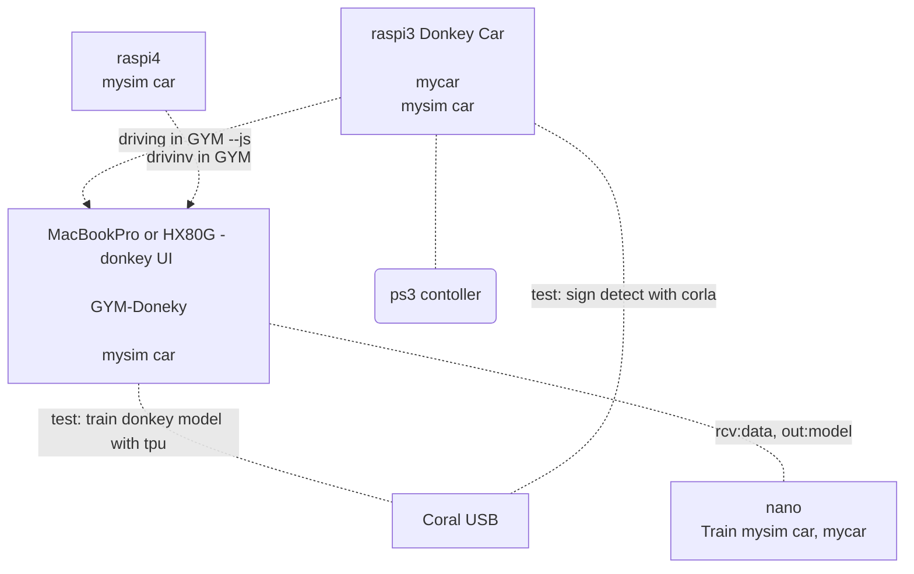

MFT2023
- [ ] 8/1 申し込み開始
- [ ] 子供むけ 車体お絵描き
    - [ ] [ FMプロポ](https://note.com/gc_akira/n/nbbdc9137699a)
- [ ] 説明ボード
- [ ] コース

    https://www.researchgate.net/publication/351455198_A_Gamified_Simulator_and_Physical_Platform_for_Self-Driving_Algorithm_Training_and_Validation

    ↑ このPaperに掲載されていたコース(tack)　1/10 で曲がれるみたいですね

    パズルマット 60cm x 16 枚数で 6000円
      https://www.monotaro.com/p/6251/6573/

GYM Donkey Map
- [ ] plateau road, terrain, buildings
- [ ] Unity create track

  https://github.com/tawnkramer/sdsandbox/blob/master/docs/guide/create_a_track.md

  - Prefab/object
  - Game Object Path (PathCreator)

  https://github.com/tawnkramer/sdsandbox/blob/master/docs/advanced/path_manager.md

---


1. Setup
    - [ ] raspi3 Doneky Car
      - [ ] update
      - [ ] Coral TPU
        - [ ] stop sign detection ⭐️

    - [ ] raspi4 ⭐️
      - [ ] connect with SSH/VNC
      - [ ] update
      - [ ] does solar2D work?

    - [ ] nano ⭐️
      - [ ] connect with SSH/VNC
      - [ ] update
      - [ ] does solar2D work?

1. Driving
    - [ ] MacbookPro Unity GYM-Doneky
    - [ ] mysim car
      - [ ] from MackbookPro
      - [ ] from raspi4 ⭐️
      - [ ] from nano
      - [ ] from raspi3 Donkey Car
        - [ ] ps3 controller with python manage.py drive --js ⭐️

    <br>

    > all of them are controlled via browser with PS3 controller on mac or HX80G

    > or python manage.py drive --js enable to use the connected controller on raspi4, nano or raspi3 Donkey Car

    > can it be a virtual racing demo?

1. Donkey UI

    - [ ] MacbookPro
      - [ ] connect car
        - [ ] raspi3 Donkey Car
        - [ ] raspi4
        - [ ] nano
          - [ ] train on nano ⭐️
      - [ ] train w/o Coral USB　⭐️
      - [ ] train with Coral USB


1. AI Pilot on GYM-Doneky each mysim car
    - [ ] raspi3 Donkey Car ⭐️
    - [ ] raspi4 ⭐️
    - [ ] nano

---
TPU
  https://docs.donkeycar.com/parts/stop_sign_detection/ ⭐️

---
Donkey UI

  ```
  cd ~/Documents/GitHub/making-iot/src/donkey_mycar
  conda activate donkey
  donkey ui
  ```
  

  

---
https://docs.donkeycar.com/guide/host_pc/setup_mac/

  ↓OLD instruction (Now use conda activate instead of source activate)
  ```
    1.Calibrate your car.
    1.Start driving.
    1.Train an autopilot.
        Pi
            /home/pi/mycar
        Mac
            cd donkeycar
            source activate donkey
                =>(donkey) ymmtnyMac:mycar ymmtny$
            cd mycar
            rsync -r pi@ymmtny.local:~/mycar/data/ ./data/
            python manage.py train --tub ./data/<tub folder names comma separated> --model ./models/mypilot

                python manage.py train --tub ./data/tub_29_18-11-15/ --model ./models/mypilot

                30 minutes driving
                24,596 items
                16:45
                17:53 24/100

    1.Experiment with simulator.
  ```
---
PS3 controller DsHidMini
  https://note.com/iso12800jp/n/n7eee6100e6b4

---
train
  ls | wc -l
  2k -5-20k images  -- 10 labs


AI_THROTTLE_MULT = 1.4

---
mini conda

    https://dorapon2000.hatenablog.com/entry/2020/04/29/152251

    brew install Caskroom/cask/miniconda
    conda init zsh

---
playstation 3 controller

    https://qiita.com/noraworld/items/55c0cb1eb52cf8dccc12
  ```
    sudo ./sixpair

    > USB からコントローラを外す

    sudo bluetoothctl
    scan on

    > PSボタンを押す

    connect
　　 trust
  ```

---
docker pi

    https://github.com/lukechilds/dockerpi

    docker run -it -v $HOME/Documents/GitHub/making-iot/bin/.dockerpi.dockerpi:/sdcard lukechilds/dockerpi pi3

----
donkey car

    source env/bin/activate

     scp -r pi@surrogate-kwiksher.local:/home/pi/mycar ./donkey_mycar

----
XQuartz Mac

  ```
  sudo vi /etc/ssh/ssh_config
      XAuthLocation /usr/X11/bin/xauth

  ssh -X pi@surrogate-kwiksher.local
  ```

----------------------------
普段 MacでPython使っている 方は Anacondaがはいるので、Dockerがおすすめです。
WinやAnaconda 使ってない方は、Dockerは不要でしょう。

    https://qiita.com/shibukawa/items/0daab479a2fd2cb8a0e7

WindowsでDockerは不要です。MacのPython使いのひとは、Dockerいれましょう。

    ※Windows でDockerを入れたければ、Win10Professionalが必要 それか VirtualBoxいれてDockerを動かします。
      Windows Homeだと VirtualBoxいれて Dockerを入れる。
      https://qiita.com/idani/items/fb7681d79eeb48c05144
