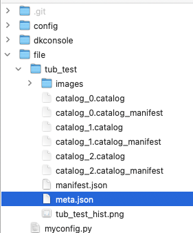

# Raspi3A+ with donkey console

{}

 Robocar donkey console and donkey app on iOS/Android are created by robocar store

 - https://github.com/robocarstore


DonkeyCopilot" is WEB controller application for DonkeyCar made by @covao


- https://github.com/covao/DonkeyCopilot


- PC

  1. setup .env

      donkeycar path etc

  1. start train manually when the console service receives data from raspi

  1. update meta.json status

- Raspi
  1. setup .env

      donkeycar path etc

      - config/settings/base.py

        change user namme if not 'pi'

  1. run donkey console

     the console receives requests from donkey app, and run scripts like 'manage.py drive --js' or forward a request of training to a train server.

- Donkey App

  1. setup

    find a raspi

  1. drive a car

  1. train a car

      a trained model will be automatically copied to your raspi

  1. auto-pilot

### PC

  - env

    ```
    VENV_PATH=/usr/local/Caskroom/miniconda/base/envs/donkey/bin

    CARAPP_PATH=/Users/ymmtny/Documents/GitHub/AI-RC/src/mycar
    DONKEYCAR_DIR=/Users/ymmtny/Documents/GitHub/AI-RC/src/donkeycar
    WLAN=en0
    HOTSPOT_IF_NAME=None

    CONSOLE_DIR=/Users/ymmtny/Documents/GitHub/AI-RC/HongKong/robocarstore/donkeycar-console
    # HQ_BASE_URL=http://kwiksher.local:8001
    ```

    - network name "en0"

      ```
      system_profiler SPNetworkDataType | grep Wi-Fi -A10
      ```


  - file/meta.json

    data from raspi is stored in file folder. So you can train it and updates the status in **meta.json**

    ```
    {"last_update": "03/29/2024, 14:20:11", "size": 10.8, "uuid": "75f793fa-a391-4aa7-a2da-bd02bb2695b7"}
    ```

    - "SCHEDULED"
    - "TRAINING"
    - "COMPLETED"

    {{}}


  - train/views.py

    ```py
    @api_view(['POST'])
    def submit_job_handler(request):
        try:
            print("--- submit_job_handler -----")
            print(request.data)
            myconfig_file = request.data.get('myconfig_file')
            tub_archive_file = request.data.get('tub_archive_file')
            device_id = request.data['device_id']
            hostname = request.data['hostname']

            if myconfig_file:
              job_uuid = str(uuid4())
              myfile = request.FILES['myconfig_file']
              TrainService.save_for_training(myfile, device_id, hostname, job_uuid)
            elif tub_archive_file:
              job_uuid = request.data['job_id']
              # TrainService.get_train_uuid(device_id, hostname)
              myfile = request.FILES['tub_archive_file']
              myfile = TrainService.save_for_training(myfile)
              TrainService.extract_for_training(myfile, device_id, hostname)

            return Response({"success": True, "job_uuid":job_uuid})

        except Exception as e:
            logger.error(e)
            return Response(status=status.HTTP_400_BAD_REQUEST)

    @api_view(['POST'])
    def refresh_job_statuses(request):
        global dummy_counter
        try:
            print(request.data)
            job_id = request.data['job_id']
            return_value = TrainService.get_statuses(job_id)
            return Response(return_value)
        except Exception as e:
            logger.error(e)
            return Response(status=status.HTTP_400_BAD_REQUEST)
    ```

    RTrainService.get_statuses reads meta.json and send it back to raspi, then raspi can start downloading a model which has just been trained.

  - test/post_to_train.http

    - POST https://localhost:8001/train/submit_job_handler

      request

      ```json
      QueryDict: {'device_id': ['3c:22:fb:5b:9c:3a'], 'hostname': ['kwiksher.local'], 'donkeycar_version': ['4.5.0'], 'tub_uuids': ['75f793fa-a391-4aa7-a2da-bd02bb2695b7'], 'myconfig_file': [<InMemoryUploadedFile: myconfig.py (text/plain)>]}
      ```

      response

      >  it returns array of job json, then dkconsole.donwload_model uses curl to fetch them

      ```json
      { 'uuid':"", 'status':"",, 'model_url':"",, 'model_accuracy_url':"",, 'model_movie_url':""}
      ```

        - "SCHEDULED"
        - "TRAINING"
        - "COMPLETED"
        - "NO_CAPACITY"
        - "NO_QUOTA"
        - "SPOT_REQUEST_FAILED"
        - "TIMEOUT"


    - POST https://localhost:8001/train/refresh_job_statuses

      request

      ```json
      {"job_uuids": job_uuids}
      ```


### Raspberry

  - config/settings/base.py

    id -gn

    ```
    uid = pwd.getpwnam("ymmtny").pw_uid
    gid = grp.getgrnam("staff").gr_gid
    ```

  - env raspberry

    ```
    VENV_PATH=/home/pi/env/bin
    DCONSOLE_VENV_PATH=/home/pi/env_dc/bin
    CARAPP_PATH=/home/pi/mycar
    WLAN=wlan0
    #HOTSPOT_IF_NAME=uap0
    HOTSPOT_IF_NAME=None
    DONKEYCAR_DIR=/home/pi/donkeycar
    CONSOLE_DIR=/home/pi/donkeycar-console

    HQ_BASE_URL=http://kwiksher.local:8001
    ```

  reqeust comes from Donkey App

  - job counts only

    ```
    POST https://localhost:8000/tain/refresh_job_status
    ```

  - jobs

    ```
    GET https://localhost:8000/train
    ```

  - submit_job to a training server (HQ)

    ```
    POST https://localhost:8000/train/submit_jop

    {"tub_paths":[path1, path2], "id_token":id}
    ```

  - download model using curl in train/services.py

    ```
    POST https://localhost:8000/train/download_model

    {"job_ids":job_uuids}
    ```

----

camera check

  ```
    raspistill -o test.jpeg
    vcgencmd get_camera
  ```

----
3A+ requirements

- 32bit
- buster
- picamera2 python library
  - https://github.com/autorope/donkeycar/issues/1141
  - https://github.com/autorope/donkeycar/issues/1051

- FAT32

  https://2021.jackbarber.co.uk/blog/2019-05-01-quick-raspberry-pi-setup


Buster bootloader issue

=>FaBoのDonkeyCarイメージ/DonkeyCarのボードなら、3A+にも対応しています

- https://discord.com/channels/684962202960003142/684962510323056642/1128491700382343178
- https://faboplatform.github.io/DonkeyDocs/7.SDカード作成/02.donkey4


[１年前のRaspbian（2020-02-05-raspbian-buster-lite）をセットアップして試してみたところ正常動作](http://www.inoshita.jp/freo/view/616)

  電源ＯＮで赤ＬＥＤが点灯，緑ＬＥＤが暫く点滅した後，いくら（５分位）待っても画面に何も表示されない

  - https://downloads.raspberrypi.org/raspbian_lite/images/raspbian_lite-2020-02-07/
  - https://downloads.raspberrypi.org/raspios_lite_armhf/images/raspios_lite_armhf-2020-05-28/
