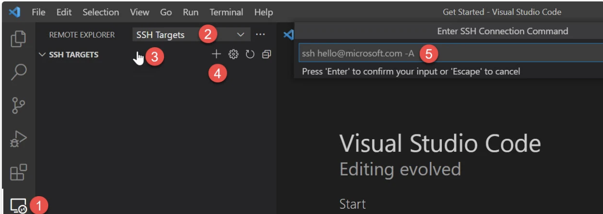

- [x] SDカードのバックアップ

    佐々木さんがSkipCityに行けそうな日時で、バックアップ作業を行うことは可能でしょうか？SkipCity側の展示は その間１台のみの運用。２−３時間？

- [x] jetson donkeyカーを 2-3台増やせないか？

    １日の初めに５台を準備して、バッテリーの交換の代わりに車体を丸ごと交換で１日が終わるようなオペレーションにしたそうです。

    =>
    代替案としては、 バッテリー係と車体係を分けて、バッテリーの数を増やし、バッテリー係は放電と充電のみを担当。車体係はバッテリーがなくなったら、バッテリー係からバッテリーを受け取る

    ラズパイDonkeyもrun_ai.serviceを登録したので、走らせるだけならば運用はJetson Donkeyカーと変わりませんが、現在はバッテリーが違うのが難点とのことです。。raspi donkeyにYokokoバッテリーでいけますかね？

    代替案でも良さそうさですが、それでも車体の数が一台でも増えた方が、あらかじめスタンバイさせておくということができるので良いそうです。交換という作業の数を減らしたいという意向です。


- [ ] ２月、３月

    上記の追加のdonkeyカーの要望ですが、学習走行とdonkey trainは、私たちが実施する必要があるので、２月に追加車体が間に合えば、２月に作業日程を調整する。

　　３月くらいに コミュニティイベントで走行会をSkipCityでやるのもありかと、
    wltoys のブラシレスマシンは私が預かりました、組みて立ててみます。

    T2マシンも走行できそうなコースですし、Donkey T2はどうでしょう？

    やっぱ 浦川さんの カエル号なのかなと思います。カエル２号を作る内向けのイベント・ハッカソン的にしても良いかもしれません。


- [ ] 今日はcuda 入れて動作確認中、libcudart.so.10.6 not found がtensorflowのimport checkで出たとこまでで、終了しました

  https://stackoverflow.com/questions/64193633/could-not-load-dynamic-library-libcublas-so-10-dlerror-libcublas-so-10-cann

  https://stackoverflow.com/questions/64880546/tensorflow-could-not-load-dynamic-library-libcudart-so-10-0-on-ubuntu-18-04

> 企画展の運営から借りたAsusノートブックのDonkey環境。英語キーボードです。

> jetson nanoドンキー1号機、２号機とも donkeycar 4.5.0 tensorflow 2.3.1です。これに合わせます。

## WSL Ubuntu

> UbuntuとUbuntu 22.04.3(バージョン付き) ２つが表示されていたら、バージョン名が無い方を選択してください。（重複して入れてしまったので、バージョン付きをアンインストールしましたが、残っているとこがあるみたいです）

## donkey carの環境

- [x] https://docs.donkeycar.com/guide/host_pc/setup_windows/

- [x] WSLとUbuntu
  - [x] vscode

    - user:donkey
    - password:!DonkeySkipCity2024

    remote explorerで入れます。

    

TODO

- [x] conda install python=3.6


    - [x] https://docs.donkeycar.com/guide/host_pc/setup_ubuntu/

      > 現在のdonekycarのdocは 5.0.0用なので 3.9になってしまいます。


- [x] opencv python headless

  ```
  sudo apt install python3-opencv
  pip install opencv-python==4.5.1.48
  ```

- [x] projectsフォルダ

  ```
  cd ~
  mkdir projects
  ```

- [x] 4.5.0に変更

    https://docs.donkeycar.com/guide/host_pc/setup_ubuntu/

    - [x] tagsでチェックアウトしてください。ブランチ名 4.5.0

      ```
      git checkout tags/4.5.0 -b 4.5.0

      pip install -e .[pc]
      ```

  -  [x] Cythonのバージョンエラーの対処

      setup.pyの修正

      ```
      Cython==0.29.36
      numpy==1.18.5

      'tf': ['tensorflow==2.3.1'],

      ```

      tf関連のインストールは、-e .[tf]

      ```
      pip install -e .[tf]
      ```

- [x] 4.5.0に変更

    https://docs.donkeycar.com/guide/host_pc/setup_ubuntu/

    ```
    # ブランチの確認
    git branch

    pip install -e .[pc]
    conda update -n base -c defaults conda

    #conda donkey環境の再作成
    conda env remove -n donkey
    create -n donkey python=3.6
    conda activate donkey
    　
    donkey createcar --path ./mycar
    ```

 - [ ] 確認

  > TODO このtensorflowでcuda  10.6 not foundが出ている。対応が必要

    ```
    cat /etc/os-release

    python -c 'import tensorflow as tf; print(tf.__version__)'

    python -c "import cv2; print(cv2.__version__)"

    python -c "import numpy; print(numpy.version.version)"

    ```

----
## 学習をホストPCで実施

- [x] ssh configの設定

  ```
  Host skipcity-donkey-01
    HostName 192.168.100.101
    User jetson

  Host skipcity-donkey-02
    HostName 192.168.100.102
    User jetson
  ```

  - [ ] donkey-endo.local のラズパイドンキーも設定したか不明

ホストPCとrsync

1. **WiFiをDONKEY001に切り替える**

1. 以下のコマンドの実施

  ```
  cd /home/donkey/projects/mycar

  # 学習 dataの取得
  rsync -r jetson@skipcity-donkey-01o:~/mycar/data/ ./data/

  # 確認や学習の実施
  donkey ui

  # modelをドンキーカーに格納
  rsync -rv --progress --partial ./models/ jetson@skipcity-donkey-01:~/mycar/models/

  ```

  - [ ] donkey uiからの学習の実施はできているが、cuda 10.6の対応ができていないので、モデルを donkey-endoで動かすとエラーになってしまう

  > donkey uiの**car connector** の機能は動作しません rsyncを使ってください。
