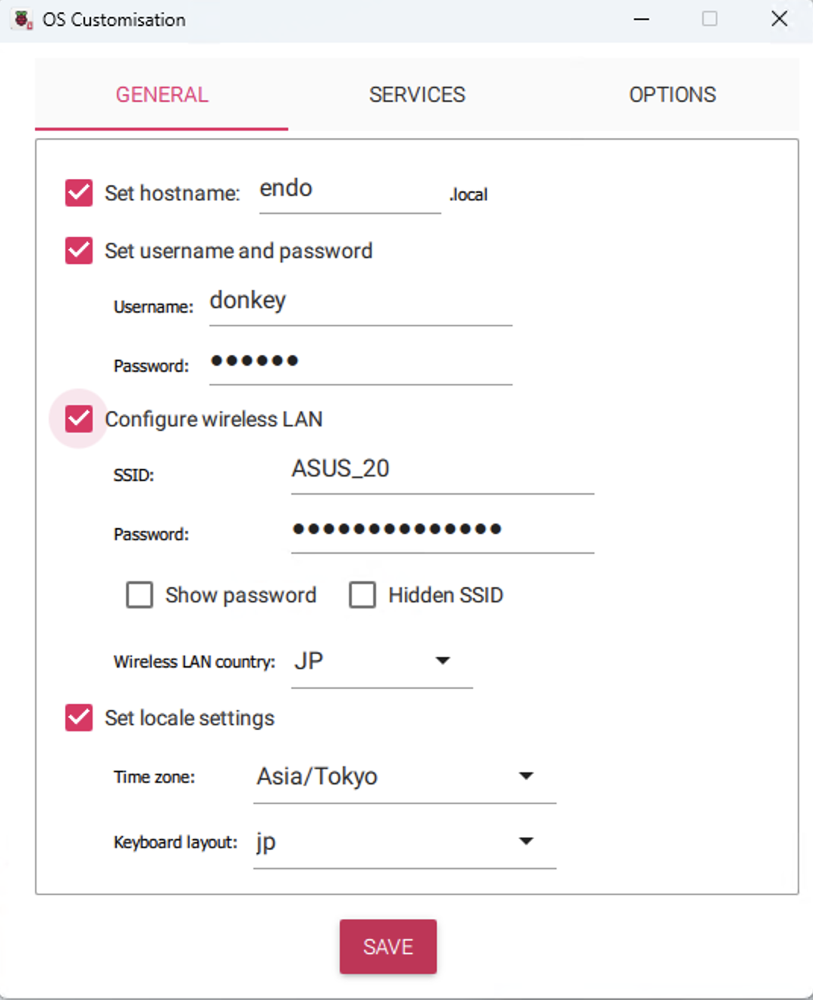
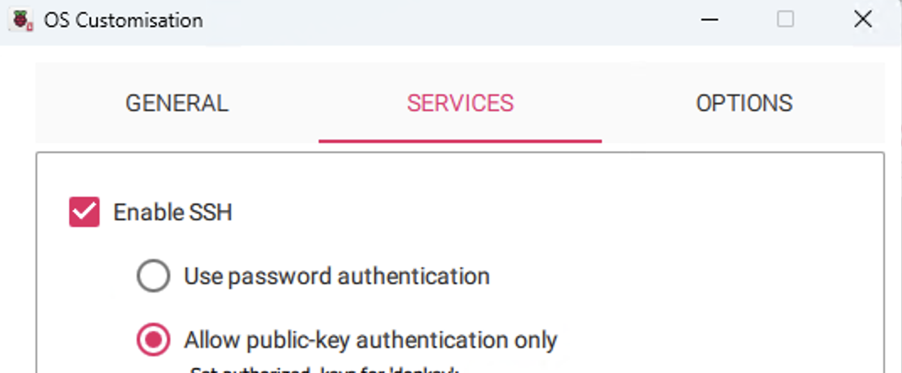

# Raspi 3B+ Buster

1. raspi imgの書き込み

    Buster download URL

    - https://support.pishop.us/article/137-official-links-to-raspberry-pi-os-buster

      Raspberry Pi OS (Legacy) with desktop .xz file.

      - https://downloads.raspberrypi.org/raspios_oldstable_armhf/images/raspios_oldstable_armhf-2022-04-07/2022-04-04-raspios-buster-armhf.img.xz

        **Installation for Donkeycar <= 4.5 using Raspberry Pi OS Buster** を参照してください。最新は (>= 5.0) using Raspberry Pi OS Bullseyeなので間違えないように。

        - Step 1: Flash Operating System
        - Step 2: Setup the WiFi for First Boot
        - Step 3: Setup Pi's Hostname
        - Step 4: Enable SSH on Boot
        - Step 5: Connecting to the Pi
        - Step 6: Update and Upgrade
        - Step 7: Raspi-config
        - Step 8: Install Dependencies
        - Step 9: (Optional) Install OpenCV Dependencies
        - Step 10: Setup Virtual Env
        - Step 11: Install Donkeycar Python Code

            > jetson nano ドンキーと合わせるために、4.5.0とtensorflow 2.3を使用します。

            ```
            git checkout tags/4.5.0 -b 4.5.0

            pip install https://github.com/lhelontra/tensorflow-on-arm/releases/download/v2.3.0/tensorflow-2.3.0-cp37-none-linux_armv7l.whl
            ```

        - Step 12: (Optional) Install OpenCV

          > hostPCでは opencvのインストールに時間がかかるので 4.5.1.48を導入しました。raspiではオプションなので任意となります。

          ```
          pip install opencv-python==4.5.1.48
          ```
        - Step 13: (Optional) Install Mobile App

    Step 1: Flash Operating System

    - Raspberry Pi Imagerを使用してみました

      https://www.raspberrypi.com/software/

      - https://docs.donkeycar.com/guide/robot_sbc/setup_raspberry_pi/#step-1-flash-operating-system

      GUIでhost名やwifiポイントを設定できます

      {{}}

      - hostname donkey-endo
      - username pi

        - [ ] 写真が間違っているので変更

      {{}}

      　sshの設定では、鍵の作成も可能です。その場合は 例えば **donkey_id_rsa**として 名前を変更する

      > この id_rsa はパスフレーズ無し

      ```
      ssh-keygen -y -f ~/.ssh/donkey_id_rsa
      ```

    - sshを有効

      ホストPCから ssh idを登録する

      ```
      ssh-copy-id -i donkey_id_rsa pi@donkey-endo.local
      ```

1. ホストPCから ssh アクセス

    ~/.ssh/config

    ```
    Host donkey-endo
      HostName donkey-endo.local
      User pi
      IdentityFile ~/.ssh/donkey_id_rsa
    ```

    ```
    ssh pi@donkey-endo
    ```

1. 確認 os version

    ```
    cat /etc/os-release

    PRETTY_NAME="Raspbian GNU/Linux 10 (buster)"
    NAME="Raspbian GNU/Linux"
    VERSION_ID="10"
    VERSION="10 (buster)"
    VERSION_CODENAME=buster
    ID=raspbian
    ID_LIKE=debian
    HOME_URL="http://www.raspbian.org/"
    SUPPORT_URL="http://www.raspbian.org/RaspbianForums"
    BUG_REPORT_URL="http://www.raspbian.org/RaspbianBugs"
    ```

---
**Step 11**

  最新ではなく、4.5.0を利用します。

  ```
  git checkout tags/4.5.0 -b 4.5.0
  ```

  tensorflowのインストール

    > make it tensorflow 2.3.1 as same as jetson nano donkey

    2.3.1 not found なので 2.3.0 を使用

    ```
    pip install https://github.com/lhelontra/tensorflow-on-arm/releases/download/v2.3.0/tensorflow-2.3.0-cp37-none-linux_armv7l.whl

    ```

    src/donkey/setup.py でnumpyのバージョンを設定

    ```
    numpy==1.18.5
    ```

    確認

    ```
    python -c "import tensorflow; print(tensorflow.__version__)"

    2.2.0
    ```


----

## 学習をホストPCで実施

ホストPCとrsync

1. wslのubuntuにvscodeで入ってください

```
cd /home/ymmtny/projects/mycar

# raspi dataの取得
rsync -r pi@donkey-endo:~/mycar/data/ ./data/

# train
donkey train --tub ./data --model ./models/mypilot.h5

# modelをraspinに格納
rsync -rv --progress --partial ./models/ pi@donkey-endo:~/mycar/models/
```

train time
  - mac
    - 15000 20分
  - win
    -　1500 20分

----

## raspiでauto pilotの実行

```
mypilot=pilot_24-01-09_4.tflite
python manage.py drive --js --model ./models/$mypilot --type tflite_linear

python manage.py drive --js --model ./models/pilot_24-01-09_4.h5
```


----

## raspi backup

- ラズパイのSDカードをまるごとバックアップ/リストア【小ネタ】
  https://zenn.dev/dsl_gunma/articles/1f2456582db81c

-   Etcher や Win32 Disk Imager
 https://www.makeuseof.com/how-to-back-up-your-raspberry-pi-sd-card-on-windows/


----

## service

- https://github.com/raspberrypi/documentation/blob/83aeab3278fc7b648022fb56b30e4d62c5ccba24/linux/usage/systemd.md

```
sudo systemctl enable run_ai.service
sudo systemctl start run_ai.service
sudo systemctl stop run_ai.service

```

/etc/systemd/system/run_ai.service

```
[Unit]
Description=Run AI Script
Wants=network-online.target
After=network-online.target

[Service]
Type=simple
ExecStart=/bin/bash -c 'source /home/pi/env/bin/activate donkey;/home/pi/mycar/run_ai.sh'

[Install]
WantedBy=multi-user.target
```

### log

```
tail -f /var/log/syslog
```

```
systemctl list-unit-files | grep enabled

sudo service --status-all
```